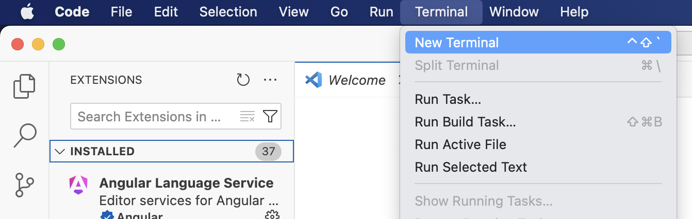
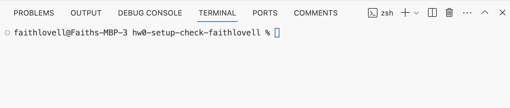
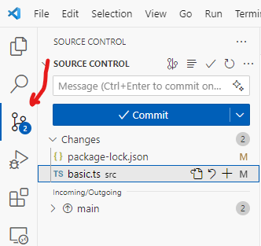

# Environment Setup

[« Return to the Chapter Index](index.md)

<details open markdown="block">
  <summary>
    Table of contents
  </summary>
  {: .text-delta }
1. TOC
{:toc}
</details>

This assignment helps you figure out how to setup your environment, install everything, and make your first submission
to GradeScope.
If everything goes well, this will only take you about 20 minutes. But it is very normal to encounter issues if you are
not used to this workflow. Don't worry, you will be an expert by the end of the semester!

Making web applications is super complicated, so we are going to be really pushy about your environment's setup and the eventual structure of our web application. If this seems limiting, that's the idea. 
Please try to stay within the bounds we give you, as you experiment and try things out!

Do not skip steps.

Read error messages, and ask questions. Talk to humans as needed to get help, and use google intelligently.

## Environment Setup

### Get VSCode

**Download [Visual Studio Code](https://code.visualstudio.com/download)**

VS Code is an IDE (Integrated Development Environment) that you will program in. Previously, you were using Thonny.

When you have VS Code downloaded, open the application. You will need to install two extensions.

To open the extension menu, you can type `Ctrl+Shift+X` (Windows) or `Cmd+Shift+X` (Mac). There is also a navigation bar on the left side of your screen and you can click the extensions menu that looks like this:


A search bar will appear at the top of the menu. Type `ESLint` and click install:


Then, search for `Prettier` and click install:


Make sure you have installed the extensions that are in the images above. These are the correct versions!

### Get Node

**Next, Download and Install [Node](https://nodejs.org/en/download/)**

You should use the installer for the most recent **LTS** version. The link will take you to the correct download page.

Once you have downloaded the installer, open it.


You may notice that it is installing both Node and something called npm. Node Package Manager (npm) will make it easier
to manage, install, and update node packages. You need both of these!

The installer will ask you to select where you want to install the package; keep the default location that already
appears.

  * For Windows: `C:\Program Files\nodejs`
  * For Mac: `/usr/local/bin/node`

Once the installer is finished, you should see this screen:


Now we need to verify that the installation was successful. Navigate back to VS Code and open a Terminal.

At the top of your VS Code window, click Terminal and then click New Terminal:



A new terminal will appear at the bottom of your screen. Its appearance can vary depending on your platform, but you
might see something like this:


You should not be in any folders for this step! This should not be an issue if you have not opened a project in VS Code
yet.

The blue box is the cursor where I can type commands. In the future, we will give instructions on what to write by
writing boxes like this:

```
$ node --version
```

Note that you do not write the dollar sign (`$`); that just indicates the start of a new command. Sometimes folks will write an angle bracket (`>`) or some other symbol.

In this case, you need to type `node --version` and then press enter. The version that should appear is `v20.11.0`.  
If `v21.6.1` appears, you need to go back and install the **LTS version** ; some packages may only support the latest
LTS version of Node, so it’s better to fix it now.

If `node: command not found` appears, it means something went wrong with your installation. Check that the installer is
properly finished. If it has, open the installer again and verify that the destination of your installation matches the
ones listed above.

Once you have verified that Node was installed, enter the command (without the dollar sign):

```
$ npm --version
```

You should see `10.2.4` appear if everything is installed correctly.

**Note:** If Node and/or Git appear to not be working correctly or do not seem installed, completely quit and re-open
VS Code before troubleshooting. Sometimes VS Code will not recognize the install immediately.

{: .warning-title}

### Get Git

**Next, Download and Install [Git](https://git-scm.com/downloads)**

  * For Windows: You can download and use the installer.
  * For Mac: There are a few options you can choose from on the download page. 
    * I recommend installing [Homebrew](https://brew.sh/). Once you do this, run the command 
  
```
$ brew install git
```


### Create GitHub Account

**Finally, [Create a GitHub Account](https://github.com/signup)** (if you don't already have one)

Once you have verified that everything has been installed correctly, you are ready to move on!


## Clone Assignment

Now that you have a programming environment, it is time to complete the first coding assignment.

Click this link to get your own copy of the starter assignment on Github Classroom:
<https://classroom.github.com/a/wCPnaVyW>

**Note** : if you are unable to access the link with your GitHub account, you might need to be added to the classroom
roster. Contact your professor ASAP.

{: .warning-title}

You may need to reload the page manually. The process should not take long. When the repository is ready, you should see
a new link:


Click the URL for the repository (e.g., "https://github.com/UD-S24-CISC181/hw0-setup-check-acbart") to access your
repository.


Click the green "< > Code" button and a menu will pop out.


Click the copy button to get the URL of the repository. You will **clone** this repository in VS Code, in order to get a
local copy of the repository that you can freely edit.

You will need to run the "Git: Clone" command in VS Code:

* Type `Ctrl+Shift+P` (Windows) or `Cmd+Shift+P` (Mac) to bring up the Command Palette
* Type `Git: Clone` and press enter
* Type `Ctrl+V` (Windows) or `Cmd+V` (Mac) to paste the previously copied link and press enter
* You may be asked to authenticate on GitHub; do so.
* A folder select window will pop up and ask "Choose a folder to clone <url> into". We recommend that you create a `CISC-181` folder in your User directory, and store all your assignments in there. If you select that `CISC-181` folder, then a new folder will be created there for this assignment.
* When completed, it will ask if you would like to "open the cloned repository". Click "Open" to open the repository in the current window.

## Inspecting the Project

If everything went well in the previous step, you now have the repository downloaded locally and open in VS Code.

There are a lot of files already in this repository, but we only need to look closely at two of them. If the file are
not already visible, click the document icon in the topleft of the left navigation bar to see the Explorer view.


This shows all the current files in the project. We are most interested in the `src` and `test` directories, which can
be expanded by clicking on them.


Click on the `basic.ts` file (NOT the `basic.test.ts` file), which is located inside of the `src` folder. This will open
up the file in the editor area.


It looks like someone defined and exported a function named `addition`, which takes in three `number` parameters and
returns a `number`.

The code in this file is just a function, which will not do anything on its own. We could run the function definition,
but we would not see anything happen since the function is not even being called. Let's try running the project's tests
to see the function in action.

Click on the `basic.test.ts` file to view the file's contents:


Note: If you single clicked on the `basic.ts`, file, then clicking `basic.test.ts` replaces the file in the current
view. To keep the file open even when you click on other files, double click the filenames instead.

{: .warning-title}

Oh dear, there appear to be red squiggles in our code, the universal sign of trouble. What has gone wrong?

To find out more details, hover over the first word with the red squiggles (`describe`) and a message box will appear.


The interface is reporting an error: it "`Cannot find name 'describe'.`" It goes on to suggest installing "`type definitions for a test runner`" and even offers a command and some `Quick Fix` actions.

Should you take the advice of the machine? The answer will always be "it depends". If you know what you are doing and
the advice is correct, then you should certainly use a tool like this. But if you are not sure, then **you should not run commands you do not understand**.

In this case, the system is letting us know that we never installed the necessary modules required to run our program. 
This is one of the first steps when starting a project - to install the necessary dependencies onto your system.
We'll need to do this every time we clone a new assignment repository.

## Install Modules

The next step is to open a Terminal that we can run instructions in.

At the top of your VS Code window, click Terminal and then click New Terminal. You've done this before, but this time,
you need to be in the assignment directory. VS Code will do this for you!

A new terminal will appear at the bottom of your screen, and it will look something like this (notice you are in
`hw0-setup-check`):



Run the command (without the dollar sign):

```
$ npm install
```

A whole bunch of messages will appear, some of which may look alarming. Just because you see red text does not mean you
have errors, though.


Hopefully, you get a message like the one shown above. It says that it "`added 877 packages`".

The message also says that "`3 vulnerabilities`" were detected in the packages, and offers a command to fix them. Again,
you might be wondering if you should take the advice of a machine? Remember, do not run commands you do not understand.

Modern Typescript development requires a large number of packages, even for simple projects. Often, these projects will
have small vulnerabilities that are rigorously tracked by the community. If you were going to deploy a website for a
large bank or trusted government entity, then it would be very important to address these vulnerabilities.

However, you are a student learning to code. Let's not get caught up in the security ramifications of our `addition`
function. At least, not yet. We will ignore these vulnerabilities and move back to the code.

## Running the Tests

The `basic.test.ts` file we were looking at before no longer has red squiggles! The code is much easier to read now.


This is a test file written with a library named "**Jest** ". You have previously seen unit tests written using the
Bakery's `assert_equal` function, but Jest is a much more sophisticated testing framework. Let's look at each part of
the file in turn.

  * At the top of the file (on line 1), we `import` the `addition` function from the `basic.ts` file, which is in the `src` directory. Since that function was `export`ed, we are able to `import` the function in this file.
  * The next line of code (line 3) is a call to the `describe` function, which is a Jest function for organizing a suite of unit tests. It takes the `string` name of a collection of tests and then an anonymous function that has all the tests inside. Don't worry about that "anonymous function" term just yet; for now, just think of it as a block of code that Jest will run for us.
  * The inside of the `describe` function call is a sequence of four calls to the `test` function (on lines 4, 9, 14, and 19). The test function is another Jest function, once again for organizing related unit tests. We give names to the tests, and sometimes we will also let you know how much that test is worth to us when we grade the assignment. Then there is another anonymous function to have the actual assertions.
  * On lines 5, 6, 10, 11, 15, 16, and 20, we see the actual assertions, which are equivalent to the `assert_equal` function you saw previously. In Jest, they are written using the `expect` function, which consumes one expression (almost always a function call for the function we are testing). The result of the `expect` function is an object that has a `toEqual` method, which allows us to check the expected result. Again, don't worry about the terms just yet, just focus on the comparable idea for writing tests between Bakery and Jest:

```python
# Bakery version in Python  
assert_equal(addition(1, 2, 3), 6)  
```

```typescript
// Jest Version in Typescript  
expect(addition(1, 2, 3)).toEqual(6)
```

The two approaches are basically the same, but Jest has a lot of features for organizing the unit tests. Jest also has a
lot of other kinds of assertions, which we might see later in this course. For now, all that matters is that we can see
there are 7 tests.

Are we passing the tests? To find out, go back to the terminal and enter the following command (without the dollar
sign):

```
$ npm run test
```

The output might take a little while the first time, and may be so long that it scrolls offscreen. The final output
might look something like this:


The bottom of the output has a summary of what happened.

  * We had one test suite ("addition function")
  * With four total tests 
    * Three of which failed ("Positive Numbers", "Negative Numbers", and "Mixed Numbers")
    * One of which passed ("Zeros")

Scrolling up through the output, you can see more details about exactly which tests failed, and the specific `expect`
assertions that went wrong.


According to the output, the `Positive Numbers` test called the `addition` function with the arguments `1, 2, 3` and
expected the result to be `6`. However, instead the result was `-4`. There seems to be an error in our code.

## Fix the Code

Let us return to our source code file, `basic.ts`, where the addition function was defined.


There is a new red squiggle waiting for us! We can hover over the squiggle to find out what it is about.


The feedback from the environment has nothing to do with the correctness of our code. Instead, this is the linter
(**eslint**) complaining about the formatting of our file. Specifically, the system wants us to add a newline at the end
of our file.

Sometimes, you may disagree with what the Linter says. There is a lot of subjective opinions about how code should be
formatted. On a good development team, all the developers will agree on a set of linting rules that they can live with.
However, while you are starting out (and even sometimes when you are established), you may have to live with rules you
do not like. In this case, we need everyone to follow linting rules to make our ability to help you more effective.
Clean, well-formatted code is much easier to read and debug!

{: .info-title}

Add a blank line at the end of the file to make the squiggle go away.

However, this does not fix the program. You should look at what the function is doing and think about it for a moment.
We will not tell you the error, but you have probably already noticed it. Either way, fix the code now.


You may notice a black dot next to the name of the `basic.ts` file in the tab. This indicates that the file has not been
saved. Save the file now (either using the appropriate keyboard shortcut or the File menu). If you do not fix AND save
the file, then the next step will not work.

## Run the Tests Again

Now that you've fixed the code and saved the file, you can return to the terminal to run the tests again:

```
$ npm run test
```

And the resulting output this time should look a lot happier.


With the code fixed, we are now ready to save our work back to our remote repository.

## Stage/Commit/Push to GitHub

Periodically, as you complete portions of assignments, you should **stage** and **commit** your work in your local Git
repository. This makes a backup of your work locally and also will give us a clear indication of your work timeline.
When you are done the assignment, you can **push** your commits to the remote repository on GitHub.

We will discuss these terms a lot more in lecture, but here are some basic definitions:

  * Stage: Mark locally edited files as being ready to save.
  * Commit: Save a group of files' current state along with a message describing the change made to them.
  * Push: Move a bunch of local commits to a remote repository.

To stage and commit files, we will use the Source Control panel, accessible from the left navigation bar.



The Source Control panel gives us a graphical user interface for running Git commands. We could also run them from the
terminal, but for now it will most likely be easier to use this interface.

VS Code has identified two files that we have edited: `basic.ts` and `package-lock.json`.

You hopefully remember editing the `basic.ts` file, but what about `package-lock.json`? That's a file used by the system
to track the installed packages. We updated it when we ran npm install. You don't need to worry about this file.

Instead, focus on the `basic.ts` file. Click on the filename in the Source Control panel and VS Code will show you a
diff ("difference").


The dark red line was deleted from the left, so it shows up as a grey hatched line on the right. Similarly, the light
red line was modified on the left, so it shows up as a green line on the right. This was indeed the changes we made to
the file.

We're happy with these changes, so the time has come to **stage** the files.

Click the plus button next to each file to Stage them.


When staged, the files are moved to the "Staged Changes" section, and are ready to be committed.


However, first we must write a commit message to explain what we have done. This message should be short, ideally
fitting nicely into that box. If someone scrolls through the history of our commit messages, they should have a clear
idea of what we did while writing the project.

An example commit message here might be `Addition function fixed`.

It might have been a better idea to make two separate commits, one for updating the package-lock.json file ("Modules
installed") and then one for just the basic.ts file ("Addition function fixed"). Commits don't have to be made with all
edited files; just the ones you have staged. Deciding on the granularity of your commits is a personal decision, but we
encourage you to be fine-grained!

{: .info-title}

Once you have typed your message, click the Commit button to **commit** your staged changes.


After committing, the button will change to "Sync Changes", allowing you to **push** your commits to GitHub.


Click the Sync Changes button, and you will be told "This action will pull and push commits from and to "origin/main"".
Click "OK", because that is exactly what we want to do.


The Source Control panel will now be partially greyed out since you have nothing left to commit.

If you encounter an error like "need to configure git" before you can push, then you can run the following commands in
the Terminal, substituting your email address and name.

```
git config --global user.email "YOUREMAIL@udel.edu"  
git config --global user.name "YOUR NAME"
```

Make sure you replace `YOUREMAIL` with your UD Email, and `YOUR NAME` with your name (e.g., "Austin Bart").

If everything went well, you should be able to see your new commit on the GitHub repository website.


We're almost done. The time has come to submit!

## Submitting on GradeScope

At the bottom of this page, you will see a box with GradeScope embedded inside (just like BlockPy!). GradeScope is a
platform for running student code through instructor unit tests, which will give you automatic feedback and score you.

For this assignment, GradeScope will run the same tests that we gave you. But in future assignments, we may have hidden
tests. This helps make sure that you are fulfilling all the parts of the assignment, and not just coding directly
against the tests we gave you. Make sure you follow all the instructions!

In the box below, click Submit and then choose "GitHub" as the submission method.

The first time you submit your repository, you will need to authorize Gradescope to access your git repository.

When you click to authorize GitHub with Gradescope, the embedded page may fail to load. If this happens, just open
<https://gradescope.com>, go into the course and assignment (`"Homework 0- Setup Check"`), and authorize there. The
permissions should work fine in a separate browser tab.

Type the name of your repository and choose it from the dropdown. It should start with `hw1`.

From the branch dropdown, choose the `main` branch.

You can submit multiple times before the deadline. Your last submission will determine your grade. For many assignments,
we will give you additional feedback beyond what the autograder will give you, so do not assume that your grade will
remain as it is. However, if the autograder reports any issues, you should definitely handle them now!

## Summary

Let us review all the steps we took in this assignment:

  * Created a fork of the assignment on GitHub Classroom
  * Cloned the repository onto your computer
  * Installed the project's modules using npm install
  * Ran the project's tests using npm run test
  * Edited the Typescript source code files for the project in the src/ directory
  * Reran the tests to make sure everything worked
  * Staged, Commited, and Pushed the changes to your repository
  * Submitted the repository below to GradeScope
  * Confirmed that we passed all the autograder tests

This will be the workflow for the rest of the semester, so get used to it!

# Next Step

Let's start learning the material: [Basics &raquo;](../1-introduction/basics.md)