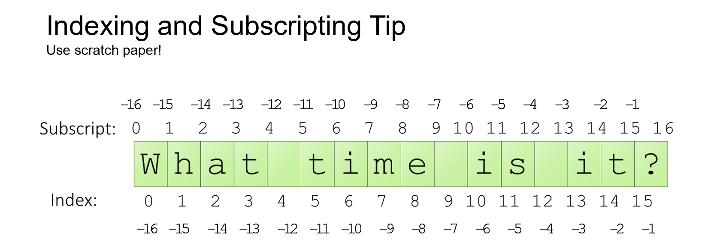

# Strings

[&laquo; Return to the Chapter Index](index.md)

<details open markdown="block">
  <summary>
    Table of contents
  </summary>
  {: .text-delta }
1. TOC
{:toc}
</details>

## Key Idea

A string is sequence of character values used to store text data.

## Overview

The `string` type is a primitive data type in Typescript. 
We can declare a variable to be of type string directly:

```typescript
let username: string = "gauss";
let password: string = 'captain';
```
{: .no-run}

Notice how we can use either single or double quotes to define a string.

## String Methods and operations

There are several functions which we can use to operate on strings in Typescript.
We will look at some of the most common ones briefly, but there are actually many more!


### *charAt*, *indexOf*, and *lastIndexOf*

You can use the `charAt`, `indexOf`, and `lastIndexOf` methods to get information about the characters in a string.

* `charAt(index)`: This method will return character at the specified index, or an empty string if the index is out of range.
* `indexOf(value)`: This method will return the index of the first occurrence of the specified value, or -1 if not found.
* `lastIndexOf(value)`: This method will return the index of the last occurrence of the specified value, or -1 if not found.

As a more concrete example:

```typescript
let myStr: string = "Hello World";

console.log(myStr.charAt(2)); // "l"
console.log(myStr.indexOf("o")); // 4
console.log(myStr.indexOf("x")); // -1
console.log(myStr.indexOf("lo")); // 3
console.log(myStr.lastIndexOf("o")); // 7
console.log(myStr.lastIndexOf("z")); // -1
```

### Square Bracket Access of Strings

Besides using the `charAt` method, you can also access individual characters in a string using square brackets.

```typescript
let myStr: string = "Hello World";

console.log(myStr[2]); // "l"
console.log(myStr[4]); // "o"
console.log(myStr[10]); // "d"
```

#### No Negative Indices with Brackets

Unlike Python, you cannot access characters in a string using negative indexes in TypeScript. The result will be the special value `undefined`.

```typescript
let myStr: string = "Hello World";

console.log(myStr[-1]); // undefined
console.log(myStr[-2]); // undefined
```

With the `charAt` method, the result would be an empty string instead.

### Taking Parts of Strings with `slice`

You can use the `slice` method to extract parts of a string.
* The first parameter is the starting slice position.
* The second parameter is the ending slice position (not included in the result).
* If the second parameter is omitted, the slice will go to the end of the string.
* If the first parameter is negative, it will be treated as an offset from the end of the string.
* If the second parameter is negative, it will be treated as an offset from the end of the string.

```typescript
let myStr: string = "Hello World";

console.log(myStr.slice(2)); // "llo World"
console.log(myStr.slice(2, 5)); // "llo"
console.log(myStr.slice(-1)); // "d"
console.log(myStr.slice(-3)); // "ld"
console.log(myStr.slice(0, -1)); // "Hello Worl"
console.log(myStr.slice(5, -3)); // " World"
console.log(myStr.slice(5, 3)); // ""
console.log(myStr.slice(4, 5)); // "o"
```

### Indexes and Slices in Strings



It can be difficult to remember how string slicing works, compared to regular indexes. The image above should help you remember how to slice strings:
* When indexing, put numbers directly below the characters
* When slicing, put the numbers *between* the characters.

```typescript
let message: string = "What time is it?";

console.log(message.slice(0, 4)); // "What"
console.log(message.slice(5, 9)); // "time"
console.log(message.slice(-1)); // "?"
console.log(message.slice(-3)); // "it?"
console.log(message.slice(0, -1)); // "What time is it"
console.log(message.slice(5, -3)); // "time is"
console.log(message.slice(5, 3)); // ""
console.log(message.slice(4, 5)); // " "
```

### Combining Strings with `concat`

The `concat` method will combine two separate strings and return that combined string.

```typescript
let myStr1: string = "Hello";
let myStr2: string = "World";

console.log(myStr1.concat(myStr2)); // "HelloWorld"
console.log(myStr1.concat(" ", myStr2)); // "Hello World"
console.log(myStr2.concat(myStr1)); // "WorldHello"
console.log(myStr2.concat(",", myStr1)); // "World,Hello"
```

### Combining Strings with `+`

Note that you can also use the `+` operator to concatenate strings:

```typescript
let myStr1: string = "Hello";
let myStr2: string = "World";

let combined: string = myStr1 + " " + myStr2;
console.log(combined); // "Hello World"
```

The advantages of `concat` are that:
* You can combine more than two strings at once with a single operation
* You can make sure that you are only combining strings (no numbers or other types), since `concat` only works with strings. With the `+` operator, you can accidentally add numbers to strings, which can lead to unexpected results (since JavaScript will convert the number to a string and concatenate it).

### The `substring` method

* Assume the string ```let myStr="Hello World";```
* __split():__  Splits the specified String object into an array of strings.
  * myStr.split(" "); //returns the array \["Hello","World"\]
* __substring():__  Returns character of string between two define indexes.
  * myStr.substring(2); // returns "llo World"
  * myStr.substring(2,5); // returns "llo"
  > _Note: the first parameter is the index of the first character to return, and the second is the index of the first character NOT returned._
  
The `substring` and `slice` methods are very similar, with two differences:
* The main difference is that if the second parameter is less than the first, the `substring` method will swap them. The `slice` method will return an empty string in this case.
* The `substring` method does not support negative indexes.

### The `toLowerCase` and `toUpperCase` methods

The `toLowerCase` and `toUpperCase` methods will create a new string with all characters in either lowercase or uppercase, respectively.

```typescript
let myStr: string = "Hello World";

console.log(myStr.toLowerCase()); // "hello world"
console.log(myStr.toUpperCase()); // "HELLO WORLD"
```

Notice how the methods take no arguments; the parentheses are still required to call the method, even with nothing in between them. These are __nullary__ methods because they take no arguments.

### Number to String Conversion with `parseInt` and `+`


What if the string contains a number and we want to convert it to a number type? We can use two approaches:
* `parseInt`: This function will convert a string to a number, but only if the string contains a valid number. If the string does not contain a valid number, `parseInt` will return `NaN`.
* `+`: The unary addition operator can be placed before a value to convert the value to a number. This is different than the binary addition operator, which will add two numbers or strings together. The unary addition operator is less explicit than `parseInt`, but it is a common shorthand.

```typescript
let myNumStr: string = "42";

let myNum: number = parseInt(myNumStr); // this function does the trick
let myNum2: number = +myNumStr; // this also works, but is less explicit
console.log(myNum);
console.log(myNum2);
```

If `myNumStr` did not contain a valid number, the `parseInt` function would return the special value `NaN` to specify "Not a number".

```typescript
let myNumStr: string = "Hello";

let myNum: number = parseInt(myNumStr); // NaN
let myNum2: number = +myNumStr; // NaN
console.log(myNum);
console.log(myNum2);
```

### Number to String Conversion with `toString`

If we want to go the other way, and convert a number to a string, we can use the `toString` method to explicitly convert a non-string value to a string.

```typescript
let myNum: number = 42;

let myNumStr: string = myNum.toString();
console.log(myNumStr);
```

The `toString` method is available on all non-string types in TypeScript, by default. That means we can use it on numbers, booleans, and other more complex types (although that is not always useful, as we will see).

### Implicit String Conversion with `+`

If you use the binary `+` operator to combine a string and a number, the number will be converted to a string automatically.

```typescript
let myNum: number = 42;
let myStr: string = "The answer is " + myNum;
console.log(myStr);
```

This can be a useful shorthand, but it can also lead to unexpected results if you are not careful. For example, if you add a number to a string, the number will be converted to a string and concatenated to the other string.

```typescript
let myNum: number = 42;
let myStr: string = "The answer is " + myNum + 1;
console.log(myStr); // "The answer is 421"
```

### Strings Are Immutable

The `slice` method does NOT modify the string. In fact, no methods or functions can modify a string in TypeScript. Instead, they return a new string.

```typescript
let myStr: string = "Hello World";

myStr.slice(1, 3); // "el"
console.log(myStr); // "Hello World"
```

### Other String Methods

There are MANY other methods available to the string type, but these are some of the more useful and common.  Some other useful ones we will not cover in detail here are:

* `startsWith(pattern)`/`endsWith(pattern)`: Check if a string starts or ends with a certain value
* `includes(pattern)`: Check if a string contains a certain value anywhere inside
* `padStart(length, padString)`/`padEnd(length, padString)`: Add characters to the start or end of a string.
* `replace(pattern, replacement)`: Replace a pattern with a new string
* `replaceAll(pattern, replacement)`: Replace all occurrences of a pattern with a new string
* `search(pattern)`: Find the index of a pattern in a string
* `trim`/`trimStart`/`trimEnd`: Remove whitespace from the start, end, or both ends of a string
* `split(separator)`: Split a string into an array of strings based on a separator

## Summary

* Strings are a fundamental data type in TypeScript, used to store text data. 
* There are many methods available to manipulate strings, and we have only covered a few of the most common ones here:
  * `charAt`, `indexOf`, and `lastIndexOf` to get information about characters in a string
  * `slice` to extract parts of a string
  * `concat` and `+` to combine strings
  * `substring` to get a substring of a string
  * `toLowerCase` and `toUpperCase` to change the case of a string
  * `parseInt` and `+` to convert a string to a number
  * `toString` to convert a number to a string
  * `slice` to extract parts of a string
* Strings are immutable in TypeScript, so any method that modifies a string will return a new string instead of modifying the original.

# Next Step

Now onto the next chapter: [Loops and Arrays &raquo;](../2-loops/index.md)