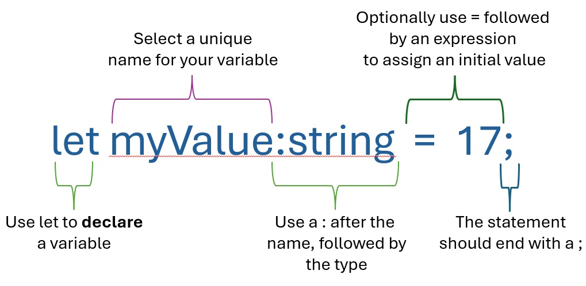

# Variables

[&laquo; Return to the Chapter Index](index.md)

<details open markdown="block">
  <summary>
    Table of contents
  </summary>
  {: .text-delta }
1. TOC
{:toc}
</details>

## Key Idea

A variable is a named container for some unknown value. We can use variables to create generic code that works on different values.

## Motivation

### Simple Math Example

Consider a simple math expression:

```
3+4
```

This is useful in computing this specific **value** (`7`), but is only useful in that one particular case.
On the other hand:

```
X+4
```

This would compute the same value if `X=3`, but would also compute a correct value for any other value of `X`.
This is the basic idea of why we use variables. We can write a single expression that computes a correct answer for many possible values of `X` (the **variable**).

### Another Math Example


Using variables we can represent concepts like the equation of a line. In the visualization shown:

-   `m` is the slope of the line (change in `y` over change in `x`) and
-   `c` is where the line intersects the `y` axis.

The equation `y = mx + c` represents every possible straight line.

`y = 2x + 4` represents a specific line. By assigning a value to the variable `x` we can compute the appropriate `y` for this line.

Just like we can use variables in math to create an expression that represents a line, in Computer Science we can use the same idea to create code that computes the correct answer for a variety of input values.

## Variables Have Types

But what happens if we do this?

```
x = "hello"
y = 2 * x + 4
```

This doesn't make any sense.

To make sure that our code makes sense, we attach a **type** to our variables so that we will get an error if we try to assign a value to the variable that is not appropriate.

We do this by declaring the variable and specifying what type of data it can contain. Once declared, we will not be able to assign an inappropriate value type to that variable.

## Declare Variables

So how do we **declare** a variable?
It depends on the language we are using, but in general, we specify:

-   its name,
-   its type, and
-   potentially its initial value.

{: .warning-title}

> Assign Before Use
>
> Note, if we do not specify a variable's initial value, then we cannot read the variable's value until we do.

In this short TypeScript code snippet, we declare the variable `myValue` to hold a number and assign it an initial value of `4`.
We declare the variable `answer` as a `number`, but do not give it a value.
We then compute `myValue+3` and store it in answer.

```typescript
let myValue: number = 4;
let answer: number;
answer = myValue + 3;
console.log(answer);
```

## Declaration Syntax



Some key notes on the syntax of declaring a variable:

-   Use `let` to **declare** a variable.
-   Use `:` symbol after the name, followed by the type.
-   Use `=` followed by an expression to assign an initial value.
-   The statement should end with a `;`

## Types in TypeScript

Typescript has only three basic types.

-   `number`: Holds any numeric data (e.g. `42` or `3.14159`)
-   `string`: Holds a string of characters (e.g. `"Hello World"`)
-   `boolean`: Holds the value `true` or `false`

There are other more complex types we will examine later (like arrays) and we can even create our own types to use in our programs.

## The ***const*** keyword

The ```const``` keyword in TypeScript is used to declare variables whose values are intended to remain constant once assigned. It provides developers with a way to ensure that the variable cannot be reassigned, promoting safer and more predictable code.

**Immutable Binding:** The ```const``` keyword ensures that a variable cannot be reassigned after it is initialized. This is particularly useful for defining constants or values that should not change throughout the execution of your program.

```
const PI = 3.14; 
PI = 3.14159; // Error: Cannot reassign a const variable.
```

While this might seem unnecessary, using ***const*** allows the programmer to express intention which is both helpful to make code more readable, and useful in debugging.

An example of some defined constants.

{:.no-run}

```typescript
const pi: number=3.1415927;
const sol_ms: number=299792458; //speed of light in m/s
```

> In some programming languages, using ```const``` can also lead to more efficient memory access as those values do not need to be changed.

## Combining Variables

```typescript
// Code to compute the area of a circle with radius 2.
const pi: number = 3.1415927;
let r: number = 2;
let answer: number = pi * r * r;
console.log(answer);
```

If we change the value of `r`, then we compute the area of a different circle.

Later we will look at turning this code into a **function** that can be called with different values of `r` and reused.

If we assign a non-numeric value to `r` (which makes no sense) we would get a compiler error telling us where the problem is so we can fix it.

```typescript
const pi: number = 3.1415927;
let r: number = "Hello";
let answer: number = pi * r * r;
console.log(answer);
```

## Boolean Expressions

Since a variable can take on many values, we might want to compare the value to something to see if it is the same, or greater than or less than.

In TypeScript, we do this with:

-   `===`: test if equal
-   `!==`: test if not equal
-   `<=`: test if less than or equal to,
-   `>=`: test if greater than or equal to
-   `<`: test if less than
-   `>`: test if greater than

{: .info-title}
Note that the equality operator is `===` (three equal signs) and not `==` (two equal signs). There is a double equal operator (`==`) operator, but it is not recommended to use it since it is not type safe. Most modern TypeScript code will use the triple equal operator (`===`).

The result of the expression will have the type **boolean**. That is, it will be either `true` or `false`.

```typescript
let myValue: number = 5;
let isEqual: boolean = myValue === 5;
// isEqual will be true
let isGreater: boolean = myValue > 5;
// isGreater will be false
let isLessEqual: boolean = myValue <= 5;
// isLessEqual will be true
console.log(isEqual);
console.log(isLessEqual);
let myString: string = "Hello";
let isStrEqual: boolean = myString === "Hello";
// isStrEqual will be true
let isStrEqual2: boolean = myString !== "Hello";
// isStrEqual2 will be false
console.log(isStrEqual);
```

## Summary

Variables are a powerful way to create generic code that produces expected results on a variety of different inputs.

The values that we assign to variables can come from many sources like data files, user input, databases, or online resources. The code will work regardless of the values so long as they are of the correct type.

Throughout this text we will use variables to create reusable code. We will later learn other data types, and even how to create our own types containing complex data.

# Next Step

Next we'll review [Functions &raquo;](../1-typescript/functions.md)
