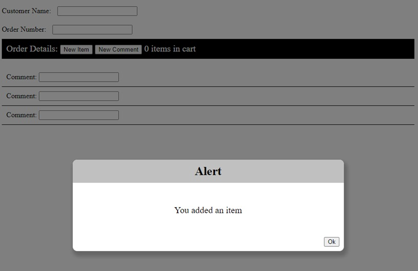
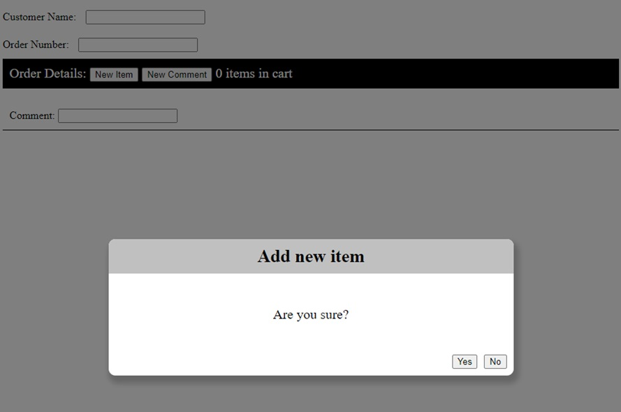
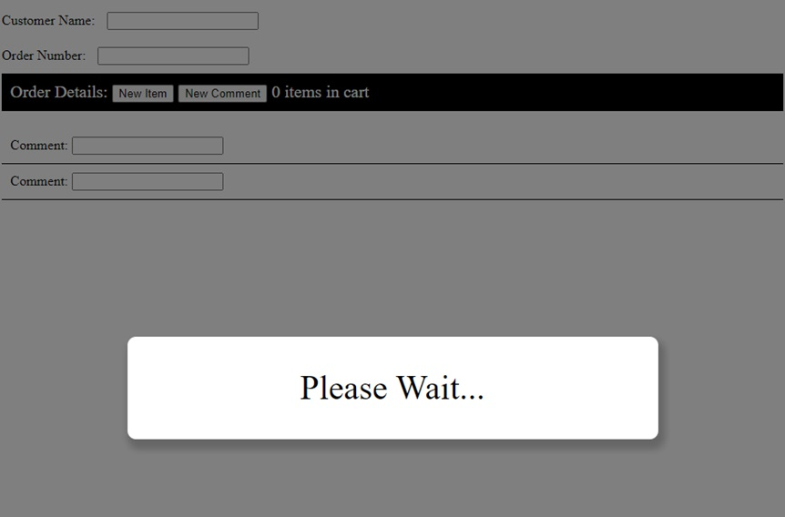

# Webz Dialogs

[&laquo; Return to the Chapter Index](index.md)

<details open markdown="block">
  <summary>
    Table of contents
  </summary>
  {: .text-delta }
1. TOC
{:toc}
</details>

## Key Idea

Popup windows and dialog boxes can be challenging in web development. Webz provides an easy mechanism for creating them.

## Overview

Sometimes we want to create an overlay window that sits on top of our page, prevents us from clicking elsewhere on our page, and has its own content and behaviors.
Webz provides two methods for doing this:

-   `Popup`: Creates a popup window with a title, some text, and buttons that returns the text on the button through a Notifier.
-   `Dialog`: Creates a popup window whose content is determined by a component. These can be created with the cli (`webz dialog myDlg`).

## Popups

The popup window is provided as an easy way to interact with your user for a quick message or question. This is similar to the javascript alert/confirm methods, but looks a lot better and is more flexible. To show a popup we simply call the popup method of the `WebzDialog` class. This is a static method (means it does not exist on an instance of `WebzDialog` but rather can be called directly on the type).

{: .no-run }

```typescript
WebzDialog.popup(attachTo: WebzComponent, message: string, title?: string, buttons?: string[], btnClass?: string):Notifier<string>
```

We can call this method to show a dialog box:

{: .no-run }

```typescript
WebzDialog.popup(
    this,
    "Hello World",
    "I am the title",
    ["Yes", "No"],
    "btnClass"
);
```

Popup returns a Notifier<string> which emits the text of the button pressed.
We can subscribe to the returned value to be notified when the popup closed.

Let's examine this in detail:

-   `attachTo` (required): is the component that you want to attach the element to. Usually you will pass in this to specify the current component.
-   `message` (required): The text inside the popup
-   `title` (optional): The title for your popup, displayed at the top.
-   `buttons` (optional): An array of strings that are the labels of the buttons that you want to display. By default there is a single OK button.
-   `btnClass` (optional): An optional css class string to style the buttons. This allows you to optionally attach a css class to the button for styling.
-   Returns: A ```notifier``` that emits the label of the pressed button.

Back to our point of sale example, we can use a popup to notify the user that a comment was added.

{: .no-run }

```typescript
	@Click("addCommentButton")
	onNewCommentClick() {
		const comment = new LineCommentComponent();
		this.comments.push(comment);
		this.commentText.push("");
		this.addComponent(comment, "orderDetails");
		let index = this.commentCount++;
		comment.commentChange.subscribe((comment: string) => {
			this.commentText[index] = comment;
			console.log(this.commentText);
		});
		WebzDialog.popup(this,"Item added.")
	}
```

Here we have added a popup with the default title `Alert` and the default buttons `Ok`.
We have not subscribed since I do not need notification of when the window closes, and there is only one button the user could have clicked.
We could have subscribed if I needed to know that the popup was closed.



Notice how the popup greys out the underlying website. You cannot click buttons or enter text while the popup is open.
Once it is closed, the gray background goes away and the rest of the page will again accept input.
With this screen, the only thing I can do is click ok.

Let's look at a more complex example:

{: .no-run }

```typescript
	@Click("addCommentButton")
	onNewCommentClick() {
		WebzDialog.popup(this, "Are you sure?", "Add new item",["Yes","No"],
		).subscribe((result: string) => {
			if (result == "Yes") {
				const comment = new LineCommentComponent();
				this.comments.push(comment);
				this.commentText.push("");
				this.addComponent(comment, "orderDetails");
				let index = this.commentCount++;
				comment.commentChange.subscribe((comment: string) => {
					this.commentText[index] = comment;
					console.log(this.commentText);
				});
			}
		});
	}
```

Here we have added a popup to ask the user if they are sure before adding the item, and then only adding it if they click the "Yes" button.
We subscribe to the ```Notifier``` returned by the popup method to see when the window closes and which button was pressed.

> Note: We moved all of the code inside the anonymous function so that it will only be called after the popup is closed.



## Dialogs

Dialogs work similarly, except they do not have a pre-defined structure. You can create them as a component where you control the layout and any Notifiers you want to implement.
Creating a new dialog is as simple as: `webz dialog myDialog`

Like webz component, this creates a new component, but it will behave and look like a popup window, only its content will be your new component.
The default implementation is a simple popup with an ok button that closes when the user clicks it. We can close a window by calling the member method this.show(true/false).
We add it just like any other component using addComponent, then display it by calling show(true).

{: .no-run }

```typescript
dialog: MyDlgDialog = new MyDlgDialog();
constructor() {
	super(html, css);
	this.addComponent(this.dialog);
}
showDialog(){
	this.dialog.show(true);
}
hideDialog(){
	this.dialog.show(false);
}
```

First we create a variable to hold our dialog:
We can then add it to the component:

> Note, if you want it to display immediately, then you can call show with true `this.dialog.show(true);`

Whenever we want to show the dialog, we just pass true to it's show method. To hide it we pass false.

If we want to get an event to subscribe to when the window is closed, or something happens in the dialog, we can implement our own Notifiers and subscribe to them in the parent.

### An Example

A simple please wait dialog with no buttons.
To make this simple, I am just going to use text, but you could use an animated gif or do some css magic to add some movement to this dialog (we will do that in a few minutes with a timer).
First we will create a new dialog with the cli: `webz dialog Pleasewait`

For the body of our dialog, we will just center a string that says "Please Wait..."

{: .no-run }

```html
<div class="content">
    <div class="body">Please Wait...</div>
</div>
```

{: .no-run }

```css
.content {
    width: 600px;
}
.body {
    text-align: center;
    font-size: 40px;
    line-height: 100px;
}
```

> Note: We are not showing the typescript for ```PlsWaitDialog``` as it is unmodified.

In the parent, we create a property for our dialog and add it to the component.

{: .no-run }

```typescript
plsWait: PleaseWaitDialog = new PleaseWaitDialog();

constructor(){
	this.addComponent(this.plsWait);
}
```

When we want the dialog we can simply display it while some time consuming task is occurring, then hide it after.

{: .no-run }

```typescript
this.plsWait.show(true);
//do something that takes a while
this.plsWait.show(false);
```



Here you can see the output after a call to plsWait.show(true).
Just like the popup, the rest of the website is grayed out and cannot be interacted with.

## Working Example

Here is a working example of the please wait dialog in action.  Note that we never close the dialog as we don't have anything time consuming to do.  In the next sections we will learn about ```Timers``` which allow us to execute code after a delay.

{:data-filename="main.component.ts"}

```typescript
import html from "./main.component.html";
import {WebzComponent} from "@boots-edu/webz";
import { PleaseWaitDialog } from "./please-wait.dialog";

export class MainComponent extends WebzComponent {
	plsWait: PleaseWaitDialog = new PleaseWaitDialog();
    constructor() {
        super(html, "");
		this.addComponent(this.plsWait);
		this.showDialog();
    }
	
	showDialog(){
		this.plsWait.show(true);
	}
	
	hideDialog(){
		this.plsWait.show(false);
	}		
}
```

{:data-filename="main.component.html"}

```html
<div class="container">
Example Dialog
</div>
```

{:data-filename="please-wait.dialog.html"}

```html
<div class="content">
    <div class="body">Please Wait...</div>
</div>
```

{:data-filename="please-wait.dialog.ts"}

```typescript
import { WebzDialog } from "@boots-edu/webz";
import html from './please-wait.dialog.html';

export class PleaseWaitDialog extends WebzDialog {
    constructor() {
        super(html,
			    `
				.body {
    				text-align: center;
    				font-size: 40px;
    				line-height: 100px;
				}`);
    }
}
```

## Summary

Creating a good user interface is critical to having your software accepted by users. Dialogs and popups are an excellent mechanism for communicating and querying simple information from the user. Webz provides a simple **_popup_** method for simple interactions, and a **_dialog_** class to derive from for creating custom layouts.

# Next Step

Next we'll learn about timers [Webz Timers &raquo;](../10-webz-advanced/timers.md)
