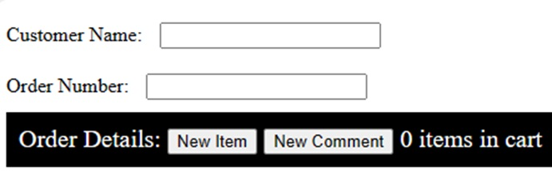
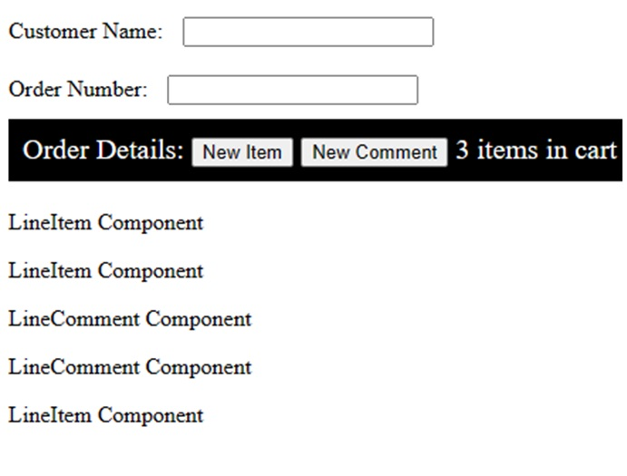

# Dynamic Components
[« Return to the Chapter Index](index.md)

<details open markdown="block">
  <summary>
    Table of contents
  </summary>
  {: .text-delta }
1. TOC
{:toc}
</details>

## Key Idea
We can create and attach components dynamically in order to create complex applicaitons. 

## Building dynamic applications
Say we wanted to make a simple point of sale system.  
* Getting the customer name and order number is easy. We just create some input boxes and bind the @Input event to a function that updates an internal variable.
* We can easily bind the @Click event of buttons to add new items to our order.
* How do we deal with a variable number of line items in the order?

Let's start by creating a simple page in html/css for the things we know how to do, and a div to hold our line items once we create them.
```html
<div class="form-container">
	Customer Name: <input type="text" id="customerName" /><br />
	Order Number: <input type="text" id="orderNumber" />
	<div class="detail-header">
		Order Details:         <button id="addItemButton">New Item</button>
		<button id="addCommentButton">New Comment</button>
		<div id="counter">0</div>
	</div>
	<div id="orderDetails"></div>
</div>
```
```css
.detail-header {
	font-size: 20px;
	color: white;
	margin-bottom: 20px;
	background-color: black;
	padding: 10px;
}
#counter {
	display: inline-block;
}
```
Now in the typescript file, we need to create variables to hold our order number and customer name.  These will be updated, but not bound directly (they could be).
We also need functions that are bound to the @Input event of these text boxes.  Finally we need functions bound to our add buttons.
```
	orderNumber: string = "";
	customerName: string = "";
	@BindValueToNumber("counter", " items in cart")
	count: number = 0;
	@Input("orderNumber")
	onOrderNumberChange(e: ValueEvent) {
		this.orderNumber = e.value;
	}
	@Input("customerName")
	onCustomerNameChange(e: ValueEvent) {
		this.customerName = e.value;
	}
	@Click("addItemButton")
	onNewItemClick() {
		//Add the item here
	}
	@Click("addCommentButton")
	onNewCommentClick() {
		//Add the comment here
	}
```
> Note we have not implemented onNewItemClick or onNewCommentClick, but we have the methods hooked up to the buttons so we just have to write the contents.

So what do we do inside the click handlers?  Assume we have created components for one line item or one line comment already using the cli.  Then we:
* Create the correct type of child component (info or comment) and store it somewhere so we can reference it later.
* Add it to our orderDetails div so they show up in order created where we want them.
* Increment the counter if it’s an item

> Note: Since count is already bound to the counter div, all we have to do is update the variable to update the counter on the screen.

```
	items: LineItemComponent[] = [];
	comments: LineCommentComponent[] = [];
	@Click("addItemButton")
	onNewItemClick() {
		const item = new LineItemComponent();
		this.items.push(item);
		this.addComponent(item, "orderDetails");
		this.count++;
	}
	@Click("addCommentButton")
	onNewCommentClick() {
		const comment = new LineCommentComponent();
		this.comments.push(comment);
		this.addComponent(comment, "orderDetails");
	}
```



This is what our website looks like when we run it.  If we type in the text boxes, our member variables are automatically updated.  If the count property of the class is changed, the number of items in the cart will change.  If we click on our buttons, our event handlers are called.  Those click handlers create a new component and add it to the orderDetails in the order they are created.



This is what our website looks like after we press new item twice, comment twice, then new item a third time.  Since the click handler updated count, the correct count is displayed.  The different types of line items are interspersed.  They are displayed in the page where we want them since we added them to the orderDetails element.


## Summary
We can create dynamic components by adding them to an existing component using the ```addComponent(...)``` method.  Adding components dynamically allows us to create interactive web applications and reuse components (like our line item component) over and over again as appropriate.

# Next Step

Next we'll learn about component communication  [Webz Events &raquo;](../10-webz-advanced/events.md)