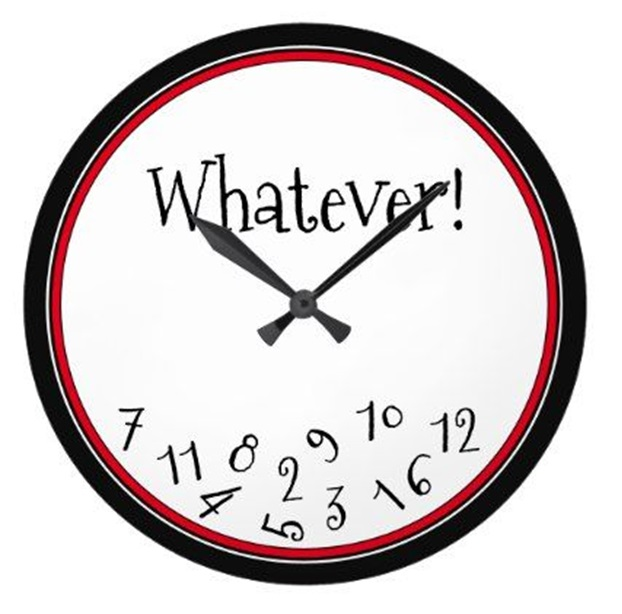

# Webz Timers

[&laquo; Return to the Chapter Index](index.md)

<details open markdown="block">
  <summary>
    Table of contents
  </summary>
  {: .text-delta }
1. TOC
{:toc}
</details>

## Key Idea

We can cause things to happen periodically by using a **_timer_**. Timers allow us to schedule actions to occur once per time interval.

## Overview



Sometimes we want to do something periodically while our site is displayed

-   Update a timer
-   Refresh data from a backend
-   Move a game element
-   Animation
-   Anything else we want to accomplish on an interval.

This can be useful to provide more interactivity to your site.

## Using Timers

Returning to our PleaseWait dialog, we can use a timer to make it more interesting.
First, we will bind a variable to the text we are displaying:

```
@BindValue("displayDots")
displayDots: string = "";
```

We will modify the html and add a div with the id displayDots.

```html
<div class="content">
    <div class="body">
        Please Wait
        <div id="displayDots"></div>
    </div>
</div>
```

And style it so that it has a fixed width and will appear inline after the words Please Wait.

```css
#displayDots {
    width: 50px;
    display: inline-block;
    text-align: left;
}
```

The plan is to change displayDots to contain 1, 2, or 3 dots and change it once a second.

To implement the behavior, we will use the **_@Timer_** decorator to decorate a function hat we want called periodically.
Passing 1000 to the timer method causes onTimer to be called once a second while the page is displayed (forever: more on this later). 1 second= 1000 milliseconds
Each time it is called, we check a counter that will keep track of how many dots are displayed. When we get to 3, we set it back to 0. Otherwise, we draw the correct number of dots (count+1 because count goes from 0-2) by updating our displayDots property which is bound to the page.

{ .no-run }
```typescript
@Timer(1000)
private onTimer() {
	if (this.count === 3) {
		this.count = 0;
	}
	this.displayDots = ".".repeat(this.count + 1);
	this.count = this.count + 1;
}
```

## Summary

We can use a timer to cause a function to be called periodically. The @Timer directive takes the number of milliseconds between calls, and runs until the page exits.

# Next Step

Next we'll build an image editor in Webz by following the [Advanced Webz tutorial &raquo;](./tutorial.md)
