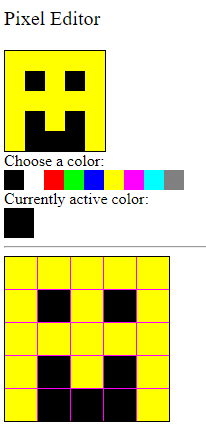
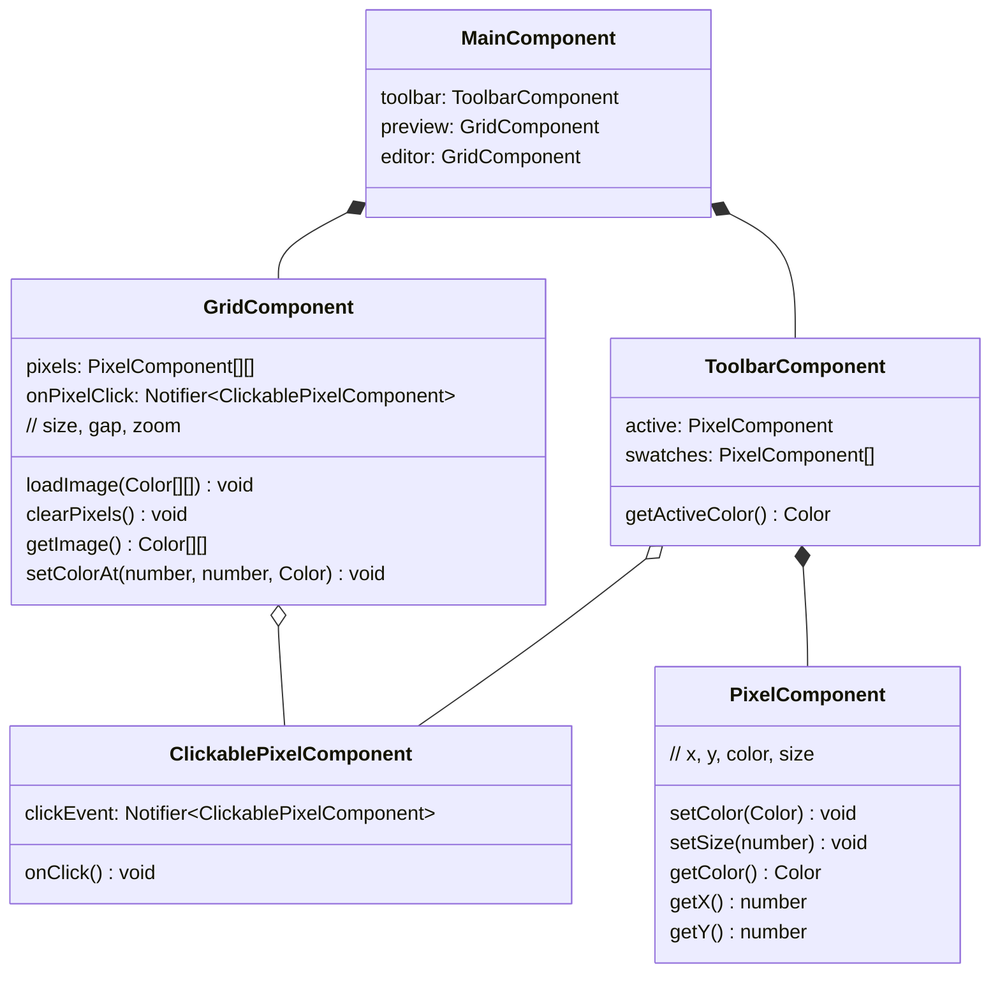
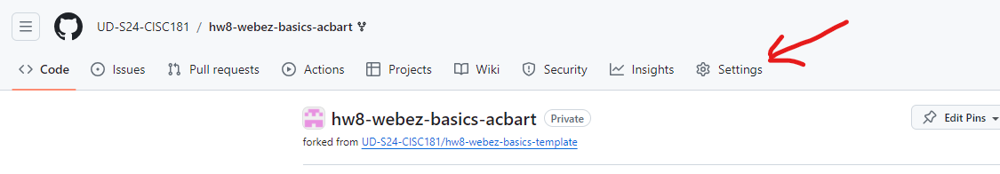
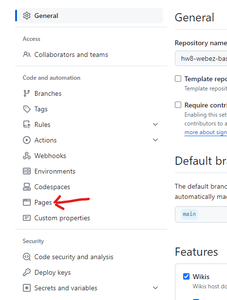
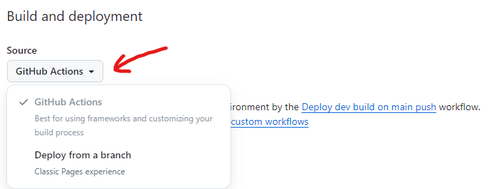
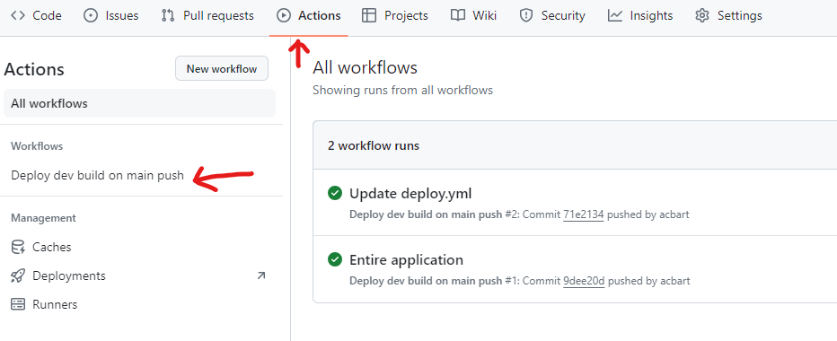
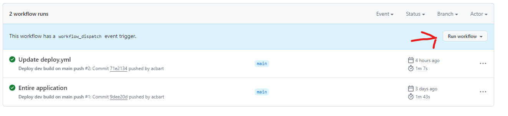
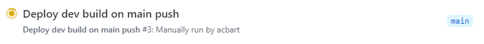
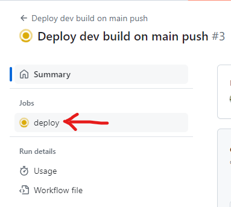
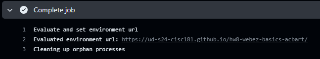

# Webz Advanced Tutorial
[&laquo; Return to the Chapter Index](index.md)

<details open markdown="block">
  <summary>
    Table of contents
  </summary>
  {: .text-delta }
1. TOC
{:toc}
</details>

## Key Idea
**Notifier** is a powerful class for facilitating inter-component data transfer in Webz.


This tutorial will walk you through building a more complex Webz application with multiple components and dynamic content. This will involve creating a new component, binding data between components, and handling events. By the end of this tutorial, you will have a better understanding of how to build more complex applications with Webz.

# The Image Editor

Our goal is to create a simple image editor to edit pixel art. We will create a component that displays an image and allows the user to edit the image by changing the color of individual pixels. We will also create a color picker component that allows the user to select a color to use for editing the image.



## 0) Setup

1. Use the Github classroom link provided in the original assignment on Canvas to create your own copy of the starter repo.
2. Clone the repo to your local machine in an appropriate directory.
3. Open the directory in VS Code, as you normally do.
4. Run `npm install` in the VS Code terminal to install the dependencies.

```bash
npm install
```

1. Run `npm run start` in the terminal to start the development server. This may take a few seconds to compile the code and start the server. If you need to stop the server, you can press `Ctrl+C` in the terminal.

<details markdown="block">
<summary>You can click here to see what the output looks like for us when the server starts successfully.</summary>

Keep in mind that the details of your output may look different!

```
> hw9-webz-advanced@0.0.1 start
> webpack serve

<i> [webpack-dev-server] Project is running at:
<i> [webpack-dev-server] Loopback: http://localhost:8080/
<i> [webpack-dev-server] On Your Network (IPv4): http://10.0.0.154:8080/
<i> [webpack-dev-server] On Your Network (IPv6): http://[fe80::33d:1bcd:53b8:4c62]:8080/
<i> [webpack-dev-server] Content not from webpack is served from 'C:\Users\acbar\Projects\cisc181\sites\hw9-webz-advanced\public' directory
<i> [webpack-dev-server] 404s will fallback to '/index.html'
assets by path assets/ 110 KiB
  asset assets/babbage.jpg 63.8 KiB [emitted] [from: assets/babbage.jpg] [copied]
  asset assets/ada.jpg 45.9 KiB [emitted] [from: assets/ada.jpg] [copied]
  asset assets/.keep 0 bytes [emitted] [from: assets/.keep] [copied]
asset main.bundle.js 367 KiB [emitted] (name: main) 1 related asset
asset index.html 198 bytes [emitted]
runtime modules 27.4 KiB 13 modules
modules by path ./node_modules/ 219 KiB 41 modules
modules by path ./src/app/ 38.9 KiB
  modules by path ./src/app/boop-button/ 7.3 KiB 4 modules
  modules by path ./src/app/simple-calculator/ 12.2 KiB 4 modules
  modules by path ./src/app/box-editor/ 10.7 KiB 4 modules
  modules by path ./src/app/*.css 3.02 KiB 2 modules
  ./src/app/main.component.ts 5.21 KiB [built] [code generated]
  ./src/app/main.component.html 445 bytes [built] [code generated]
modules by path ./*.css 3.5 KiB
  ./styles.css 2.23 KiB [built] [code generated]
  ./node_modules/css-loader/dist/cjs.js!./styles.css 1.27 KiB [built] [code generated]
./wbcore/start.ts 265 bytes [built] [code generated]
webpack 5.91.0 compiled successfully in 4226 ms
```
</details>

6. Although we could now open your website in chrome at the localhost url `http://localhost:8080`, we will use the integrated debugger in VS Code. Activate this by pressing `F5` on your keyboard (or selecting the `Run` tab from the top menu and then clicking `Start Debugging`). This will open a new browser window with your application running. The debugger has a bunch of useful features, like setting breakpoints and inspecting variables - we'll talk more about them later on.

{: .note-title }
> Debugging in VS Code
>
> You can only activate the debugger if you have the server running. If you close the server, you will need to start it again before you can use the debugger.

7. You should now be able to see your website. Now we can start making the actual application.

## 1) Colors

Our goal is to eventually create a simple image editor, but that all begins with a representation of colors. We will create a `Color` class that represents a color as an RGB value. This will not be a `WebzComponent`, but a simple TypeScript class. We'll eventually create other components that use this class.

1. Create a new file in the `src/app` directory called `color.ts`. Create and export a class called `Color` with three private properties: `red`, `green`, and `blue`. These properties should be numbers that represent the red, green, and blue values of the color. The constructor should take three parameters, one for each property, in this order.

2. Define a method in the class named `toString()` that consumes nothing and returns a string. This method should return a string that represents the color in the format `rgb(red, green, blue)`. For example, if the color has `red=255`, `green=0`, and `blue=0`, the `toString()` method should return the string `rgb(255, 0, 0)`.

3. Define a method in the class named `asNumbers()` that consumes nothing and returns an array of three numbers. This method should return a newly created array with the red, green, and blue values of the color in that order.

### Palettes

Colors are usually described as a combination of red, green, and blue values. Each value can range from 0 to 255, where 0 means no color and 255 means the maximum amount of color. For example, `rgb(255, 0, 0)` is a bright red color, while `rgb(0, 255, 0)` is a bright green color.

However, writing out three numbers every time we want to represent a color can be cumbersome. Our application will use an additional color representation that is more user-friendly: a palette. A palette is an index of colors (usually an array of colors) that can be used to represent colors in a more user-friendly way. Specifically, we will use a palette of 9 colors (0-8) to represent colors in our image editor:

<table>
    <thead>
        <tr>
            <th>Palette Index</th>
            <th>Color Triple</th>
            <th>Name</th>
            <th>Preview</th>
        </tr>
    </thead>
    <tr><td>0</td><td><code>[0, 0, 0]</code></td><td>Black</td><td><div style="width: 20px; height: 20px; background-color: rgb(0, 0, 0);"></div></td></tr>
    <tr><td>1</td><td><code>[255, 255, 255]</code></td><td>White</td><td><div style="width: 20px; height: 20px; background-color: rgb(255, 255, 255); border: 1px solid black"></div></td></tr>
    <tr><td>2</td><td><code>[255, 0, 0]</code></td><td>Red</td><td><div style="width: 20px; height: 20px; background-color: rgb(255, 0, 0);"></div></td></tr>
    <tr><td>3</td><td><code>[0, 255, 0]</code></td><td>Green</td><td><div style="width: 20px; height: 20px; background-color: rgb(0, 255, 0);"></div></td></tr>
    <tr><td>4</td><td><code>[0, 0, 255]</code></td><td>Blue</td><td><div style="width: 20px; height: 20px; background-color: rgb(0, 0, 255);"></div></td></tr>
    <tr><td>5</td><td><code>[255, 255, 0]</code></td><td>Yellow</td><td><div style="width: 20px; height: 20px; background-color: rgb(255, 255, 0);"></div></td></tr>
    <tr><td>6</td><td><code>[255, 0, 255]</code></td><td>Magenta</td><td><div style="width: 20px; height: 20px; background-color: rgb(255, 0, 255);"></div></td></tr>
    <tr><td>7</td><td><code>[0, 255, 255]</code></td><td>Cyan</td><td><div style="width: 20px; height: 20px; background-color: rgb(0, 255, 255);"></div></td></tr>
    <tr><td>8</td><td><code>[128, 128, 128]</code></td><td>Gray</td><td><div style="width: 20px; height: 20px; background-color: rgb(128, 128, 128);"></div></td></tr>
</table>

This way, an image can be written as a 2D array of palette indices, where each index represents a color in the palette. For example, the following 2D grid represents a 5x5 image of a smiley face (remember that `0` is black and `5` is yellow):

<table>
    <tr>
        <td style="background-color: rgb(255, 255, 0);">5</td>
        <td style="background-color: rgb(255, 255, 0);">5</td>
        <td style="background-color: rgb(255, 255, 0);">5</td>
        <td style="background-color: rgb(255, 255, 0);">5</td>
        <td style="background-color: rgb(255, 255, 0);">5</td>
    </tr>
    <tr>
        <td style="background-color: rgb(255, 255, 0);">5</td>
        <td style="background-color: rgb(0, 0, 0); color: white">0</td>
        <td style="background-color: rgb(255, 255, 0);">5</td>
        <td style="background-color: rgb(0, 0, 0); color: white">0</td>
        <td style="background-color: rgb(255, 255, 0);">5</td>
    </tr>
    <tr>
        <td style="background-color: rgb(255, 255, 0);">5</td>
        <td style="background-color: rgb(255, 255, 0);">5</td>
        <td style="background-color: rgb(255, 255, 0);">5</td>
        <td style="background-color: rgb(255, 255, 0);">5</td>
        <td style="background-color: rgb(255, 255, 0);">5</td>
    </tr>
    <tr>
        <td style="background-color: rgb(255, 255, 0);">5</td>
        <td style="background-color: rgb(0, 0, 0); color: white">0</td>
        <td style="background-color: rgb(255, 255, 0);">5</td>
        <td style="background-color: rgb(0, 0, 0); color: white">0</td>
        <td style="background-color: rgb(255, 255, 0);">5</td>
    </tr>
    <tr>
        <td style="background-color: rgb(255, 255, 0);">5</td>
        <td style="background-color: rgb(0, 0, 0); color: white">0</td>
        <td style="background-color: rgb(0, 0, 0); color: white">0</td>
        <td style="background-color: rgb(0, 0, 0); color: white">0</td>
        <td style="background-color: rgb(255, 255, 0);">5</td>
    </tr>
</table>

This would translate to the following 2D number array in TypeScript:

{: .no-run }

```typescript
const smileyFace: number[][] = [
    [5, 5, 5, 5, 5],
    [5, 0, 5, 0, 5],
    [5, 5, 5, 5, 5],
    [5, 0, 5, 0, 5],
    [5, 0, 0, 0, 5]
];
```

<details markdown="block">
<summary>Which is much more compact than the <code>Color[][]</code> representation would be.</summary>

{: .no-run }

```typescript
const smileyFace: Color[][] = [
    [new Color(255, 255, 0), new Color(255, 255, 0), new Color(255, 255, 0), new Color(255, 255, 0), new Color(255, 255, 0)],
    [new Color(255, 255, 0), new Color(0, 0, 0), new Color(255, 255, 0), new Color(0, 0, 0), new Color(255, 255, 0)],
    [new Color(255, 255, 0), new Color(255, 255, 0), new Color(255, 255, 0), new Color(255, 255, 0), new Color(255, 255, 0)],
    [new Color(255, 255, 0), new Color(0, 0, 0), new Color(255, 255, 0), new Color(0, 0, 0), new Color(255, 255, 0)],
    [new Color(255, 255, 0), new Color(0, 0, 0), new Color(0, 0, 0), new Color(0, 0, 0), new Color(255, 255, 0)]
];
```
</details>

4. To make it possible to support palettes, we will need a `PALETTE` array that holds the colors of the palette. This array should be a constant array of `number[]` triples (arrays of length 3), where each index corresponds to the index of the color in the palette. For example, `PALETTE[0]` should be black (`[0, 0, 0]`), `PALETTE[1]` should be white (`[255, 255, 255]`), and so on. You will need to export the `PALETTE` array so that the test can access it.

{: .no-run }

```typescript
export const PALETTE: number[][] = [
    [0, 0, 0], // Black
    [255, 255, 255], // White
    [255, 0, 0], // Red
    [0, 255, 0], // Green
    [0, 0, 255], // Blue
    [255, 255, 0], // Yellow
    [255, 0, 255], // Magenta
    [0, 255, 255], // Cyan
    [128, 128, 128] // Gray
];
```

5. Create and export a function named `makeColor` that consumes a `number` and returns a `Color`. This function should take a number `index` and return a new `Color` object with the red, green, and blue values from the `PALETTE` array at the given index. For example, `makeColor(0)` should return a new `Color` object with the red, green, and blue values from `PALETTE[0]`. Additionally, if the index is out of bounds, the function should throw an error with an appropriate message (e.g., `"Invalid color index"`).

6. Finally, create and export a function named `convertPalette` that consumes a 2D number array (representing a palette-indexed image) and returns a 2D `Color` array. This function convert each of the palette-indexed numbers to a `Color` object using the `makeColor` function. For example, `convertPalette(smileyFace)` should return a 2D array of `Color` objects that represent the smiley face image.

{: .note-title }

> 2D Arrays
> 
> Notice that both the `PALETTE` and the `smileyFace` arrays are 2D arrays (an array of arrays). However, they are different types of arrays. The `PALETTE` array is an array of `number[]` triples, while the `smileyFace` array is an array of `number[]` arrays (with the outer array representing rows and the inner arrays representing individual columns within a row). This is because the `smileyFace` array represents a 2D grid of palette indices, while the `PALETTE` array represents a list of colors. Don't get these confused as you work with them!

If everything has been done correctly so far, you should be able to run the `Color` tests and see them pass. You can run the tests by running the following command in the terminal:

```bash
npm run test color
```

If the tests fail, then you can run them in interactive mode. This will make the tests run whenever you save a file, and you can see the output in the terminal. To run the tests in interactive mode, run the following command:

```bash
npm run watch color
```

## 2) Pixels

Now that we have a way to represent colors, we can create a `PixelComponent` class that represents a single pixel in an image. A pixel is a color at a specific location in an image. We will create a Pixel class that has a `color` property (a `Color` object), size (a `number`), and read-only `x` and `y` properties (numbers that represent the location of the pixel in the image).

These pixels are going to appear in multiple places in our editor. We'll make their size adjustable so that they can be used in different contexts (the preview area, the color picker, and the image editor itself). Since they're going to be used in multiple places, we'll make them a `WebzComponent` so that we can reuse them easily.

1. Run the following command in the `src/app/` directory to create a new component called `pixel`:

```bash
webz component pixel
```

A new directory called `pixel` will be created in the `src/app/` directory. This directory will contain the TypeScript, HTML, and CSS files for the Pixel component: `pixel.component.ts`, `pixel.component.test.ts`, `pixel.component.html`, and `pixel.component.css`.

This class is going to be used by many other classes, but we don't actually place it in on the screen until we have a Grid or Toolbar to place it in. However, during development, you may find it easier to add a `PixelComponent` Component to the `Main` component so that you can see it in the browser. You can do this by adding the following code to the `Main` component:

{: .no-run }

```typescript
import { PixelComponent } from "./pixel/pixel.component";

// ...

export class MainComponent extends WebzComponent {
    constructor() {
        super(html, css);

        // Create a test pixel
        const testPixel = new PixelComponent(0, 0);
        testPixel.setColor(new Color(255, 0, 0)); // Red
        testPixel.setSize(50); // 50px by 50px
        this.addComponent(testPixel,"pixels");
        // Delete this before you are finished!
    }
}
```

1. To further test your `PixelComponent`, we created some tests that are specifically for the `PixelComponent`. Since you just created the `PixelComponent`, these tests are not yet in the `pixel.component.test.ts` file. You'll need to add them yourself. Copy all of the following code and paste it into the `pixel.component.test.ts` file, making sure to replace any existing code in that file.

{: .no-run }

```typescript
import { describe, expect, test, beforeAll } from "@jest/globals";
import { PixelComponent } from "./pixel.component";
import { bootstrap } from "@boots-edu/webz";
import { Color } from "../color";

describe("PixelComponent", () => {
    let component: PixelComponent | undefined = undefined;
    beforeAll(() => {
        const html: string = `<div>Testing Environment</div><div id='main-target'></div>`;
        component = bootstrap<PixelComponent>(PixelComponent, html);
    });
    describe("Constructor", () => {
        test("Create Instance", () => {
            expect(component).toBeInstanceOf(PixelComponent);
        });
    });

    // New tests!
    describe("Methods", () => {
        test("(1pts) Pixels can change color", () => {
            expect(component).toBeDefined();
            if (component === undefined) {
                return;
            }
            // Try changing it to be red
            const red = new Color(255, 0, 0);
            component.setColor(red);
            expect(component.getColor()).toEqual(red);
            expect(component["shadow"].getElementById("pixel").style.backgroundColor).toBe("rgb(255, 0, 0)");

            // Try changing it to be cyan
            const cyan = new Color(0, 255, 255);
            component.setColor(cyan);
            expect(component.getColor()).toEqual(cyan);
            expect(component["shadow"].getElementById("pixel").style.backgroundColor).toBe("rgb(0, 255, 255)");
        });

        test("(1 pts) Pixels can change size", () => {
            expect(component).toBeDefined();
            if (component === undefined) {
                return;
            }
            // Try changing it to be 20x20
            component.setSize(20);
            expect(component["shadow"].getElementById("pixel").style.width,).toBe("20px");
            expect(component["shadow"].getElementById("pixel").style.height).toBe("20px");

            // Try changing it to be 10x10
            component.setSize(10);
            expect(component["shadow"].getElementById("pixel").style.width).toBe("10px");
            expect(component["shadow"].getElementById("pixel").style.height).toBe("10px");
        });
    });
});
```

If you read over the tests above, you will see that we have two tests. The first test checks if the pixel can change color, and the second test checks if the pixel can change size. You can run these tests by running the following command in the terminal:

```bash
npm run watch pixel
```

The tests will fail until we implement the `PixelComponent`.

3. In the `pixel.component.html` file, create a `div` element with the id `pixel`. This element will represent the pixel on the screen.

4. In the `pixel.component.ts` file, add four private fields to the class:

- `color` (a `Color` object that represents the color of the pixel): Choose an appropriate default value (e.g., white, black, purple).
- `size` (a `number` that represents the size of the pixel in actual screen pixels): Choose an appropriate default value (e.g., `10`, `20`, `50`).
- `x` (a `number` that represents the x-coordinate of the pixel in the image): Initialize this member variable through a constructor parameter.
- `y` (a `number` that represents the y-coordinate of the pixel in the image): Initialize this member variable through a constructor parameter.

5. Define the methods `getX`, `getY`, and `getColor` that consume nothing and return the `x`, `y`, and `color` properties of the pixel. Do not overthink these methods; they should be simple one-liners that return the appropriate property.

6. Define the methods `setColor` (which consumes a `Color` and returns nothing but updates the `color` property of the pixel) and `setSize` (which consumes a `number` and returns nothing but updates the `size` property of the pixel). Again, do not overthink these methods; they should be simple one-liners that update the appropriate property. These are public methods for other parts of the application to safely change the color and size of the pixel. Notice that we do NOT have a `setX` or `setY` method; the location of the pixel should be immutable once it is created.

7. We need the `color` of the `PixelComponent` class to update the background color of the `div` element in the HTML. To do this, we need to use the `BindStyle` decorator on the `color` member variable. This decorator will bind the `color` property to the `background-color` style of the `div` element in the HTML. Add the following code to the `pixel.component.ts` file:

{: .no-run }

```typescript
import { BindStyle } from "@boots-edu/webz";

export class PixelComponent extends WebzComponent {
    // ...
    @BindStyle("pixel", "backgroundColor", (color: Color) => color.toString())
    color: Color = new Color(255, 255, 255);
    // ...
}
```

The first parameter to the `BindStyle` decorator is the id of the `div` element in the HTML. The second parameter is the style property that we want to bind to (in this case, `backgroundColor`). The third parameter is an anonymous function that takes the `color` property of the `PixelComponent` class and returns a string. This function should convert the `Color` object to a string that represents the color in the format `rgb(red, green, blue)`.

8. We also need to update the size of the `div` element in the HTML to match the size of the pixel. To do this, we need to use the `BindStyleToNumberAppendPx` decorator on the `size` member variable. This decorator will bind the `size` property to the `width` and `height` styles of the `div` element in the HTML. This decorator automatically converts the number to a string and appends `px` to the end. You will need to attach the decorator to the `size` member variable TWICE, once for the `width` style and once for the `height` style. Both times, you will be binding to the `pixel` id in the HTML.

The tests should now pass. If they do not, you may need to debug your code to find the issue. If you are having trouble, don't hesitate to ask for help! Don't be afraid to experiment with your `testPixel` in the `Main` component to see how it behaves (but remember to remove it before you finish).

## 3) Toolbar

With our `PixelComponent` ready, we can now create a `Toolbar` component that will contain a set of `PixelComponent` representing the colors in the palette. The `Toolbar` component will allow the user to select a color from the palette to use in the image editor, changing a currently active color (also represented on the screen by a `PixelComponent`).

1. Run the following command in the `src/app/` directory to create a new component called `toolbar`:

```bash
webz component toolbar
```

A new directory called `toolbar` will be created in the `src/app/` directory. This directory will contain the TypeScript, HTML, and CSS files for the `Toolbar` component: `toolbar.component.ts`, `toolbar.component.test.ts`, `toolbar.component.html`, and `toolbar.component.css`.

2. In the `toolbar.component.html` file, you can use the following HTML to create a `div` element with the id `swatches` (styled to be in a row). This element will contain the Pixel components representing the colors in the palette. You can also create a `div` element with the id `active` to display the currently active color. We put a horizontal rule (`<hr>`) at the bottom of the toolbar to separate it from the rest of the page, but you can remove that if you like. We could also have styled the `swatches` in the `css` file instead of the `html` file, or left the swatches in a vertical column.

{: .no-run }

```html
<div>
    <span>Choose a color:</span>
    <div id="swatches" style="display: flex; flex: row"></div>
    <span>Currently active color:</span>
    <div id="active"></div>
</div>
<hr>
```

3. In the `main.component.html` file, create a new `div` element with the id `toolbar`. This element will represent the palette toolbar on the screen. Then, in the `main.component.ts` file, create an instance of a `ToolbarComponent` and add it to the `MainComponent` using the `addComponent` method, with the target id `"toolbar"`. You will need to import the `ToolbarComponent` class at the top of the file. At this point, the toolbar should appear on the screen, but it will not contain any colors. Assign the instance of the `ToolbarComponent` to a field in the `MainComponent` class named `toolbar` so that you can access it later.

4. In the `toolbar.component.ts` file, add a public constant field named `DEFAULT_COLOR` (a `Color`) that represents the default color of the active pixel. You can choose any color you like for the default color, but we recommend black (`0, 0, 0`) and not white (`255, 255, 255`) so that it is visible on the screen.

5. In the `toolbar.component.ts` file, add a private field to the class called `active` (a `PixelComponent` object that represents the currently active color). Initialize this field to a new `PixelComponent` object with the `x` and `y` properties set to `0` (the top-left corner of the image). In the `ToolbarComponent` constructor, use the `addComponent` method to add the `active` pixel to the component. You will need to use the `setSize` method to set the size of the `active` pixel to `30` (or another appropriate size), and the `setColor` method to set the color of the `active` pixel to the `DEFAULT_COLOR`. At this point, the active color should appear on the screen!

6. Since the `active` field is private, other classes will not be able to ask the `ToolbarComponent` for the active color. To allow other classes to access the active color, define a public method in the `ToolbarComponent` class named `getActiveColor` that consumes nothing and returns a `Color`. This method should return the color of the `active` pixel.

7. The `ToolbarComponent` class will contain a set of `PixelComponent` objects representing the colors in the palette. We'll need to create one pixel for each color in the palette, set them to the appropriate size and color, and then add them to the `ToolbarComponent`. To do this, we will need to use the `PALETTE` array that we created earlier. In the `ToolbarComponent` constructor, iterate over the `PALETTE` array and create a new `PixelComponent` object for each color in the palette (you can use the `makeColor` function too, if you want). Set the size of each pixel to an appropriate value (e.g., `20`), set the color of each pixel to the color from the `PALETTE` array, and add each pixel to the `ToolbarComponent` using the `addComponent` method. You will also need to create a private `swatches` field in the `ToolbarComponent` class to store these newly created `PixelComponent` objects. make sure you adding the component to the screen (`addComponent`) AND to the `swatches` array (`push`).

### Clickable Pixels

The `Toolbar` component contains a set of `PixelComponent` objects representing the colors in the palette. These pixels should be clickable, allowing the user to select a color from the palette to use in the image editor. When a pixel is clicked, the `active` pixel should change to the color of the clicked pixel. We're going to need to use the `Click` decorator to make this happen.

However, the active pixel should not be clickable (what would it even do?). Since we want to have a version of Pixels that can be clicked and a version that cannot (but is otherwise the same), a simple way to do this is to create a new class that extends `PixelComponent` and adds the `Click` decorator. We'll call this class `ClickablePixelComponent`.

8. Do NOT run the `webz component` command to create the `ClickablePixelComponent`. Instead, create a new file in the `src/app/pixel/` directory called `clickable-pixel.component.ts`. In this file, create a new class called `ClickablePixelComponent` that extends `PixelComponent`. This class should extend the `PixelComponent` class:

{: .no-run }

```typescript
import { PixelComponent } from "./pixel.component";

export class ClickablePixelComponent extends PixelComponent {
    constructor(x: number, y: number) {
        super(x, y);
    }
}
```

Our new `ClickablePixelComponent` class is now a subclass of the `PixelComponent` class. This means that it has all the properties and methods of the `PixelComponent` class, but it can also have additional properties and methods that are unique to the `ClickablePixelComponent` class. The main difference between the `PixelComponent` and the `ClickablePixelComponent` is that the `ClickablePixelComponent` will have the `Click` decorator on it so that it supports clicking.

9. In the `clickable-pixel.component.ts` file, define a new function named `onClick` that consumes nothing and returns nothing. This function should be empty for now. Next, attach the `Click` decorator with the id `pixel` to the `onClick` function. This will make the `onClick` function run whenever the `div` element with the id `pixel` is clicked.

{: .no-run }

```typescript
import { Click } from "@boots-edu/webz";

export class ClickablePixelComponent extends PixelComponent {
    constructor(x: number, y: number) {
        super(x, y);
    }

    @Click("pixel")
    onClick() {
        // Do nothing for now
    }
}
```

But what on earth should go into the `onClick` function? We want the `active` pixel in the `ToolbarComponent` to change to the color of the clicked pixel. However, the `ClickablePixelComponent` class does not have access to the `active` pixel in the `ToolbarComponent`. When using Composition (which is the type of relationship between the `ToolbarComponent` and the `ClickablePixelComponent`), the `ClickablePixelComponent` should not have direct access to the `active` pixel in the `ToolbarComponent`. Toolbars can know about their pixels, but pixels should not know whether they are in a toolbar (since they could be in other places too).

To solve this problem, we will use a `Notifier`. As previously described in the [Events](./events.md) chapter, the `Notifier` class is a special class that can be composed in a class to notify other classes of changes. In this case, we will create a `Notifier` in the `ClickablePixelComponent` class that will notify the `ToolbarComponent` when the pixel is clicked. The `ToolbarComponent` will then update the `active` pixel to the color of the clicked pixel.

A `Notifier` has two halves:

- An inner class will have a `Notifier` instance and will call its `notify` method when something happens.
- An outer class will have a reference to the inner class, and can `subscribe` a function to the `Notifier` instance to be called when `notify` is called.

10. In this case, we'll have our `ClickablePixelComponent` be the inner class and the `ToolbarComponent` be the outer class. The `ClickablePixelComponent` will call `notify` when it is clicked, and the `ToolbarComponent` will subscribe to the `ClickablePixelComponent` to update the active color when `notify` is called. The `Notifier` itself will be stored in a field named `clickEvent` in the `ClickablePixelComponent` class. Here is the new definition of the `ClickablePixelComponent` class:

{: .no-run }

```typescript
import { Click, Notifier } from "@boots-edu/webz";
import { PixelComponent } from "./pixel.component";

export class ClickablePixelComponent extends PixelComponent {
    clickEvent: Notifier<ClickablePixelComponent> = new Notifier();

    constructor(x: number, y: number) {
        super(x, y);
    }

    @Click("pixel")
    onClick() {
        this.clickEvent.notify(this);
    }
}
```

11. All that is left is to update the `ToolbarComponent` to subscribe to the `ClickablePixelComponent` when it is created. In the `ToolbarComponent` constructor, where you originally created the `PixelComponent` inside of a `for` loop, you should now instead create a `ClickablePixelComponent` and subscribe to its `clickEvent`. When the `clickEvent` is called, the `ToolbarComponent` should update the `active` pixel to the color of the clicked pixel. You will need to import the `ClickablePixelComponent` class at the top of the file. Here is an example of how you might do this:

{: .no-run }

```typescript
import { ClickablePixelComponent } from "../pixel/clickable-pixel.component";

export class ToolbarComponent extends WebzComponent {
    // ...
    swatches: PixelComponent[] = [];

    // ...
    constructor() {
        super(html, css);

        // Create the swatches
        for (let i = 0; i < PALETTE.length; i++) {
            const swatch = new ClickablePixelComponent(0, i);
            // ...
            swatch.clickEvent.subscribe((swatch: ClickablePixelComponent) => {
                this.active.setColor(swatch.getColor());
            });
            // ...
        }
    }
}
```

We have to subscribe to the `clickEvent` right after we create the `ClickablePixelComponent`, since that is when we have the reference to the `ClickablePixelComponent` that we need to subscribe. The `subscribe` method takes a function that consumes a `ClickablePixelComponent` and returns nothing. This function should update the `active` pixel to the color of the clicked pixel. The `subscribe` method will be called whenever the `clickEvent.notify` method is called in the `ClickablePixelComponent`.

If you are having trouble with the syntax of anonymous functions, you should consider reviewing the [Anonymous Functions](../8-testing/anonymous.md) chapter. We will use anonymous functions with `Notifier` a lot when building interactive web applications.

{: .note-title }

> Inheritance != Notifiers
> 
> We used inheritance here to create a new class that is almost the same as the `PixelComponent` class, but with the added ability to be clicked. This is a common use of inheritance. However, inheritance is not required to create a `Notifier`. Inheritance is used to create new classes that are similar to existing classes, while a `Notifier` is a special class that can be composed in a class to notify other classes of changes. We could have put all the code into one `PixelComponent` class and just let the inner class do nothing. Make sure you understand that we do not have to create a subclass just to use Notifiers!

You should now be able to click on the pixels in the toolbar to change the active color. If you are having trouble, don't hesitate to ask for help! Make sure you are passing all the tests for the Palette, and that you understand how `Notifier` works, before you move on.

## 4) Preview

The preview will display the image that the user is currently editing. The preview will contain a 2D grid of `PixelComponent` objects representing the pixels in the image. The user will eventually be able to click on the pixels in the editor to change the pixels in a preview area. For now, we'll just make the preview component display a grid of pixels. This will share functionality with the editor component, so we'll have a general `GridComponent` that can be used in both places.

1. Run the following command in the `src/app/` directory to create a new component called `grid`:

```bash
webz component grid
```

2. In the `grid.component.html` file, you can use the following HTML with CSS styling:

{: .no-run }

```html
<div
    id="pixels"
    style="
        border: 1px solid black;
        background-color: rgb(255, 0, 255);
        display: flex;
        flex-wrap: wrap;
        justify-content: space-between;
        align-content: space-between;
    ">
</div>
```

This HTML creates a `div` element with the id `pixels` that will contain the `PixelComponent` objects representing the pixels in the image. The `div` element is styled to display the pixels in a grid with a border and a background color. The `flex-wrap: wrap` property allows the pixels to wrap to the next line when they reach the edge of the container. The `justify-content: space-between` and `align-content: space-between` properties space the pixels evenly in the container. As long as we make the grid the right size, the pixels should be evenly spaced and fill the container, with an optional (purple) gap in between. You are free to change the `background-color` and the `border` to suit your design.

3. In the `main.component.html` file, create a new `div` element with the id `preview`. This element will represent the preview area on the screen. Then, in the `main.component.ts` file, create an instance of a `GridComponent` and add it to the `MainComponent` using the `addComponent` method, with the target id `"preview"`. You will need to import the `GridComponent` class at the top of the file. At this point, the preview area should appear on the screen, but it will not contain any pixels. Assign the instance of the `GridComponent` to a field in the `MainComponent` class named `preview` so that you can access it later.

4. In the `grid.component.ts` file, add the following field:

- `gap` (`number`): Represents the size of the gap between the pixels in the grid in pixels. This should be assigned via the first parameter of the constructor.
- `zoom` (`number`): Represents the zoom level of the grid (how big the pixels are). This should be assigned via the second parameter of the constructor.
- `size` (`number`): Represents the total size of the grid in pixels, initially zero. This will be recalculated and updated whenever the `pixels` field is updated.

You'll need to update the constructor call in the `MainComponent` to pass in the `gap` and `zoom` values when creating the `GridComponent` (we recommend `0` and `20` for the preview, but you might start off with `1` and `32` so you can make sure you've got the gap size correct).

1. Use the `BindStyleToNumberAppendPx` to bind the `size` field to the `pixels` div element's `width` and `height` styles. This will ensure that the grid is the correct size on the screen. You will need to attach the decorator to the `size` member variable TWICE, once for the `width` style and once for the `height` style. Both times, you will be binding to the `pixels` id in the HTML.

2. Now we need to create the `PixelComponent` objects that will represent the pixels in the image. In the `GridComponent` class, define a private field named `pixels` (a 2D array of `PixelComponent` objects) that represents the pixels in the image. Initialize this field to an empty 2D array. We're going to need A) a way to load an entire initial image into the grid, and B) a way to update individual pixels in the grid. We'll start with A.

3. In order to setup the grid's pixels, we're going to need to create a pixel. Because there are so many steps involved in creating a pixel, let's create a helper function to do this. In the `grid.component.ts` file, define a private method named `addPixel` that does all of the following:

- Consumes a `number` `x` and a `number` `y` (the location of the pixel in the grid), and a `color` (the `Color` of the pixel).
- Constructs a new `PixelComponent` object with the `x` and `y` properties set to the given `x` and `y` values.
- Sets the size of the pixel to the `zoom` property of the `GridComponent`.
- Sets the color of the pixel to the given `color`.
- Adds the pixel to the `pixels` field at the appropriate location in the 2D array.
- Adds the pixel to the `pixels` div element in the HTML using the `addComponent` method.
- Returns the newly created `PixelComponent` object.

{: .note-title }

> Row-Column Format of 2D Arrays
> 
> A 2D Array is an array of arrays. The outer array represents the rows of the grid, and the inner arrays represent the columns within a row. When you add a pixel to the `pixels` field, you will need to add it to the appropriate row and column in the 2D array. The `x` and `y` values represent the column and row of the pixel in the grid, respectively. A tricky part is that when iterating through the `pixels` array, you are first iterating through the `y` values (the rows) and then the `x` values (the columns). Then, when you are indexing into the `pixels` array, you will need to index into the `y` value *first* and then the `x` value. It is tempting to write expressions like `this.pixels[x][y]`, but this will be transposed from what you expect. Make sure you are indexing into the `pixels` array correctly!

1. Now you can add a public method to the `GridComponent` named `loadImage` that consumes a 2D array of `Color` objects and returns nothing. This method should iterate through the 2D array of `Color` objects and call the `addPixel` method for each color in the array. This will create a `PixelComponent` object for each color in the image and add it to the `pixels` field of the `GridComponent`. During the iteration, you must also create a new array for each row of the grid, push this array to the appropriate row of the `pixels` 2D array, and add the `PixelComponent` objects to that row array. Finally, after the iteration, you should update the `size` field of the `GridComponent` to be the size of the grid in pixels, using the following formula (replacing the terms with the appropriate expressions or variables):

```
size = number_of_rows * (zoom + gap) - gap
```

<details markdown="block">
<summary>Having trouble with `loadImage`?</summary>

Keep in mind all of the following when you are tackling the `loadImage` method:
- You will need to iterate through the 2D array of `Color` objects using a nested `for` loop.
- You need to make sure you are iterating in the correct order: first through the rows (`y`) and then through the columns (`x`).
- For each color in the 2D array, you will need to call the `addPixel` method with the appropriate `x` and `y` values and the color.
- You will need to create a new array for each row of the grid and push this array to the `pixels` 2D array.
- You will need to calculate the `size` of the grid using the formula provided.
</details>

9. In your `MainComponent` class, define a new public constant member variable named `DEFAULT_IMAGE` that is a 2D array of `Color` objects. This array should represent a simple image (e.g., a smiley face) that you can use to test the `GridComponent`. The image must be square and at least 5 pixels wide and tall. You can use the `convertPalette` function to convert a 2D array of palette indices to a 2D array of `Color` objects. For example, the smiley face would look like:

{: .no-run }

```typescript
DEFAULT_IMAGE = convertPalette([
    [5, 5, 5, 5, 5],
    [5, 0, 5, 0, 5],
    [5, 5, 5, 5, 5],
    [5, 0, 5, 0, 5],
    [5, 0, 0, 0, 5],
])
```

10. Call the new `loadImage` method inside of the `MainComponent` constructor, passing in your `DEFAULT_IMAGE` constant, on your Preview's `GridComponent` instance. This will load the default image into the grid when the page is loaded.

If you run your tests (`npm run watch preview`) at this point, you will fail one labeled `The loadImage method correctly clears old pixels`. You can see why if you try calling `loadImage` more than once. Instead of clearing out the old image, the new image is just added below of the old one. You will need to add a new method to the `GridComponent` class to clear out the old image before loading a new one. This method is named `clearPixels`, takes no arguments, and should be called just before you start adding new pixels to the grid in `loadImage`. The `clearPixels` function is partially implemented for you below:

{: .no-run }

```typescript
clearPixels() {
    for (let y = 0; y < this.pixels.length; y++) {
        for (let x = 0; x < this.pixels[y].length; x++) {
            // TODO: Remove the component in this.pixels[y][x] from the screen
        }
    }
    // TODO: Clear out all elements in the this.pixels array
}
```

You will need to replace the `TODO` comments with the appropriate code to remove the `PixelComponent` objects from the screen and clear out the `pixels` array.

11. While we are here, let's also provide a method named `getImage` that consumes nothing and returns a 2D array of `Color` objects. This method should iterate through the `pixels` field of the `GridComponent` and create a new 2D array of `Color` objects that represents the image in the grid. You can use the `getColor` method of the `PixelComponent` class to get the color of each pixel in the grid. This will be helpful for testing purposes (and would be essential if we were going to add functionality for saving the image).

12. We've only got one more method for the `GridComponent` to implement. We need a way to update individual pixels in the grid. Add a public method to the `GridComponent` named `setColorAt` that consumes a `number` `x`, a `number` `y`, and a `Color` `color`, and returns nothing. This method should update the color of the pixel at the given `x` and `y` location in the grid to the given `color`. You will need to use the `setColor` method of the `PixelComponent` class to update the color of the pixel.

We can now see the image, although we cannot yet interact with it. You should be able to pass all the tests when you run `npm run watch preview`.

## 5) The Editor

We're getting closer to the final product, but we are still missing our actual editor. Like the preview area, the editor will also have a `GridComponent`. But unlike the preview area, the editor will need to support clicking on the pixels to change their color. We could follow the same pattern that we did for pixels and extend the `GridComponent` class to create a `ClickableGridComponent` class. However, this time we'll add the new functionality directly into the `GridComponent` class.

{: .note-title }

> When to Extend
> 
> Knowing when it is worth it to extend a class is challenging. In this case, we are adding a new feature to the `GridComponent` class that is not present in the `Preview` area. This new feature is specific to the `Editor` area, so it would make sense to extend the class to avoid having unnecessary functionality in the `Preview` area. If we thought that we might later need clickable preview areas, we would be better off adding the functionality to the `GridComponent` class directly. In this case, we're not extending the class because we want to make it clear that **Notifier** is not tied to inheritance. But making these kinds of decisions is a big part of software design!

1. In the `grid.component.ts` file, define a new field named `onPixelClick` that is a `Notifier<ClickablePixelComponent>`. This `Notifier` will be used to forward the click events from the pixel objects in the grid to the `EditorComponent`. 
   
2. Modify the `addPixel` method to create an instance of a `ClickablePixelComponent` instead of a `PixelComponent`. Then, in the same method, subscribe to the `clickEvent` of the newly-constructed `ClickablePixelComponent` with an anonymous function that calls the `notify` method of the `onPixelClick` `Notifier` with the `ClickablePixelComponent` object as an argument. Now, whenever someone clicks on a pixel, that will trigger the this subscription, which will in turn notify any subscribers of the `onPixelClick` `Notifier`.

{: .note-title }

> Polymorphic Pixels
> 
> Although you needed to change the type of pixel you were creating to be a `ClickablePixelComponent`, you did not need to change the type of the `pixels` field itself. Because `ClickablePixelComponent` is a subclass of `PixelComponent`, you can store `ClickablePixelComponent` objects in a `PixelComponent` array. This is an example of polymorphism, where a subclass can be used in place of a superclass. This works in this situation because we are not relying on any additional functionality of the `ClickablePixelComponent` class, outside of the `addPixel` method (where the compiler still knows that the pixel is a `ClickablePixelComponent`).

3. Return to the `main.component.ts` file and add a new field named `editor` to the `MainComponent` class. This field should be a `GridComponent` object that represents the editor area. Add the `editor` to the `MainComponent` using the `addComponent` method, with the target id `"editor"`. You will need to import the `GridComponent` class at the top of the file. When constructing the `GridComponent`, we recommend using a gap of `1` and a size of `32` for the editor.

4. Duplicate the `loadImage` call you previously used for the preview area, but this time call it on the `editor` field of the `MainComponent` class. This will load the default image into the editor when the page is loaded. Both the preview and the editor should now display the same image.

5. Finally, we need to "wire" up the editor and preview area to handle their click events. Basically, when a pixel in the editor is clicked, we want to change the color of that pixel AND the corresponding pixel in the preview area, using the current active color from the toolbar. This requires information from three different components spread across the application, which means we must rely on the Notifier. Observe the class composition diagram below that shows the composition relationships between the components (note that we have not included the `WebzComponent` class, which is a parent class of all the components except `Color`, and we have also not shown the inheritance relationship between `ClickablePixelComponent` and `PixelComponent`):



The only place where we can have the two grids and toolbar all talk to each other is their earliest common ancestor, which is the `MainComponent`. The `MainComponent` will need to subscribe to the `onPixelClick` `Notifier` of the `editor` `GridComponent`. When the `onPixelClick` `Notifier` is called, the `MainComponent` should update the color of the clicked pixel in the editor and the corresponding pixel in the preview area using their `setColorAt` methods. The `MainComponent` will need to get the `x` and `y` position of the clicked pixel (which is available as the parameter of the subscription function) and the active color from the `toolbar` `ToolbarComponent`. This is really only four lines of code (although Prettier may split it up into more lines):


<details markdown="block">
<summary>Try to write the code yourself before looking at the solution!</summary>

```typescript
this.editor.onPixelClick.subscribe((pixel: ClickablePixelComponent) => {
    this.editor.setColorAt(pixel.getX(), pixel.getY(), this.toolbar.getActiveColor());
    this.preview.setColorAt(pixel.getX(), pixel.getY(), this.toolbar.getActiveColor());
});
```
</details>

Once you have the data flowing between these components, you should be able to pass all the tests when you run `npm run watch editor`. Congratulations! You have created a working image editor!

## 6) Deploy Your Site

Before we finish, let's deploy your site!

1. In order to let you build your site locally (despite the tests originally failing), we modified one of the build files a little bit. To deploy your site, you need to revert this change. Open the `tsconfig.json` file in the top-level of your project folder, and change line 13 to become:

```json
    "include": ["./src/**/*", "./wbcore/**/*", "./jest/**/*", "./test/**/*"],
```

{: .note-title }
> Editing Build Files
>
> Once again, we won't normally ask you to edit your build files; this is a special case just to make it easier to get started on the assignment.

1. Make sure you save all the files, commit your changes, and push them to Github.

2. Next, you need to enable Github Pages for your repository. Go to the repository on Github, click on the "Settings" tab.



4. Scroll down to the "Github Pages" section. 



5. In the Source dropdown, select "GitHub Actions".



6. Go to the Actions tab and you should see a "workflow" running. This workflow will build and deploy your site to Github Pages. Once the workflow is complete, you should see a link to your site at the top of the page.



If the workflow doesn't seem to be running, click "Deploy dev build on main push" and then click "Run workflow". This will manually trigger the workflow to run, although you may have to reload the page to see it.



You can check the progress of a workflow by clicking on it:



Click on the "deploy" button on the left sidebar to see the details of the deployment.



Assuming nothing goes wrong during deployment, the final step can be expanded to get the URL of your live site. Click on the URL to visit your site!



If that URL is not visible, then you can also find the URL by going back to the "Settings" tab and scrolling down to the "Github Pages" section. The URL should be displayed there.

## 7) Submission

Once you have completed the tutorial and deployed your site, you can submit on GradeScope. If you have any questions or issues, please don't hesitate to ask for help!

In addition to passing our tests, you will also be graded on the successful deployment of your site. If the site is not deployed, you will not receive credit for the assignment. The TAs and instructors will review your site, your tests, and your code to ensure that you have completed the assignment correctly.


# Next Step

Next we'll learn more features of TypeScript and how to use them in [Advanced TypeScript &raquo;](../11-typescript-advanced/index.md)