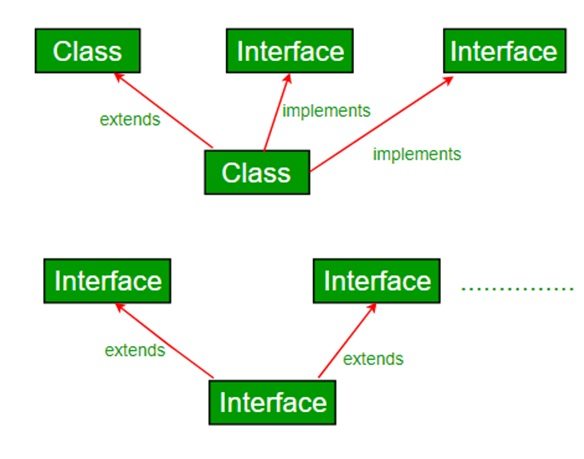

# Typescript Interfaces

[&laquo; Return to the Chapter Index](index.md)

<details open markdown="block">
  <summary>
    Table of contents
  </summary>
  {: .text-delta }
1. TOC
{:toc}
</details>

## Key Idea

An **_interface_** is a contract that describes the shape of data without values or implementation.

## Interfaces in Typescript

Sometimes we want to describe the shape of our data.
Sometimes we want to describe the methods and values that a class contains without detailing the entire class.
We can only extend one class, but we can implement many interfaces.



We say that it is a contract, because the object must implement the things in the interface, and users of the object are guaranteed that those things are implemented.

> **_Interfaces_** can contain property or method signatures but not implementations.

## A simple example

Suppose we are building a drawing program and want to be able to pass around point structures {x:number,y:number}. We can declare this as an interface then use the interface name as a type.

```typescript
export interface Point {
    x: number;
    y: number;
}
let point: Point = { x: 1, y: 2 };
let point2: Point = { x: 2, y: 3, z: 4 }; //this is an error
let point3: Point = { x: 3 }; //this is an error
```

> Note this will give an error because point2 and point3 don't conform to the interface.

We can't create a point (with new) like a class, but the compiler will guarantee that the object contains the members of the interface and only the members of the interface.

We say that a class **_implements_** an interface if it contains all of the members of the interface (not necessarily only those members). Using the **_implements_** keyword guarantees this.

```typescript
interface Point {
    x: number;
    y: number;
}
class DrawPoint implements Point {
    x: number;
    y: number;
    constructor(x: number, y: number, private color: string) {
        this.x = x;
        this.y = y;
    }
}
const point: Point = new DrawPoint(4, 5, "red");
console.log(point);
```

Now I can refer to the DrawPoint object as a Point and I know it contains an x and a y without having to know anything else about DrawPoint.

We are guaranteed that DrawPoint contains an x and a y member, because it implements point. If it doesn't, the code won't compile.

## Interface methods

Interfaces can contain methods as well. They don't include the implementation, they are just stating that the class must contain that method in order to compile, so users of the class know it contains that method.

```typescript
import { Point } from "ch11/drawing6";

interface Drawable {
    points: Point[];
    draw(): void;
}
class Triangle implements Drawable {
    points: Point[];
    constructor(p1: Point, p2: Point, p3: Point) {
        this.points = [p1, p2, p3];
    }
    draw() {
        //draw triangle
    }
}
```

Here we can see that Triangle contains an array of Point objects, and a draw method, therefore it correctly implements the Drawable interface.  
If a class implements an interface, then the class can be referenced as an object of interface type and will always have the points array and draw method or it would not compile.

## Multiple Interfaces

A class cannot extend more than one class in typescript, but it can implement many interfaces.

```typescript
interface Serializable {
    serialize(): string;
}
interface IterableList<T> {
    next(): T;
}
class MyList implements Serializable, IterableList<number> {
    values: number[] = [];
    pos: number = 0;
    next(): number {
        if (this.pos < this.values.length) return this.values[this.pos++];
        else return -1;
    }
    serialize(): string {
        return JSON.stringify(this.values);
    }
}
```

Here we have a class that implements two interfaces. We can see that it provides the implementation that matches the signatures in all of the interface.

Now I can use it to write a function:

```typescript
import { Point } from "ch11/list";

function serializeAll(obj: Serializable[]) {
    let result: string[] = [];
    for (let o of obj) {
        result.push(o.serialize());
    }
    return result;
}
const obj: MyList[] = [new MyList()];
console.log(serializeAll(obj));
```

## Using Interfaces

**_Interfaces_** have many uses, primarily:

-   Describe the shape of data to guarantee that the data is in the right form.

```typescript
interface Point {
    x: number;
    y: number;
}
```

-   Describe certain features that we want to enforce when we create a class so that if we know the class implements the interface, we know that the interface members actually exist in the class and are implemented for us.

{: .no-run }

```typescript
interface Drawable{points: Point[];draw():void;}
class Triangle implements Drawable{ . . . }
```

-   Using interfaces we can simplify coding by having multiple (very different) classes that all implement the interface, then we can call the interface methods on the objects even though they are otherwise

{: .no-run }

```typescript
class Elephant implements Serializable{ . . . }
class Tomato implements Serializable{ . . . }
```

## Notes on Interfaces

-   Interfaces allow us to further type our data by specifying what methods and properties an object must contain.
-   Unlike extending classes (inheritance), we can implement multiple interfaces in a single class.
-   If a class implements an interface, then that class can be stored in a variable whose type is the interface, and we can access the interfaces members through that variable.
-   Interfaces can be very useful to describe typescript objects that are otherwise untyped (like complex data returned from an API call). Once described, the interface will enforce that the object is indeed the correct shape and contains all of the interface members (methods and properties).
-   Interfaces are common in most Object Oriented programming languages and provide a convenient means to strengthen typing within our code.

## Summary

**_Interfaces_** provide another powerful mechanism for creating type safe reusable code. By specifying the _contract_ that a class or method must adhere to, users of the class or type can be assured that the type contains the members specified in the interface. In this way, disperate objects can be used as if they are the same object so long as they implement a given interface.

# Next Step

Next we'll learn about Union Types [Union Types &raquo;](./unions.md)
