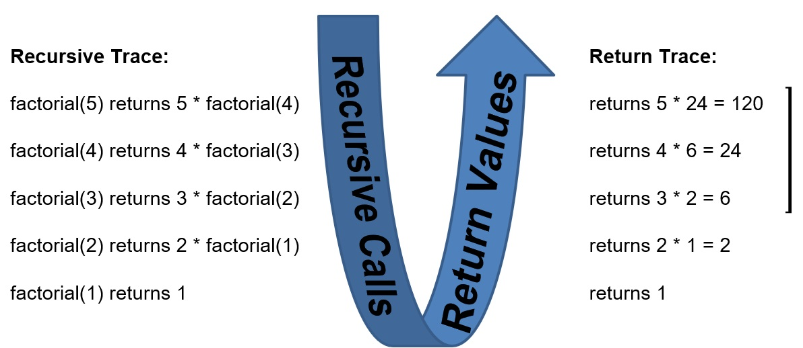

# Description and Definition of Recursion
[&laquo; Return to the Chapter Index](index.md)

<details open markdown="block">
  <summary>
    Table of contents
  </summary>
  {: .text-delta }
1. TOC
{:toc}
</details>

## Key Idea
***Recursion** is a method in Computer Science where we state a problem in terms of a smaller instance of that problem, then write a function which calls itself to solve the smaller version of the problem.

## Stating a problem recursively
In general, Recursion involves stating a large problem in terms of a smaller version of the same problem.

Consider the problem of teaching all of you a concept.
We can restate this problem as

* Teach one student
* Teach the rest of the students (this is a smaller group with 1 less student)

Eventually there are no more students to teach and we are done.
That is the basic idea behind recursion

Consider a problem where we have a container of balls that are all colored either red or yellow.  If we want to know if there are any yellow balls in the container, we can state this problem recursively.

* Checking one ball is easy, so if we remove a ball we know if it is yellow or not.  
	* If the ball is yellow, we are done, so return true.
	* If the ball is red, we can remove the ball from the set
		* Now we have the same problem, only there are fewer balls to look at.


Eventually, we will find a yellow ball, or we will empty the container making the problem trivial. *Are there any yellow balls in the empty container?*

## Recursion Terminology
When we find a yellow ball we are done.  The answer is "yes" there is a yellow ball.  When the container is empty we are done.  The answer is "no" because there are clearly no yellow balls in the empty container, and while making it empty, we didn't see any.  These cases where the answer is trivial are know as ***stop conditions*** or the ***base case*** of the recursion.

So how do we get there?  We need to make sure that whatever we do when the stop conditions are not met *approaches* the stop condition.  If we keep removing balls one at a time, either we find the yellow ball or we reduce the number of balls by one.  Clearly in all cases, this approaches the stop conditions of finding a yellow ball or emptying the container.  The step that handles non-stop conditions and approaches the stop conditions is referred to as the ***recursive step***.

<pre><code>public balls:string[] = [“red”, “red”, “red”, “red” ,”yellow”, “red”, “red”];
function findYellowBall(container:string[]):boolean{
	<div style="background:yellow;display:inline-block">	if (container.length==0){  //Yellow ball not found if balls array is empty
		return false;
	}
	else if (container[0]===(“yellow”)){  //Yellow ball found
		return true;
	}
	</div>	else  {  //Yellow ball might still be in the container, but not in the first element
		return findYellowBall(container.slice(1));
	}
}
</code></pre>

The highlighted section above is the ***stop condition***.  We first check if the array is empty, then we check if the first ball in the array is yellow.  If either is true we are done and we know the answer (false/true respectively).

<pre><code>public balls:string[] = [“red”, “red”, “red”, “red” ,”yellow”, “red”, “red”];
function findYellowBall(container:string[]):boolean{
	if (container.length==0){  //Yellow ball not found if balls array is empty
		return false;
	}
	else if (container[0]===(“yellow”)){  //Yellow ball found
		return true;
	}
<div style="background:yellow;display:inline-block">	else  {  //Yellow ball might still be in the container, but not in the first element
		return findYellowBall(container.slice(1));
	}</div>
}
</code></pre>

The highlighted section above is the ***recursive step***.  Since we know it is not the first element, we simply reinitiate our search on the rest of the array (elements 2...n) by slicing the array and passing the result to our function.

## Recursion Rules
* A recursive algorithm must have a base case or stop condition
* A recursive algorithm must change state and move towards the base case
* A recursive algorithm must call itself recursively

## A simple Example
Consider the porblem of computing factorial.

Factorial is defined as: *n! = n \* (n-1) \* (n-2) \* (n-3) \* ... \* 1*
```
5! = 5 * 4 * 3 * 2 * 1
```

We can restate this in terms of an easier instance of factorial: *n! = n \* (n - 1)!*

```
5! = 5 * 4!
```

Since we know that 1! is equal to 1, we can rewrite the definition as:


> This is a recursive definition.  It has a stop condition (n === 1), and a recursive step *(n\*(n-1)!)*

So how do we code this:


Let's try it:
```typescript
factorial(n:number):number{
	if (n===1){
		return 1;
	} else {
		return n * factorial(n-1);
	}
}
console.log(factorial(5));
```

So what is actually happening:

* factorial(5) returns 5 * factorial(4)
* factorial(4) returns 4 * factorial(3)
* Factorial(3) returns 3 * factorial(2)
* factorial(2) returns 2 * factorial(1)
* factorial(1) returns 1

This process leads to the answer being computed during each return from the base case to the original function call.



## But why?
In the jar of marbles and factorial examples, we could very easily solve these problems without recursion.  A simple loop would be sufficient.  While this is true of most/all problems, there are problems that are considerably easier to deal with by using recursion.

Let's look at a simple example of binary search.

* In binary search, we start with a sorted list.  Instead of checking every element, we check the middle element.
* Since the list is sorted, if the value is less than the middle element, then we don't have to search the second half of the list.  If it is greater, than we don't have to search the first half.

Consider:

*Find 4 in [1,2,3,4,5,6,7,8,9]*

The middle element is 5, and since 4 is less, we can restrict further searches to [1,2,3,4]
In other words, if the middle element is not what we want, then we have reduced the problem to searching half the list.  If it is what we want, then we are done.

Eventually the list will have 0 or 1 elements in it.  
* If 1, it is either what we are looking for or not.
* If 0, then we did not find what we were looking for.

So to complete the example on the array [1,2,3,4,5,6,7,8,9] trying to find 4.
* 4 < 5 so we only search for 4 in [1,2,3,4]
* The middle element is either 2 or 3, os if we pick 3 4>3 so we search for 4 in [4]
* The list contians 1 element, and that element is the 4 we are looking for.

Another example, search for 11 in the same array.
* 11 > 5 so search for 11 in [6,7,8,9]
* 11 > 8 so search for 11 in [9]
* 11 != 9 so we did not find it.

> This is a lot faster than searching every element one at a time.

In the case of binary search our ***stop condition*** is:
* We stop when there are no elements in the list and return false
* We stop when the middle element is the one we are looking for and return true

Our ***recursive step***
* If the search value is greater than the middle value, we search the second half of the list
* If the search value is less than the middle value, we search the first half of the list

> Each time, we are searching a smaller list, so eventually we will find what we want or the list will be empty.

Our stop condition in code:
```
if (list.length === 0){ return -1; }
let mid=Math.floor((list.length - 1) / 2);
if (list[mid] === target){ return list[mid]; }
```

Our recursive step simply calls itself on the correct half of the array:
```
else if (list[mid] < target){
	return binSearch(list.slice(mid + 1), target);
}
else{
	return binSearch(list.slice(0, mid), target);
}
```

And the full search function:
```typescript
function binSearch(list: number[], target: number){
	if (list.length === 0){
		return -1;
	}
	let mid = Math.floor((list.length-1) / 2);
	if (list[mid] === target){
		return list[mid];
	}
	else if (list[mid] < target){
		return binSearch(list.slice(mid + 1), target);
	}
	else{
		return binSearch(list.slice(0, mid), target);
	}
}
let list=[1,2,3,4,5,6,7,8,9];
console.log(binSearch(list, 9));
console.log(binSearch(list, 11));
```

## Summary
***Recursion*** is a programming technique where a problem is restated in terms of a smaller instance of the same problem.  Recursive functions must have a ***stop condition*** when the problem is solved or when the smaller instance becomes trivial.  They must also have a ***recursive step*** where they call the same function on a smaller instance of the problem.

# Next Step

Next we'll learn about Trees  [Trees &raquo;](../13-Recursion/trees.md)