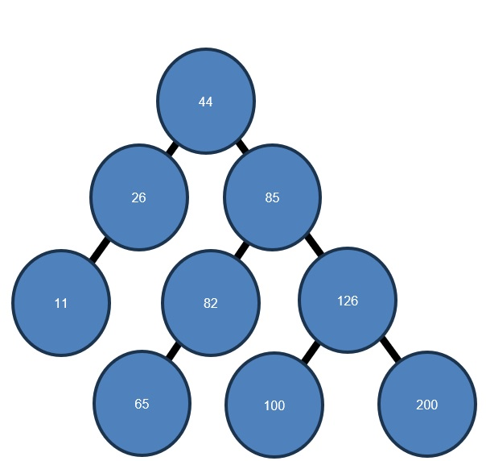
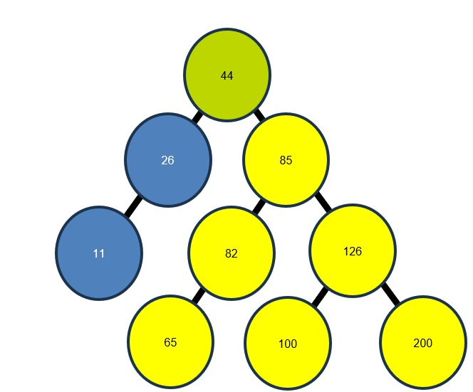
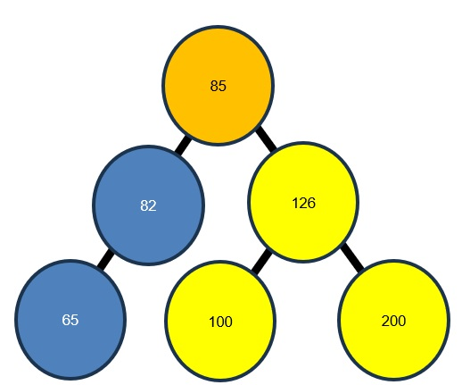
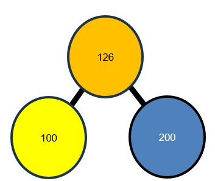

# Trees

[&laquo; Return to the Chapter Index](index.md)

<details open markdown="block">
  <summary>
    Table of contents
  </summary>
  {: .text-delta }
1. TOC
{:toc}
</details>
## Key Idea
A ***tree*** in Computer Science is a data structure that represents data in a parent/child relationship.

## Motivating Recursion

All of these would have been very easy to implement using a loop instead. One place where recursion is particularly useful is **_Trees_**.
**_Trees_** are a basic data structure that we can use to represent data in a parent child relationship.

Many problems can be modeled as a tree. As a matter of fact HTML is actually a tree representation since a parent element can have multiple child elements.

## Binary Search Trees

Consider a tree of numbers instead. If we look at the children of any node in the tree, they are themselves a tree. Just a smaller one.

Even for the nodes without children we can think of them as trees with no children (empty trees).
So in other words, we can treat each sub-tree of a tree with a given root as if it were a tree.
This feels like a good candidate for recursion.



As it turns out, this is a special kind of tree called a **_binary search tree_**.

It has some specific properties:

-   A node will have 2 subtrees (possibly empty)
-   Every number in the left sub-tree must be less than the value stored in the node
-   Every number in the right sub-tree must be greater than the value stored in the node
-   These must hold for the subtree rooted at every node in the tree.

We can search this structure by examining the root node then recursively searching the correct subtree based on the values.

Say we have a treeSearch method

```
function treeSearch(tree: TreeNode, target: number){
```

and we want to find the number 100 in the tree. We woudl start by comapring it to 44. Since 100 > 44 we know the answer must be in the right subtree if this is a **_binary search tree_**.

|                   |
| :--------------------------------------------------: |
| _Root is in orange, subtree to search is in yellow._ |

We now call our treeSearch function on just the right subtree. Now we compare 85 to 100.
Again, 85 < 100 so we again search the right subtree.

|                   |
| :--------------------------------------------------: |
| _Root is in orange, subtree to search is in yellow._ |

This time, we see that the value 100 < 126, so we will call treeSearch on the left sub-tree.

|                   |
| :--------------------------------------------------: |
| _Root is in orange, subtree to search is in yellow._ |

This time when we call on the left subtree, our root is the value we are looking for, so we can return that we found it.

|       |
| :--------------------------------------: |
| _Root is in orange, subtrees are empty._ |

> Note: if we had been looking for 99, we would search the left subtree, which would be empty and we would return tat we did not find it.

### Implementing Binary Search Trees in Typescript

First we need a way to represent a tree in typescript. Since every node in a tree is itself a tree root, we should implement the node of a tree, then just keep a reference to that node as the root of the tree.

We will create a node class that will contain a number and 2 children. Those children themselves will be nodes (possibly empty).

```
export class TreeNode{
	left: TreeNode|undefined=undefined;
	right: TreeNode|undefined=undefined;
	constructor(public value: number){}
}
```

### Searching Binary Search Trees

Now we can right our treeSearch function to recursively search our tree.

Our function should have **_stop conditions_** when the tree is empty or when the value in the root of the tree is the one we are looking for.

```
if (tree === undefined) {  			//tree is emtpy
	return false;
} else if (tree.value === value) {		//root of tree is our value
	return true;
}
```

For the **_recursive step_**, we want to search either the left or right subtree based on whether value is less than or greater than the node's value (we already checked === in our stop conditions)
When we look at a node, there are only 4 possibilities.

-   The node is empty (undefined)
-   It is the node we are looking for
-   It is > than the node we are looking for
-   It is < than the node we are looking for.

If the node is empty (undefined) then the node with the value we are looking for can't exist, so we return false (did not find it).

If the node's value is === the value we are looking for, then we return true (found it).

If the node's value is < the value we are looking for, then if the value is in the tree, it must be in the right sub-tree, so we call treeSearch recursively to search that sub-tree.

If the node's value is > the value we are looking for, then if the value is in the tree, it must be in the left sub-tree, so we call treeSearch recursively to search that sub-tree

```
function treeSearch(tree: TreeNode | undefined, value: number): boolean {
	if (tree === undefined) {
		return false;
	} else if (tree.value === value) {
		return true;
	} else if (tree.value<value){
		return treeSearch(tree.right, value);
	} else {   //must be > value, it is the only posibility left
		return treeSearch(tree.left, value);
	}  
}
```

### Inserting into Binary Search Trees

We can also recursively insert a node into the tree. Search the tree until you find a node where the subtree you would search next is undefined and add a new node there. This is our stop condition. If the sub-tree we would insert into is not empty, then we just insert into that (smaller) sub-tree.

```
function insert(tree: TreeNode, value: number): void {
	if (value===tree.value) return;
	else if (value < tree.value) {
		if (tree.left === undefined) {
			tree.left = new TreeNode(value);
		} else {
			insert(tree.left, value);
		}
	} else {
		if (tree.right === undefined) {
			tree.right = new TreeNode(value);
		}else{
			insert(tree.right, value);

		}
	}
}
```

**_Trees_** are a common data structure in Computer Science and recursion is a much more natural way to deal with them.

### Complete Tree Example

```typescript
export class TreeNode {
    left: TreeNode | undefined = undefined;
    right: TreeNode | undefined = undefined;
    constructor(public value: number) {}
}
function treeSearch(tree: TreeNode | undefined, value: number): boolean {
    if (tree === undefined) {
        return false;
    } else if (tree.value === value) {
        return true;
    } else if (tree.value < value) {
        return treeSearch(tree.right, value);
    } else {
        //must be > value, it is the only posibility left
        return treeSearch(tree.left, value);
    }
}
function insert(tree: TreeNode, value: number): void {
    if (value === tree.value) return;
    else if (value < tree.value) {
        if (tree.left === undefined) {
            tree.left = new TreeNode(value);
        } else {
            insert(tree.left, value);
        }
    } else {
        if (tree.right === undefined) {
            tree.right = new TreeNode(value);
        } else {
            insert(tree.right, value);
        }
    }
}
let treeRoot = new TreeNode(44);
insert(treeRoot, 26);
insert(treeRoot, 11);
insert(treeRoot, 85);
insert(treeRoot, 82);
insert(treeRoot, 126);
insert(treeRoot, 100);
insert(treeRoot, 200);
insert(treeRoot, 65);
console.log(treeSearch(treeRoot, 100));
console.log(treeRoot);
```

THis example implements the **_binary search tree_** in the previous example, then searches it for 100.

> If I inserted them in a different order, I would have gotten a different tree.

Thought question: What happens if I insert them in sorted order?

<details markdown="block">
  <summary>
    Answer
  </summary>
> You would get a list.  Every node would have an empty left subtree and we would need to visit every node to search the tree.
</details>

## An Object Oriented Tree

This is nice, but it is NOT very object oriented.

A tree node should encapsulate the things we can do to a tree so we won't need external methods.
For our implementation of insert, it is pretty straight forward.
We just remove the tree parameter, and instead call the member method on the appropriate subtree which is not null since we already checked that.

{: .no-run }

```typescript
class TreeNode{
	...

	insert(value: number): void {
		if (value === this.value) return;
		else if (value < this.value) {
			if (this.left === undefined) {
				this.left = new TreeNode(value);
			} else {
				this.left.insert(value);
			}
		} else {
			if (this.right === undefined) {
				this.right = new TreeNode(value);
			} else {
				this.right.insert(value);
			}
		}
	}

	...

}
```

For the search method, it is a little less straight forward. We need to check for a null subtree before we make the recursive call instead of stopping when the tree is null (otherwise we will not have an object to call search on).

{: .no-run }

```typescript
	treeSearch(value: number): boolean {
		if (this.value === value) {
			return true;
		} else if (this.value < value) {
			if (this.right === undefined) {
				return false;
			} else {
				return this.right.treeSearch(value);
			}
		} else {
			if (this.left === undefined) {
				return false;
			} else {
				return this.left.treeSearch(value);
			}
		}
	}
```

Now we stop in the parent node if the child node is undefined instead of stopping in the child when it is itself undefined.

Here is a complete example of our tree program:

```typescript
export class TreeNode {
    left: TreeNode | undefined = undefined;
    right: TreeNode | undefined = undefined;
    constructor(public value: number) {}
    insert(value: number): void {
        if (value === this.value) return;
        else if (value < this.value) {
            if (this.left === undefined) {
                this.left = new TreeNode(value);
            } else {
                this.left.insert(value);
            }
        } else {
            if (this.right === undefined) {
                this.right = new TreeNode(value);
            } else {
                this.right.insert(value);
            }
        }
    }
    treeSearch(value: number): boolean {
        if (this.value === value) {
            return true;
        } else if (this.value < value) {
            if (this.right === undefined) {
                return false;
            } else {
                return this.right.treeSearch(value);
            }
        } else {
            if (this.left === undefined) {
                return false;
            } else {
                return this.left.treeSearch(value);
            }
        }
    }
}
let treeRoot = new TreeNode(44);
treeRoot.insert(26);
treeRoot.insert(11);
treeRoot.insert(85);
treeRoot.insert(82);
treeRoot.insert(126);
treeRoot.insert(100);
treeRoot.insert(200);
treeRoot.insert(65);
console.log(treeRoot.treeSearch(100));
console.log(treeRoot);
```

## Summary

**_Trees_** are an important data structure in Computer Science. They allow us to store data in a structured way that represeents parent/child relationships. In other words, a parent can have many children, but a child can only have one parent. A **_binary tree_** is a tree where each node has at most two children. A special case of a **_binary tree_** is a **_binary search tree_**. In a binary search tree each node in the left subtree of all nodes must be of lower value than the root, and each node in the right subtree of all nodes must be greater than the value of the root.

# Next Step

Next we'll learn about Trees [Trees &raquo;](../13-Recursion/trees.md)
