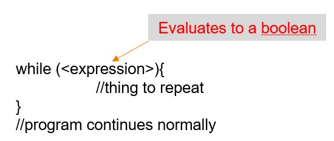
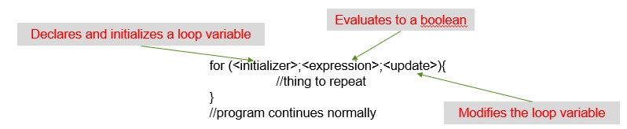

# Loops

[&laquo; Return to the Chapter Index](index.md)

<details open markdown="block">
  <summary>
    Table of contents
  </summary>
  {: .text-delta }
1. TOC
{:toc}
</details>

# Key Idea

A loop is a control flow structure in programming that allows us to repeat a section of code until some boolean condition is met.

# Loops in Typescript
In programming we often have to do things more than once. Rather than copying and pasting our code over and over again, we can use a loop to run the same section of code repeatedly.
There are two basic types of loops that we will look at the while loop and the for loop.

## While Loops
The while loop allows us to repeat the following block of code (code in braces {}) while the expression is true.



## A simple while loop example
Consider the following function which implements a countdown.  This can be done easily with a while loop.
```typescript
function countdown(count:number){
  while(count>0){
    console.log(count);
    count--;
  }
  console.log("beep beep beep!");
}
countdown(10);
```
Notice that we are calling the function countdown passing in the number we want to count down from.  The number is then used in the condition of the while loop so that the function can count down from any valid non-negative integer.
> Note that we use ```console.log``` to display information to the user.  For now, this will be our primary way to display something from our programs.

## Exercise
See if you can complete the function sillyMultiply and get the answer 20.  You should do this using loops and you should not use multiplication in your function.  You should repeatedly add the first number to itself the correct number of times.
```typescript
function sillyMultiply(x:number,y:number):number{
    //What goes here?
}
console.log(sillyMultiply(5,4));
```

<details>
```typescript
function sillyMultiply(x:number,y:number):number{
  let product:number = 0;
    while(y > 0){
      product = product + x;
      y = y - 1;
    }
  return product  
}
console.log(sillyMultiply(5,4));
```

</details>

## For Loops
The other primary type of loop we will be discussing is the for loop.
While you have seen for loops in other languages, they are somewhat different in typescript, and there are a couple of different versions.
Let’s start with the simplest form.


* The initializer is simply a variable declaration and initialization like you might use elsewhere in the program.
* The expression is the same as the expression we used for our while loop.  The loop will continue to execute so long as the expression is true.
* The update statement will usually modify the loop variable so that it approaches a value that will cause the loop to exit.

## A simple for loop example
Let's take another look at the countdown example, but this time, using a for loop:
```typescript
function countdown(count:number){
  for (let i = count; i > 0; i--){
    console.log(i);
  }
  console.log("beep beep beep!");
}
countdown(10);
```
> Note: i-- is just shorthand for i=i-1 (and i++ is similarly shorthand for i=i+1)
* Our initializer sets our loop variable (i) to count
* Our expression continues the loop so long as count remains >0
* Our update statement decrements the value of i each time the loop runs

## Exercise
See if you can complete the function sillyMultiply again and get the answer 20.  You should do this using for loops and you should not use multiplication in your function.  You should repeatedly add the first number to itself the correct number of times.
```typescript
function sillyMultiply(x:number,y:number):number{
    //What goes here?
}
console.log(sillyMultiply(5,4));
```

<details>
```typescript
function sillyMultiply(x:number,y:number):number{
  let product:number=0;
  for (let i=0;i<y;i++){
    product=product+x;
  }
  return product;
}
console.log(sillyMultiply(5,4));
```

</details>

# Summary
We can create more complex program logic by repeating sections of our code to solve problems.  This is important for many reasons including readability, reducing potential for errors, and variability of the number of times something must execute based on inputs.  The two primary loops in Typescript are the while loop and the for loop.  This section examined the while loop, and one of the formats of the for loop.  We will examine the other for loop in the next section as it explicitly operates on collections which we will cover next.

# Next Step

Next we'll learn about arrays: [Arrays &raquo;](../2-loops/arrays.md)