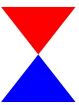

# Data Class Constructors

[Return to the Chapter Index](index.md)

<details open markdown="block">
  <summary>
    Table of contents
  </summary>
  {: .text-delta }
1. TOC
{:toc}
</details>

## Key Idea

**Constructors** are called when an instance of a class is created.  The constructor can initialize the data members of the class and/or do any additional work prior to the class being created.

## Class constructors

So far, to create a class we:

-   Create an instance of a class with the **new** keyword and store it in a variable
-   Use the variable to modify the properties of the class individually
    -   For our "Color" example clasds, this means setting red, green, and blue independently.

It would be much easier to have a function that takes the parameters we want to set and updates the object as it is being created.

{: .no-run}

```typescript
class Color {
    public red: number = 0;
    public green: number = 0;
    public blue: number = 0;
    constructor(red: number, g: number, b: number) {
        this.red = red;
        this.green = g;
        this.blue = b;
    }
}
```

By giving our class a constructor, we can create an instance of the class and initialize its values in one line:

{: .no-run}

```typescript
let veryRed: Color = new Color(255, 0, 0);
let veryBlue: Color = new Color(0, 0, 255);
let anotherColor: Color = new Color(27, 115, 98);
console.log(veryRed, veryBlue, anotherColor);
```

> Note that now we are creating and initializing our objects in one line.

While much better, the definition of "Color" still seems repetitive. While 100% correct, TypeScript gives us a shorthand.

```typescript
class Color {
    constructor(public red: number, public green: number, public blue: number) {
        //Note we don't need anything inside.  This automatically does everything.
    }
}
//this behaves equivalently in every way to our previous example.
let veryRed: Color = new Color(255, 0, 0);
console.log(veryRed);
```

> If we declare the parameters of the constructor with the private or public keywords, it both declares them as members, and initializes their values from the values passed into the constructor.

> Note that without the public or private keywords, the parameter is just local to the constructor function, but when included, the parameter becomes a member variable (property) and gets initialized to the value passed in.

Back to the drawing program, we can now rebuild our classes using constructors and the TypeScript shorthand.

```typescript
class Color {
    constructor(
        public red: number,
        public green: number,
        public blue: number
    ) {}
}
class Point {
    constructor(public x: number, public y: number, public color: Color) {}
}
// We can build a point in a few ways.
let myPoint: Point = new Point(100, 100, new Color(0, 0, 255)); //create color on the fly
let red: Color = new Color(255, 0, 0);
let myOtherPoint: Point = new Point(200, 200, red); //use an existing color object
console.log(myPoint);
console.log(myOtherPoint);
```

## Other Drawing classes

We need several other classes to complete our drawing program.  

- The Line class simply needs two points (start and end) and a color. 
- The Rectangle class requires two points (opposite corners) and a color.

We define the classes below and initialize them with a constructor.

{: .no-run}

```typescript
class Color {
    constructor(
        public red: number,
        public green: number,
        public blue: number
    ) {}
}
class Point {
    constructor(public x: number, public y: number, public color: Color) {}
}
class Line {
    constructor(public start: Point, public end: Point, public color: Color) {}
}
class Rectangle {
    constructor(
        public corner1: Point,
        public corner2: Point,
        public color: Color
    ) {}
}
```

## Polygons

Now we can represent basic shapes in a coordinate system and each shape has a color, but what about polygons. First, let's list what we know about them:

-   Generalized polygons have 3 or more points which are connected.
-   Polygons have a color

Since we don't know how many points there are to start with, we can represent the list of points using an array.

{: .no-run}

```typescript
class Polygon {
    constructor(public points: Point[], public color: Color) {}
}
```

The polygon class is initialized by and contains a public member whose type is an array of "Point" classes. It also has an instance of a "Color" class.

## Trying it out

```typescript
class Color {
    constructor(
        public red: number,
        public green: number,
        public blue: number
    ) {}
}
class Point {
    constructor(public x: number, public y: number, public color: Color) {}
}
class Line {
    constructor(public start: Point, public end: Point, public color: Color) {}
}
class Rectangle {
    constructor(
        public corner1: Point,
        public corner2: Point,
        public color: Color
    ) {}
}
class Polygon {
    constructor(public points: Point[], public color: Color) {}
}
let red: Color = new Color(255, 0, 0);
let blue: Color = new Color(0, 0, 255);
let points1: Point[] = [
    new Point(0, 0, red),
    new Point(100, 0, red),
    new Point(50, 100, red),
];
let points2: Point[] = [
    new Point(50, 100, blue),
    new Point(100, 100, blue),
    new Point(0, 100, blue),
];
let redTriangle: Polygon = new Polygon(points1, red);
let blueTriangle: Polygon = new Polygon(points2, blue);
let drawing: Polygon[] = [redTriangle, blueTriangle];
console.log(drawing);
```

With this code, drawing represents a drawing with two triangles (red and blue). If we wrote a program to render these objects, we would have all of the information that is needed.



## Summary

To simplify the creation and initialization of a data class, we can provide a constructor method that takes parameters and can be used to set initial values for the member properties. If the parameters are preceded by the words public or private, they automatically become member variables and get initialized to the values passed to the constructor. The constructor is called by using the **_new_** keyword to create a new instance of the class.

# Next Step

Next we'll learn about [Instances and References](references.md)
