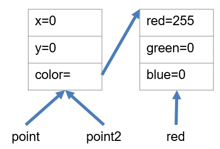
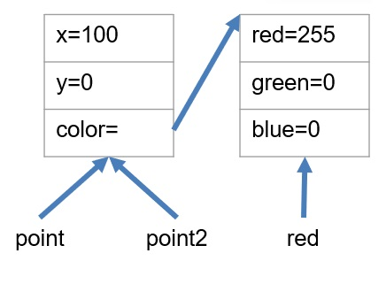
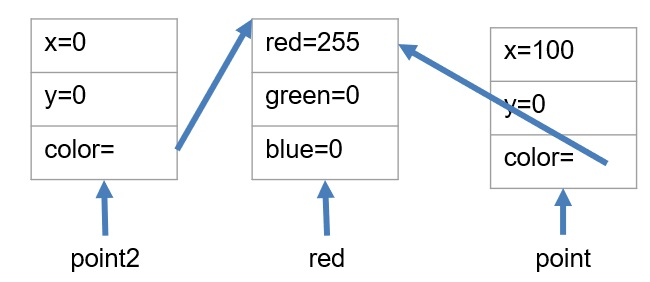
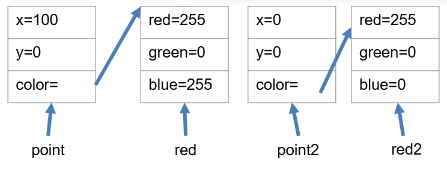

# Instances and References

[&laquo; Return to the Chapter Index](index.md)

<details open markdown="block">
  <summary>
    Table of contents
  </summary>
  {: .text-delta }
1. TOC
{:toc}
</details>

## Key Idea

**_Data Classes_** allow us to combine data into a grouping or class and use that grouping as a data type in our programs.

## Understanding Instances and References

When we define a class using the **_class_** keyword, we are creating a **_type_**. This type does not exist in memory, but is a template for creating objects that have the methods and fields described in the class. When we use the `new` keyword, we create an **instance** of the class in memory and return a **reference** to the in memory object. If we call new again, we get a second instance of the class and a second **reference** to the new memory location.

```typescript
import { Color, Point, Polygon } from "ch2/drawing1";

let red: Color = new Color(255, 0, 0);
let points1: Point[] = [
    new Point(0, 0, red),
    new Point(100, 0, red),
    new Point(50, 100, red),
];
let redTriangle: Polygon = new Polygon(points1, red);
console.log(redTriangle);
```

Examining this code in more detail, we see that each time new is called, we are creating an **instance** of the class. That means that each time we call `new`, we are allocating a new chunk of memory to hold the values of that instance. What is returned, is not the value of the class, but a **reference** to the created object.

Consider the following code:

```typescript
let red: Color = new Color(255, 0, 0);
let point: Point = new Point(0, 0, red);
let point2: Point = point;
```

{: .no-run}

Graphically, this looks like:



What would happen if we update `point.x`. In this case we would also update the instance pointed to by `point2`, because they are the same instance. When we set `point2 = point;` we are setting the variable `point2` to contain the reference stored in `point`, and thus they reference the same chunk of memory allocated by the one and only call to `new Point(...)`.

Let's see that in action.

```typescript
import { Color, Point } from "ch2/drawing1";

let red: Color = new Color(255, 0, 0);
let point: Point = new Point(0, 0, red);
let point2: Point = point;
point.x = 100;
console.log(point2);
```



As you can see, updating point updates the memory location referenced by point which is the same memory location referenced by point2. In other words, we only have one point, but we have two **references** or **aliases** to that point. Changing either one, changes the one and only object that the variables point and point2 refer to.

> Note: Sometimes this is what we want, but sometimes IT IS NOT!!!

Later, we will look at other methods to create new objects based on existing objects, but for now, we would have to call **_new_** again and set point2 to that new object, then update its properties with the properties of point.

```typescript
import { Color, Point } from "ch2/drawing1";

let red: Color = new Color(255, 0, 0);
let point: Point = new Point(0, 0, red);
let point2: Point = new Point(point.x, point.y, point.color);
point.x = 100;
console.log(point);
console.log(point2);
```



This is a **_shallow copy_** of an object as we are only copying the top level.
This will make a new object, but only copy the top level or primitive types (number, boolean, string). Any deeper objects or arrays still remain as references.

What if we want a **_deep copy_**. In other words, each point will, in addition to having a unique memory location for its primitive values, will also have a reference to a different Color object.

```typescript
import { Color, Point } from "ch2/drawing1";

let red: Color = new Color(255, 0, 0);
let red2: Color = new Color(255, 0, 0);
let point: Point = new Point(0, 0, red);
let point2: Point = new Point(point.x, point.y, red2);
point.x = 100;
console.log(point);
console.log(point2);
```



This is probably what we wanted. This is called a **_deep copy_**. While there are some ways to do this automatically in Typescript, they do not work in all cases, and can be problematic. We can do this manually as in this example, but we will look at better ways later.

## Summary

Understanding references and instances is critical in nearly all programming languages. In typescript, every variable whose type is not a primitive type (string, boolean, number) stores a reference to the object. From our examples:

-   point2=point; //makes a copy of the reference to the one and only object
-   A **_shallow copy_** of the object only copies the top level primitive types, but does not duplicate any contained objects, rather it copies the reference to the same object.
-   A **_deep copy_** of the object makes copies of all of the objects, nested objects and primitive types. Gives you a true clone of the object that is independent of the original. Later, we will learn how to clone the object, but for now, we have to create an independent object with the same values.

# Next Step

Next we'll learn about the **_this_** keyword: [this keyword &raquo;](this.md)
