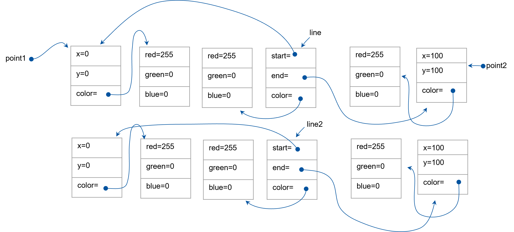
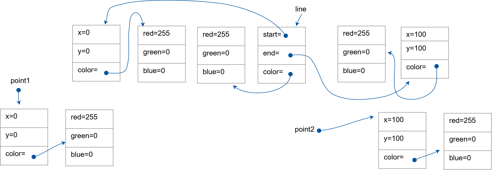

# Object Cloning

[&laquo; Return to the Chapter Index](index.md)

<details open markdown="block">
  <summary>
    Table of contents
  </summary>
  {: .text-delta }
1. TOC
{:toc}
</details>

## Key Idea

**_Classes_** allow us to combine data and methods into a grouping or class and use that grouping as a data type in our programs.

## Types of copies

Recall from the previous chapter the discussion of copying.

-   `point2= point;` makes a copy of the **_reference_** to the one and only object.
-   A **_shallow copy_** of the object only copies the top level primitive types, but does not duplicate any contained objects, rather it copies the reference to the same object. For arrays, we can use the spread operator (`...`) to do this.
-   A **_deep copy_** of the object makes copies of all of the objects, nested objects and primitive types. Gives you a true clone of the object that is independent of the original. Later, we will learn how to clone the object, but for now, we have to create an independent object with the same values.

A **_deep copy_** of the object makes copies of all of the objects, nested objects and primitive types. Gives you a true clone of the object that is independent of the original. Later, we will learn how to clone the object, but for now, we have to create an independent object with the same values.
How do we do this in a structured way?

-   We teach each class how to `clone` itself, and then use those methods if we have a class that contains another class.
-   We will work from the bottom up of our hierarchy of classes. The simplest of which is our `Color` class.

Consider the `Color` class we have been working with. Cloning that is easy as a **_shallow copy_** is sufficient. The classes data items are all primitive types (numbers).

```typescript
class Color {
    constructor(
        public red: number = 0,
        public green: number = 0,
        public blue: number = 0
    ) {}
    clone(): Color {
        return new Color(this.red, this.green, this.blue);
    }
}
let red = new Color(255, 0, 0);
let blue = red.clone();
blue.red = 0;
blue.blue = 255;
console.log(red, blue);
```

> We can create a new `Color` object from an existing one by calling the existing one's `clone` method.

Our `Point` class is more difficult in that it contains a `Color` object. Here a **_deep copy_** is required to not only copy the `Point` object into a new instance, but also create a new instance of the `Color` object. Luckily the `Color` object already has a `clone` method.

```typescript
import { Color } from "ch5/drawing2";

class Point {
    constructor(public x: number, public y: number, public color: Color) {}
    clone(): Point {
        return new Point(this.x, this.y, this.color.clone());
    }
}
let p = new Point(5, 5, new Color());
let q = p.clone();
q.color = new Color(255, 255, 255);
q.x = 0;
console.log(p, q);
```

> Note, if we passed the color, we would get a reference to the same color object, but by calling its `clone` method, we get a new one (since we wrote it that way).

Likewise, we can add a `clone` method to our Line class as well. Again, since this class contains references to objects, we must **_deep copy_** the line class. Luckily each of the object types (`Color` and `Line`) already has a `clone` method we can use.

```typescript
import { Color } from "ch5/drawing3";

class Line {
    constructor(public start: Point, public end: Point, public color: Color) {}
    clone(): Line {
        return new Line(
            this.start.clone(),
            this.end.clone(),
            this.color.clone()
        );
    }
}
let line = new Line(
    new Point(0, 0, new Color()),
    new Point(100, 100, new Color()),
    new Color()
);
let line2 = line.clone();
line2.color.red = 255;
line2.start.x = 5;
console.log(line, line2);
```

We can easily do the same for our `Rectangle` and `Polygon` classes. For the `Rectangle` class:

```typescript
import { Color, Point } from "ch5/drawing3";

class Rectangle {
    private corner2: Point;
    private corner4: Point;
    constructor(
        private corner1: Point,
        private corner3: Point,
        public color: Color
    ) {
        this.corner2 = new Point(corner3.x, corner1.y, color);
        this.corner4 = new Point(corner1.x, corner3.y, color);
    }
    clone(): Rectangle {
        return new Rectangle(
            this.corner1.clone(),
            this.corner3.clone(),
            this.color.clone()
        );
    }
}
let rect = new Rectangle(
    new Point(0, 0, new Color()),
    new Point(100, 100, new Color()),
    new Color()
);
let rect2 = rect.clone();
rect2.color.red = 255;
console.log(rect, rect2);
```

For the `Polygon` class, things are a little trickier. The class contains an array of references to `Point`. If we use the spread operator to create a new array, we will only get a **_shallow copy_** and the individual points will reference the same `Point` objects as the original `Polygon`. We will need to iterate through the array and clone the objects individually to create a new **_deep copy_** of the array to use in our cloned object.

```typescript
import { Color, Point } from "ch5/drawing3";

class Polygon {
    constructor(public points: Point[], public color: Color) {}
    clone(): Polygon {
        // initialize a new empty array.
        let newPoints: Point[] = [];
        for (let point of this.points) {
            // don't push the point, push a clone of it.
            newPoints.push(point.clone());
        }
        // so newPoints is a new array containing clones of all the points in this polygon.
        // We can pass it directly since it is completely new.
        return new Polygon(newPoints, this.color.clone());
    }
}
let pts = [
    new Point(0, 0, new Color()),
    new Point(100, 0, new Color()),
    new Point(100, 100, new Color()),
    new Point(100, 0, new Color()),
];
let poly = new Polygon(pts, new Color());
let poly2 = poly.clone();
poly2.color.red = 255;
console.log(poly, poly2);
```

## Understanding memory layouts

Let's consider how using `clone` affects the layout of our objects in memory. This can be a good way to understand what is going on in your program.

```typescript
let point1: Point = new Point(0, 0, new Color(255, 0, 0));
let point2: Point = new Point(100, 100, new Color(255, 0, 0));
let line: Line = new Line(point1, point2, new Color(255, 0, 0));
let line2: Line = line.clone();
```

{: .no-run}



Notice `point1` and `point2` are still the same references as we have in line. We can clone the points making them distinct.

```typescript
let point1: Point = new Point(0, 0, new Color(255, 0, 0));
let point2: Point = new Point(100, 100, new Color(255, 0, 0));
let line: Line = new Line(point1.clone(), point2.clone(), new Color(255, 0, 0));
```

{: .no-run}



By using our clone methods in all of our classes, this code now has each element of each class as a distinct instance.

## Summary

The simplest way to ensure deep cloning is to _teach_ each class how to deep copy itself. If we do this then classes that contain the class in question can just call its `clone` method to deep copy it.

# Chapter Summary

In addition to storing data (Data Classes), classes can also contain methods. These methods can operate on the data within the class without regard to its visibility. We can change the visibility of a member property or method with the **`public`/`private`** keywords. Anything marked as `public` is accessible outside of the class instance. Anything marked as `private` can only be accessed within a method inside that class.

# Next Step

Next we'll learn about Composition and Inheritance: [Composition and Inheritance &raquo;](../5-composition-inheritance/index.md)
