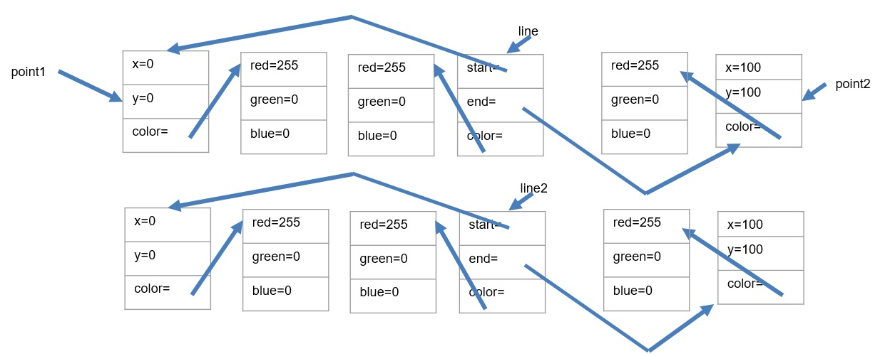
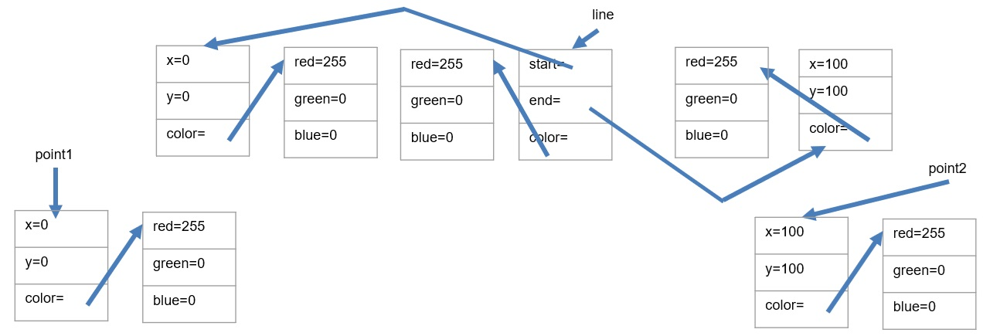

# Object Cloning
[&laquo; Return to the Chapter Index](index.md)

<details open markdown="block">
  <summary>
    Table of contents
  </summary>
  {: .text-delta }
1. TOC
{:toc}
</details>

# Key Idea
***Classes*** allow us to combine data and methods into a grouping or class and use that grouping as a data type in our programs. 
## Types of copies
Recall from the previous chapter the discussion of copying.
* point2=point; //makes a copy of the ***reference*** to the one and only object
* A ***shallow copy*** of the object only copies the top level primitive types, but does not duplicate any contained objects, rather it copies the reference to the same object.  For arrays, we can use the spread operator (…) to do this.
* A ***deep copy*** of the object makes copies of all of the objects, nested objects and primitive types.  Gives you a true clone of the object that is independent of the original.  Later, we will learn how to clone the object, but for now, we have to create an independent object with the same values.

A ***deep copy*** of the object makes copies of all of the objects, nested objects and primitive types.  Gives you a true clone of the object that is independent of the original.  Later, we will learn how to clone the object, but for now, we have to create an independent object with the same values.
How do we do this in a structured way?
* We teach each class how to clone itself, and then use those methods if we have a class that contains another class. 
* We will work from the bottom up of our hierarchy of classes.  The simplest of which is our color class.

Consider the Color class we have been working with.  Cloning that is eash as a ***shallow copy*** is sufficient.  The classes data items are all primitive types (numbers).
```
class Color{
	constructor(public red:number, public green:number,public blue:number){ }
	clone():Color{
		return new Color(this.red,this.green,this.blue);
	}
}
```
> We can create a new color object from an existing one by calling the existing one's clone method.

Our point method is more difficult in that it contains a Color object.  Here a ***deep copy*** is required to not only copy the point object into a new instance, but also create a new instance of the color object.  Luckily the color object already has a clone method.
```
class Point{
	constructor(public x:number,public y:number,public color:Color){}
	clone(): Point{
	return new Point(this.x,this.y,this.color.clone());
}
```
> Note, if we passed the color, we would get a reference to the same color object, but by calling its clone method, we get a new one (since we wrote it that way).

Likewise, we can add a clone method to our Line class as well.  Again, since this class contains references to objects, we must ***deep copy*** the line class.  Luckily each of the object types (color and line) already has a clone method we can use.
```
class Line{
	constructor(public start:Point,end:Point,color:Color){}
	clone():Line{
		return new Line(this.start.clone(),this.end.clone(),this.color.clone());
	}
}
```

We can easily do the same for our Rectangle and Polygon classes.  For the rectangle class

```
class Rectangle{
   private corner2:Point;
   private corner4:Point;
   constructor(private corner1:Point, private corner3:Point,public color:Color){ 
	   this.corner2=new Point(corner3.x,corner1.y,color);
	   this.corner4=new Point(corner1.x,corner3.y,color);
   }
   clone():Rectangle{
	  return new Rectangle(this.corner1.clone(),this.corner3.clone(),this.color.clone());
   }
}
```
For the polygon class, things are a little trickier.  The class contains an array of references to Point.  If we use the spread operator to create a new array, we will only get a ***shallow copy*** and the individual points will reference the same Point objects as the original Polygon.  We will need to iterate through the array and clone the objects indivisually to create a new ***deep copy*** of the array to use in our cloned object.
```
class Polygon{
	constructor(public points:Point[],public color:Color){}
	clone():Polygon{
		let newPoints:Point[]=[];				//initialize a new empty array.
		for (let point of this.points){
			newPoints.push(this.point.clone());	//don’t push the point, push a clone of it.
		}
		// so newPoints is a new array containing clones of all the points in this polygon.  We can pass it directly since it is completely new.
	 return new Polygon(newPoints,this.color.clone());
}
```

## Understanding memory layouts
Let's consider how using clone affects the layout of our objects in memory.  This can be a good way to understand what is going on in your program.
```
let point1:Point=new Point(0,0,new Color(255,0,0));
let point2:Point=new Point(100,100,new Color(255,0,0));
let line:Line=new Line(point1,point2,new Color(255,0,0));
let line2:Line=line.clone();
```



Notice point1 and point2 are still the same references as we have in line.  We can clone the points making them distinct.
```
let point1:Point=new Point(0,0,new Color(255,0,0));
let point2:Point=new Point(100,100,new Color(255,0,0));
let line:Line=new Line(point1.clone(),point2.clone(),new Color(255,0,0));
```



> By using our clone methods in all of our classes, this code now has each element of each class as a distinct instance.  

# Summary
The simplest way to ensure deep cloning is to *teach* each class how to deep copy itself.  If we do this then classes that contain the class in question can just call its clone method to deep copy it.

# Chapter Summary
In addition to storing data (Data Classes), classes can also contain methods.  These methods can operate on the data within the class without regard to its visibility.  We can change the visibility of a member property or method with the ***public/private*** keywords.  Anything marked as public is accessible outside of the class instance.  Anything marked as private can only be accessed within a method inside that class.

# Next Step

Next we'll learn about Composition and Inheritence: [Composition and Inheritence &raquo;](../5-composition-inheritence/index.md)