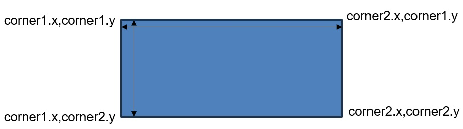

# Class methods
[&laquo; Return to the Chapter Index](index.md)

<details open markdown="block">
  <summary>
    Table of contents
  </summary>
  {: .text-delta }
1. TOC
{:toc}
</details>

## Key Idea
***Classes*** allow us to combine data and methods into a grouping or class and use that grouping as a data type in our programs. 

In addition to properties and constructors which we saw in our discussion of ***Data Classes***, generalized classes in typescript can also contain functions (called methods) that can access both *public* and *private* members of the class.

A class with methods can be viewed as a self-contained entity which ***encapsulates*** some concept, allowing us to use the class without knowing anything about its internal structure or implementation.

> ***Encapsulation*** is a key concept of this course.  The idea of creating reusable, self contained types which contain both data, and functions ot operate on that data is central to *Object-Oriented Programming*

## Adding functionality to a class

Let's consider our drawing example from the previous chapter
```typescript
class Color{
	constructor(public red:number, public green:number,public blue:number){ }
}
class Point{
	constructor(public x:number,public y:number,public color:Color){}
}
class Line{
	constructor(public start:Point,public end:Point,public color:Color){}
}
class Rectangle{
	constructor(public corner1:Point,public corner2:Point,public color:Color){}
}
```
{: .no-run}

Specifically, if we look at our Line class which contains two points with x and y coordinates, we might want an easy way to get a line's length.  We can expand our definition of a line to contain a method to accomplish this.  The `getLength()` method can be added inside the class definition.

```typescript
class Line{
	constructor(public start:Point,public end:Point,public color:Color){}

	getLength():number{
		let x=this.start.x-this.end.x;
		let y=this.start.y-this.end.y;
		let len:number=Math.sqrt(x*x+y*y);
		return len;
	}
}
```
{: .no-run}

> Note that we don’t need to know how the line is represented to use this method.  If we have a line and want it’s length, we simply call the getLength method. This is *important* because in the future we might change the internal representation of a line, but this method would still work if we rewrote it.  The calling program would not need to change.

Let's try it:

```typescript
import {Color,Point} from 'ch4/drawing1';

class Line{
	constructor(public start:Point,public end:Point,public color:Color){}
	public getLength():number{
		let x=this.start.x-this.end.x;
		let y=this.start.y-this.end.y;
		let len:number=Math.sqrt(x*x+y*y);
		return len;
	}
}
let myLine:Line=new Line(new Point(0,0,new Color(0,0,0)),new Point(100,100,new Color(0,0,0)),new Color(255,0,0));
let lineLen:number=myLine.getLength();
console.log(lineLen);
```

We can add as many methods as we want to a class.  The methods allow us to manipulate the data within the class or do calculations using the data within the class without knowing how the data within the class is actually represented.
The method itself must obviously know, but external code that uses the class does not need to know anything about the internal structure.
Later we will use the ***private*** keyword to hide that information from users of the class.
Our class will have a ***public interface*** which may be separate from its private internal representation.

## Default Parameters
It is possible to provide default values for the parameters in the function signature.  We can use this to provide default values for our color class.  Now we can create a color object with these default values.  In the example below, we create a color with a specific color, and one using the defaults (0,0,0).
```typescript
class Color{
	constructor(public red:number=0, public green:number=0,public blue:number=0){ }
}
let specificColor:Color=new Color(255,128,44);
let defaultColor:Color=new Color();
console.log(specificColor);
console.log(defaultColor);
```
## Another example
Let's try to add a `getArea()` method to our rectangle class.  This should be straight forward since we have the corners.
```typescript
class Rectangle{
	constructor(public corner1:Point,corner2:Point,color:Color){}

	getArea():number{
		//we want to multiply width * height, but we already have a way to get the width and the height
		//using our line class from before.  
		//Our width is (this.corner1.x,this.corner1,y) to (this.corner2.x,this.corner1.y)
		//Our height is (this.corner1.x,this.corner1.y) to (this corner1.x,this.corner2.y)
		//make lines for the top and left of the rectangle, and get there lengths, and multiply them together.
	}
}
```
{: .no-run}

The area is the length of the line from (corner1.x,corner1.y) to (corner2.x,corner1.y) times the length of th eline from (corner1.x,corner1.y) to (corner1.x,corner2.y)



```typescript
import {Color,Point} from 'ch4/drawing1';

class Line{
	constructor(public start:Point,public end:Point,public color:Color){}
	getLength():number{
		let x=this.start.x-this.end.x;
		let y=this.start.y-this.end.y;
		let len:number=Math.sqrt(x*x+y*y);
		return len;
	}
}
class Rectangle{
	constructor(public corner1:Point,public corner2:Point,public color:Color){}

	getArea():number{
		let corner3:Point=new Point(this.corner2.x,this.corner1.y,new Color());
		let corner4:Point=new Point(this.corner1.x,this.corner2.y,new Color());
		let horizLine:Line=new Line(this.corner1,corner3,new Color());
		let vertLine:Line=new Line(this.corner1,corner4,new Color());
		let area:number=horizLine.getLength()*vertLine.getLength();
		return area;
	}
}
let rect:Rectangle=new Rectangle(new Point(0,0,new Color()),new Point(100,100,new Color()),new Color());
console.log(rect.getArea());
```
## Exercises

Fill in the method `getDiagonals()`, `getPerimeter()`, and `getDiagonalLength()` methods as specified in the comments.
```typescript
import {Color,Point} from 'ch4/drawing1';

class Line{
	constructor(public start:Point,public end:Point,public color:Color){}
	getLength():number{
		let x=this.start.x-this.end.x;
		let y=this.start.y-this.end.y;
		let len:number=Math.sqrt(x*x+y*y);
		return len;
	}
}
class Rectangle{
	constructor(public corner1:Point,public corner2:Point,public color:Color){}

	getArea():number{
		let corner3:Point=new Point(this.corner2.x,this.corner1.y,new Color());
		let corner4:Point=new Point(this.corner1.x,this.corner2.y,new Color());
		let horizLine:Line=new Line(this.corner1,corner3,new Color());
		let vertLine:Line=new Line(this.corner1,corner4,new Color());
		let area:number=horizLine.getLength()*vertLine.getLength();
		return area;
	}
	/**
	     * Return an array of line objects which represent the two diagonals of the rectangle.
	     * @param none
	     * @returns An array of 2 points representing the diagonals.  The first point in the array should be top
	     * left to bottom right.  The second point should be top right to bottom left.
	     * @sideEffects None
	*/
	getDiagonals():Line[]{
	}
	/**
	     * Return the length of the diagonal of the rectangle.
	     * @param none
	     * @returns The length of the diagonal of the rectangle.
	     * @sideEffects None
	*/
	getPerimeter(): number {
	}
	/**
	   * Return the length of the diagonal of the rectangle.
	   * @param none
	   * @returns The length of the diagonal of the rectangle.
	   * @sideEffects None
	*/
	getDiagonalLength():number{
	}
}
let rect:Rectangle=new Rectangle(new Point(0,0,new Color()),new Point(100,100,new Color()),new Color());
console.log(rect.getDiagonals());
console.log(rect.getPerimeter());
console.log(rect.getDiagonalLength())
```
<details markdown="block">
<summary> Show Solution </summary>
```typescript
import {Color,Point} from 'ch4/drawing1';

class Line{
	constructor(public start:Point,public end:Point,public color:Color){}
	getLength():number{
		let x=this.start.x-this.end.x;
		let y=this.start.y-this.end.y;
		let len:number=Math.sqrt(x*x+y*y);
		return len;
	}
}
class Rectangle{
	constructor(public corner1:Point,public corner2:Point,public color:Color){}

	getArea():number{
		let corner3:Point=new Point(this.corner2.x,this.corner1.y,new Color());
		let corner4:Point=new Point(this.corner1.x,this.corner2.y,new Color());
		let horizLine:Line=new Line(this.corner1,corner3,new Color());
		let vertLine:Line=new Line(this.corner1,corner4,new Color());
		let area:number=horizLine.getLength()*vertLine.getLength();
		return area;
	}
	/**
	     * Return an array of line objects which represent the two diagonals of the rectangle.
	     * @param none
	     * @returns An array of 2 points representing the diagonals.  The first point in the array should be top
	     * left to bottom right.  The second point should be top right to bottom left.
	     * @sideEffects None
	*/ 
	getDiagonals():Line[]{
		let corner3:Point=new Point(this.corner2.x,this.corner1.y,new Color());
		let corner4:Point=new Point(this.corner1.x,this.corner2.y,new Color());
		let result=[
			new Line(this.corner1,this.corner2,new Color()),
			new Line(corner4,corner3,new Color()),
		];
		return result;
	}
	/**
	     * Return the length of the diagonal of the rectangle.
	     * @param none
	     * @returns The length of the diagonal of the rectangle.
	     * @sideEffects None
	*/
	getPerimeter(): number {
		let corner3:Point=new Point(this.corner2.x,this.corner1.y,new Color());
		let corner4:Point=new Point(this.corner1.x,this.corner2.y,new Color());
		let horizLine:Line=new Line(this.corner1,corner3,new Color());
		let vertLine:Line=new Line(this.corner1,corner4,new Color());
		return horizLine.getLength()*2+vertLine.getLength()*2;
	}
	/**
	   * Return the length of the diagonal of the rectangle.
	   * @param none
	   * @returns The length of the diagonal of the rectangle.
	   * @sideEffects None
	*/
	getDiagonalLength():number{
		let diags:Line[]=this.getDiagonals();
		return diags[0].getLength();
	}
}
let rect:Rectangle=new Rectangle(new Point(0,0,new Color()),new Point(100,100,new Color()),new Color());
console.log(rect.getDiagonals());
console.log(rect.getPerimeter());
console.log(rect.getDiagonalLength())
```
</details>


One thing to notice is that we had to compute the missing corners in every function.  It would make more sense to compute them when the object is created and store them as member variables.  We can do this without changing the ***public interface*** of the class and simplify all of our member methods.  We will do this in the next section.

So now we can add methods to our classes to create robust objects that encapsulate not just some heterogeneous data, but also methods that can work on that data.  
We can use the classes to create instances with the new operator which store their own data, and have methods that work on the data inside the instance.
```typescript
let color1=new Color(0,0,0);
let color2=new Color(255,255,255);
color1.red=255;
```
{: .no-run}

> NOTE: color2 is unchanged.  It is a distinct instance of our class Color.

## Summary
Classes in typescript can contain only data (Data Classes) or they can contain a combination of data and methods that operate on that data.  The methods can access the properties of the class instance by using the ***this*** keyword.  In this way, we can create classes that not only combine data that goes together, but also encapsulate it with the methods that act upon that data.  

# Next Step

Next we'll learn about Data Hiding: [Data Hiding &raquo;](./private.md)