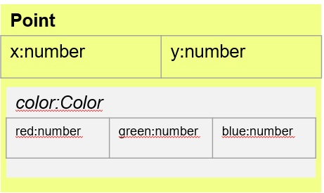

# Composition
[&laquo; Return to the Chapter Index](index.md)

<details open markdown="block">
  <summary>
    Table of contents
  </summary>
  {: .text-delta }
1. TOC
{:toc}
</details>

# Key Idea
Using ***composition***, we can build complex objects in order to define new types that has a ***contains a*** relationship with some existing type.

# Composition in Typescript
So far we have examined classes which contain both data and methods.  We can combine classes by including another class as a member of our class
* Consider the Point class which contains an instance of the color class.
* Consider the Rect class which contains instances of our color class and 2 point classes

This method of combining classes to produce other classes is known as ***composition*** because we are adding classes as members of our new class.
This is a powerful tool for building classes, as it allows us to compartmentalize concepts (like color, or point) then use them to build more complex concepts.

## Understanding the Relationship
The important thing here is the relationship with composition:
* In general, if a concept that a class (Class1) represents is a part of another class (Class2), then we add Class1 to Class2 as a member variable (property).
* We could also say that if Class2 contains Class1, 

> Note that the instance of Color is inside Point.  This makes sense since the point has a Color.

Let's look at a simple example:
```typescript
class Fruit{
  constructor(public type:string,public color:string,public price:number){};
}
class FruitBasket{
  constructor(private fruits:Fruit[],private basketCost:number){}
  public getPrice(){
    let sum:number=0;
    for (let fruit of this.fruits){
      sum+=fruit.price;
    }
    return sum+this.basketCost;
  }
}
let basket:FruitBasket=new FruitBasket(
  [new Fruit("apple","red",.50),new Fruit("orange","orange",.92),new Fruit("lemmon","yellow",1.50)],4.00
);
//expect 6.92
console.log(basket.getPrice());

```
Sometimes we have a different relationship,and we need a different mechanism to express it
# Summary

# Chapter Summary

# Next Step

Next we'll learn about Inheritence: [Inheritence &raquo;](../5-composition-inheritance/inheritance.md)