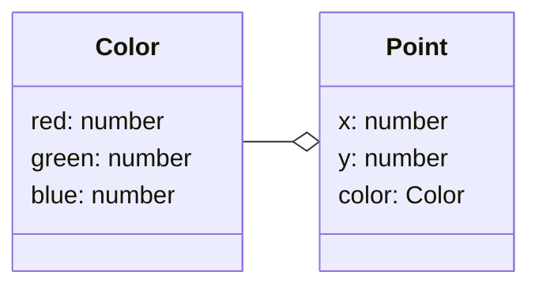

# Composition

[&laquo; Return to the Chapter Index](index.md)

<details open markdown="block">
  <summary>
    Table of contents
  </summary>
  {: .text-delta }
1. TOC
{:toc}
</details>

## Key Idea

Using **_composition_**, we can build complex objects in order to define new types that has a **_contains a_** relationship with some existing type.

## Composition in TypeScript

So far we have examined classes which contain both data and methods. We can combine classes by including another class as a member of our class

-   Consider the `Point` class which contains an instance of the `Color` class.
-   Consider the `Rect` class which contains instances of our `Color` class and 2 `Point` classes

This method of combining classes to produce other classes is known as **_composition_** because we are adding classes as members of our new class.
This is a powerful tool for building classes, as it allows us to compartmentalize concepts (like `Color`, or `Point`) then use them to build more complex concepts.

### Understanding the Relationship

The important thing here is the relationship with composition:

-   In general, if a concept that a class (Class1) represents is a part of another class (Class2), then we add Class1 to Class2 as a member variable (property).
-   We could also say that if Class2 contains Class1, then Class2 is composed of Class1.

Here is a visual representation of composition, where a `Point` class contains a `Color` class:



This would translate into the following code:

```typescript
class Color {
    constructor(
        public red: number,
        public green: number,
        public blue: number
    ) {}
}
class Point {
    constructor(public x: number, public y: number, public color: Color) {}
}

let red: Color = new Color(255, 0, 0);
let orig: Point = new Point(0, 0, red);
```

Recognizing the relationship between concepts that are to be represented as Classes is critical to Object Oriented Programming. Here are some simple examples:

-   A car _has a_ tire. If we have a tire class, we can represent a car by **_composition_**. We would add 4 (or 5) tire instances to our car class.
-   A course _has a_ final exam. If we had an exam class, we can represent a course by **_composition_**. We would add an instance of our exam class to course.
-   A classroom _has_ desks. If we had a desk class, we can represent a classroom by **_composition_**. We would add 1 or more instances of our desk class to our classroom.
-   A fruit basket _has_ fruit. The following example shows how we use **_composition_** to represent a basket of fruit by adding an array of fruit to our basket class.

```typescript
class Fruit {
    constructor(
        public type: string,
        public color: string,
        public price: number
    ) {}
}
class FruitBasket {
    constructor(private fruits: Fruit[], private basketCost: number) {}
    public getPrice() {
        let sum: number = 0;
        for (let fruit of this.fruits) {
            sum += fruit.price;
        }
        return sum + this.basketCost;
    }
}
let basket: FruitBasket = new FruitBasket(
    [
        new Fruit("apple", "red", 0.5),
        new Fruit("orange", "orange", 0.92),
        new Fruit("lemmon", "yellow", 1.5),
    ],
    4.0
);
// expect 6.92
console.log(basket.getPrice());
```

**_Composition_** allows us to reuse our fruit class for various types of fruit and combine them into a basket. Our basket can then expose public methods (like `getPrice()` which have access to the member fruits) to sum up the price of all the fruits, add it to the price of the basket, and return a total price which is dependent on the fruits inside.

## Summary

**_Composition_** gives the programmer the ability to represent a **_has a_** or a **_contains_** relationship. The relationship is the key to understanding when to use **_composition_** over other methods.

# Next Step

Next we'll learn about Inheritance: [Inheritance &raquo;](../5-composition-inheritance/inheritance.md)
