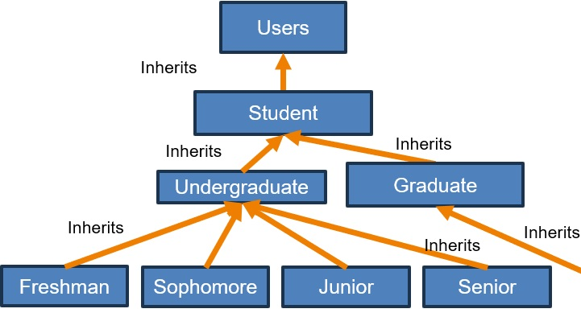

# Putting it all together
[&laquo; Return to the Chapter Index](index.md)

<details open markdown="block">
  <summary>
    Table of contents
  </summary>
  {: .text-delta }
1. TOC
{:toc}
</details>

# Key Idea
Using ***Inheritance***, we can build complex hierarchies of objects in order to define new types that are a ***type of*** some existing type.

# Composition and Inheritance
## Termiology review
**Composition:**
* Add a class or array of class as a property to your class.
* Represents a has a relationship
**Inheritance:**
* Extend an existing class by adding functionality, but keeping the functionality of the original class.
* Represents a is a relationship

The class that we are extending is called the ***superclass*** or sometimes the ***base class*** or ***parent class***
The class that we are creating by extending is called a ***subclass*** or ***child class***.

## Back to drawing
Is there something most of our objects have in common?

All of the drawing objects (Point, Line, Rectangle, Polygon) have a Color component.  If we create a class with just a color component, we could share that definition in all our drawing classes by extending it.

What should we call our new class?

We want something descriptive that supports the ***is a*** relationship with all the other classes.  For this example, I will choose to create a class *Drawable*.
```
class Drawable {
	public color: Color;
	constructor(color: Color) {
		this.color = color.clone();
	}
	public clone(): Drawable {
		return new Drawable(this.color);
	}
}
```
Here is a simple drawable class.  It contains a color (***composition***), a clone method, and automatically makes a deep copy of the color object in the constructor.
It just holds our color object, so we will extend this to make all of our other drawables.
```
export class Point extends Drawable {
	constructor(
		public x: number = 0,
		public y: number = 0,
		color: Color = new Color(),
    ) {
		super(color);
    }
	clone(): Point {
		return new Point(this.x, this.y,this.color);
	}
}
```
Our point class inherits color from the Drawable class.  Our Point constructor calls the constructor for our Drawable class and passes it the color so it can do its initialization (all drawables have a color).  It does this by passing color to ```super```
> Notice, that the public interface is unchanged, but we don’t have to worry about the color, the drawable does.

```
class Line extends Drawable{
	public start: Point;
	public end: Point;
	constructor(start: Point,end: Point,color: Color=new Color()) {
		super(color);  //Must be first thing in constructor always
		this.start = start.clone();
		this.end = end.clone();
	}
	clone(): Line {
		return new Line(this.start, this.end, this.color);
	}
}
```
Our Line class can also inherit from our Drawable class.  Again it calls super to initialize the Drawable portion of the object.
Note also that the constructor clones the corner points.
Reminder:
* Drawable is the ***superclass, base class, parent class***
* Line is the ***subclass, child class***

```
class Polygon extends Drawable{
	public points: Point[],
	constructor(points: Point[], color: Color ) {
		super(color);
		let newPoints=[];
		for (let point of points) {
			newPoints.push(point.clone());
		}
		this.points=newPoints;
	}
	clone(): Polygon {
		return new Polygon(this.points, this.color);
	}
}
```
Our polygon class can also inherit from our Drawable class.  Again it calls super to initialize the Drawable portion of the object.
Note also that the constructor clones the array of points by cloning each point and pushing them onto a new array before setting the member variable points.

At this point we have the tools to simplify our rectangle class since a rectangle is just a special ***type of*** polygon with exactly 4 sides and right angles between the points.  Our new implementation would be superior because it would allow for rotated rectangles which our current implementation does not allow.
```
class Rectangle extends Polygon{
	constructor(corner1:Point,corner3:point,color:Color=new Color()){
		super([corner1,new Point(corner3.x,corner1.y),corner3,new Point(corner1.x,corner3.y)])
	}
	public getArea():number{
		let horizLine:Line=new Line(this.points[0],this.points[1],new Color());
		let vertLine:Line=new Line(this.points[0],this.points[2],new Color());
		let area:number=horizLine.getLength()*vertLine.getLength();
		return area;
	}
	public getDiagonals():Line[]{
		let corner3:Point=new Point(this.corner2.x,this.corner1.y,new Color());
		let corner4:Point=new Point(this.corner1.x,this.corner2.y,new Color());
		let result=[
			new Line(this.points[0],this.points[2],new Color()),
			new Line(this.points[3],this.points[1],new Color()),
		];
		return result;
	}
	public getPerimeter(): number {
		let horizLine:Line=new Line(this.points[0],this.points[1],new Color());
		let vertLine:Line=new Line(this.points[0],this.points[2],new Color());
		return horizLine.getLength()*2+vertLine.getLength()*2;
	}
	public getDiagonalLength():number{
		let diags:Line[]=this.getDiagonals();
		return diags[0].getLength();
	}
}
```
Using the functionality of a Polygon to implement our rectangle greatly simplifies the implementation of the rectangle.  If we were to implement area and perimeter for a generalized polygon, then we could just call those methods using ```super.getArea```.

## Deeper hierarchies
We can create deeper hierarchies to express these types of relations.
* Everyone is a User
* A Student is a type of User
	* An undergrad is a type of Student
	* A Freshman is a type of Undergrad
Etc.



The point of inheritance is to capture these types of relationships.  Be careful that the relationship you are capturing is a ***type of*** relationship as many inexperienced programmers overuse ***inheritance***, where the relationship really calls for ***composition***.
* A point is not a type of color, so we don’t derive point from color.
* An undergraduate is a type of student, so we derive Undergraudate from Student

# Summary
***Inheritance*** allows us to capture an ***is a*** relationship between two classes.  When a class inherits from a ***superclass***, it gets access to everything in the superclass as well as anything defined within the ***subclass***.  We can use this to build complex deep hierarchies where we can represent complex objects by extending existing classes.

# Chapter Summary
In this chapter we have introduced two ways to build up a class from other classes.  
* If the two classes have an ***has a*** or ***contains*** relationship, then we use ***composition*** by adding member variables to our class of the other classes type.  A drawable contains a color by this method.
* If the two classes have a ***type of*** or ***is a*** relationship, then we use ***inheritance*** by extending one class and inheriting all of its members and functionality.  A line is a drawable by this method.

# Next Step

Next we'll learn about Overrides and Polymorphism: [Overrides and Polymorphism &raquo;](../6-polymorphism/index.md)