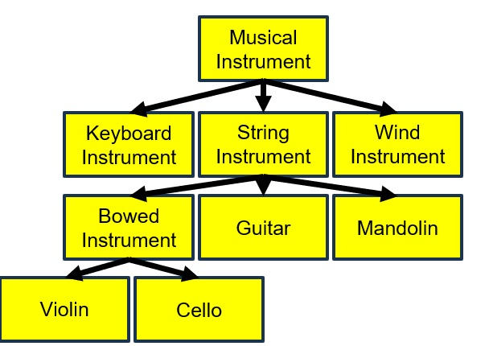

# Member Access

[&laquo; Return to the Chapter Index](index.md)

<details open markdown="block">
  <summary>
    Table of contents
  </summary>
  {: .text-delta }
1. TOC
{:toc}
</details>

## Key Idea

We can control **_access_** to the members of a superclass with the **_private, public, and protected_** keywords.

## Understanding Inheritance

In the previous chapter we introduced the notion of inheritance to support relationships between concepts that represent an **_is a_** or **_type of_** relationship.  
This is different from composition which supports relationships between concepts that represent a **_has a_** or **_contains a_** relationship.



> Note: Each subclass has a **_type of_** relationshiplower with its superclass.

Assume that the Musical Instrument has a `name`, a `musical key` (ie. C#, Bb), and a `year invented` field as well as a method `getName()` which returns the name of the instrument.

Then all the other classes ALSO have those fields. We don't need to recreate them in our child since we **_inherit_** them from the parent class. This is one of the primary benefits of inheritance.

> Note: Cellos have a name, key and year field and a getName() method automatically due to inheritance.

If you can map out the relationships between concepts, then by using a combination of inheritance and composition, we can build complex hierarchies out of simple objects.

### Controlling Access

When we create a class, we have options about how that class can be used and inherited.
Fields and methods can be:

-   `private`: Only accessible within the class
-   `protected`: Only accessible within the class or any defined subclasses
-   `public`: Accessible from anywhere (inside or outside the class hierarchy).

By controlling access to properties and methods, we expose to the outside world a minimal set of public properties and methods are exposed. Public items are more difficult to change because others might be using them. Protected are slightly easier and only break classes inherited from us. Changes to private methods effect nothing outside of the class itself.

Let's briefly go back to our drawing example.
Note that our points are private. This is good in case we want to change how we store polygons without breaking the rest of the code base, but it doesn't allow us to build other objects from polygon, like triangles, rectangles, etc.


{: .no-run}
```typescript
export class Polygon extends Drawable{
  private points: Point[],
	constructor(points: Point[], color: Color ) {
		super(color);
		let newPoints=[];
		for (let point of points) {
			newPoints.push(point.clone());
		}
		this.points=newPoints;
	}
	clone(): Polygon {
		return new Polygon(this.points, this.color);
	}
}
```

We can still prevent outsiders from accessing our array of `points`, while giving access to the array to any subclass of our class by using the **_protected_** keyword.

{: .no-run}
```typescript
export class Polygon extends Drawable{
  protected points: Point[],
  constructor(points: Point[], color: Color ) {
    super(color);
    let newPoints=[];
    for (let point of points) {
      newPoints.push(point.clone());
    }
    this.points=newPoints;
  }
  clone(): Polygon {
    return new Polygon(this.points, this.color);
  }
}
```

The points array is still not available to the outside world, and changing it would only affect the subclasses we create from `Polygon` (like rectangle and triangle), but users of our classes will not see a change. They still will not be able to access the points array just like before.

Now we can simplify the rectangle class by recognizing that a rectangle is a type of polygon. Because all of the members are private (i.e. not being used by anyone outside our class), we can change those members without fear of breaking other code.


{: .no-run}
```typescript
class Rectangle extends Polygon{
  constructor(corner1: Point, corner3: Point, color: Color) {
    super([
      corner1,
      new Point(corner3.getX(), corner1.getY()),
      corner3,
      new Point(corner1.getX(), corner3.getY()
    ], color);
  }
  clone(): Rectangle {
    return new Rectangle(this.corner1, this.corner3, this.color);
  }
}
```

Notice that now we are deriving from Polygon instead of Drawable. Because a polygon can already represent a rectangle, we don't need any other properties (we can delete the corners).

We call the superclasses constrctor with the array of points for the particular 4 sided polygon that this rectangle represents.
We would need to rewrite the area, perimeter and diagonals methods to use our new implementation, but users of our class will see no change in how they use it.

Because we are passing the points to the Polygon constructor, and that constructor clones the points when it builds the member variable points, we do not need to do it here. It would work if we did, but we would have short lived, unnecessary copies of the points in memory.
Knowing how the parent works informs how we write the subclass.

> If no **_access specifier_** (public,private,protected) is given, the compiler will default to public.

### Important points on experience

Some important points on inheritance.

-   You do not need to reimplement the properties of the parent class as you are inheriting them.
-   `super(...)` calls the constructor of the parent class and takes whatever arguments the parent constructor takes.
-   If a member is public or protected, you can access it in the subclass, if it is private, you cannot, but it is still there.

When we subclass, we get all of the properties of our parent class and can access them if they are public or protected.
For methods (i.e member functions), the same holds true based on if they are public, protected, or private. We get the functions in the superclass.

## Summary

We can control access to the members of a class (both properties and methods) by using the **_public, private, and protected_** keywords. **_Public_** members are accessible to all, **_private_** members are only accessible within the class, and **_protected_** members are accessible in the class and in any subclass of the class.

# Next Step

Next we'll learn learn about overriding class methods: [Overrides &raquo;](../6-polymorphism/overrides.md)
