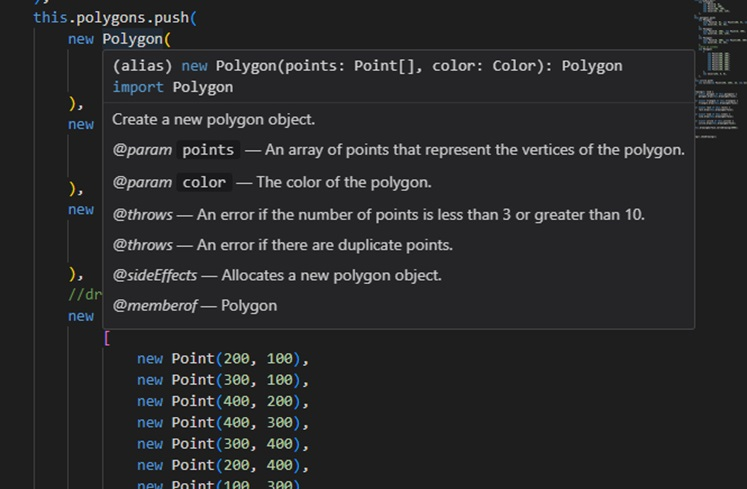
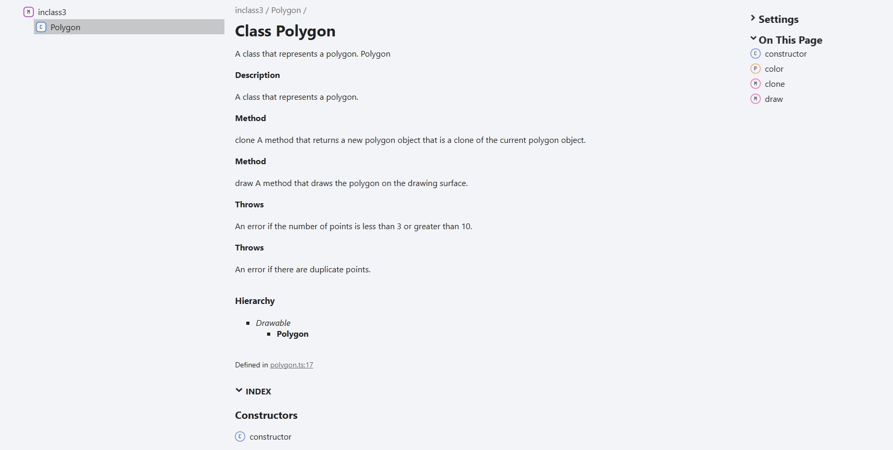
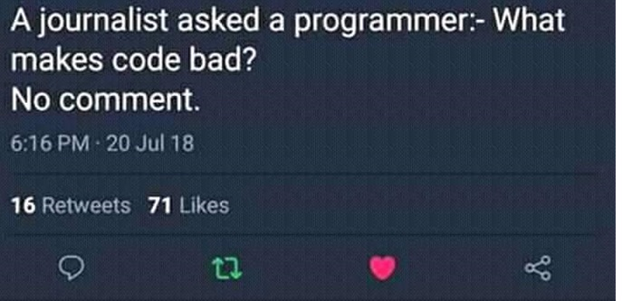

# Comments
[&laquo; Return to the Chapter Index](index.md)

<details open markdown="block">
  <summary>
    Table of contents
  </summary>
  {: .text-delta }
1. TOC
{:toc}
</details>

## Key Idea
Producing well documented, high quality, efficient and readable code is always the goal in software development.

## Code Quality in General
**Why comments?**
Helps others (and yourself) use your code without having to read it.  Informs user of everything they need to know to use your method or class.
If in the correct format, they can automatically produce documentation.
If in the correct format, they can be read by IDE’s like vscode.

**Why naming matters?**
If we do need to revisit our code (and we will), having well named variables and methods makes figuring out what the code is doing internally much easier.
Our classes will be easier to use if our public interface uses names that make sense given the purpose of the thing we are referencing.

**Code Quality**
This is a general measure of how good the code is.  It includes:
* Efficiency (more on this next semester)
* Readability
  * Comments, naming, indenting, consistency of the code, adherence to standards, etc.
* Usability
  * How easy to use is the code.  If it is a class, how easy is it to create objects or extend.  How easy is it to make changes.  If a program, how what is the user experience like?

## Comments
At this point, you should be convinced you that comments are worth your time.  Now lets look at how to format a comment in typescript to make it more usable.
We are using the jsdoc format for our comments.  This is a good solution because we can automatically generate our documentation of our classes and methods, as well as provide tool tip help in vscode (and other IDEs).

The most common tags available to us for jsdoc are:
<table>
<tr><td>@param</td><td>@private</td><td>@example</td><td>@override</td></tr>
<tr><td>@returns</td><td>@protected</td><td>@memberof</td><td>@implements</td></tr>
<tr><td> @description</td><td>@throws</td><td>@property</td><td>@interface</td></tr>
<tr><td>@class</td><td>@export</td><td>@function</td><td></td></tr>
</table>

Some of these are for constructs we have not learned yet, but all but 2 can be understood now.

```
/**
 * A class that represents a polygon.
 * @class Polygon
 * @extends Drawable
 * @description A class that represents a polygon.
 * @method clone A method that returns a new polygon object that is a clone of the current polygon object.
 * @method draw A method that draws the polygon on the drawing surface.
 * @throws An error if the number of points is less than 3 or greater than 10.
 * @throws An error if there are duplicate points.
 */
class Polygon extends Drawable {
   . . .
```

Here is a well formatted comment for the polygon class.
Note it tells us everything we need to know about the class to use it.
It also describes the exceptions that it may throw.

We should also comment the methods inside our class.  This is what a comment for the constructor might look like:
```
/**
	 * Create a new polygon object.
	 * @param {Point[]} points Array of vertices of the polygon.
	 * @param {Color} color The color of the polygon.
	 * @throws An error if the number of points is invalid
	 * @throws An error if there are duplicate points.
	 * @sideEffects Allocates a new polygon object.
	 * @memberof Polygon
	 * @constructor
	 * @example
	 * let p1 = new Point(0, 0);
	 * let p2 = new Point(0, 1);
	 * let p3 = new Point(1, 1);
	 * let polygon = new Polygon([p1, p2, p3], new Color());
*/
	constructor(points: Point[], color: Color) {
```

* We see the parameters and their types and description.
* What exceptions to expect
* It’s side effects
* It’s parent class
* It is a constructor
* An example of how to use it.

The clone method as well:
```
/**
	 * Return a deep copy of our polygon object in a new one.
	 * @description Clones a polygon object
	 * @param none
	 * @returns A new polygon object that is a clone of the current polygon object.
	 * @override The clone method of the Drawable class.
	 * @memberof Polygon
	 * @function clone
	 * @sideEffects Allocates a new polygon object.
	 * @example
	 * let p1 = new Point(0, 0);
	 * let p2 = new Point(0, 1);
	 * let p3 = new Point(1, 1);
	 * let polygon:Polygon = new Polygon([p1, p2, p3], new Color());
	 * let polygon2:Polygon = polygon.clone();
	 */
	clone(): Polygon {
```

* We see the parameters and their types and description.
* The return values
* It’s side effects
* It’s parent class
* It is a function
* An example of how to use it.

Why bother with all this formatting?  

Look what happens when I hover over the polygon class in vscode now.  I now get help on using this class constructor.
We can also generated detailed technical documentation automatically by using the typedoc command.


Quality, well formatted comments make your code more usable, manageable, and maintainable.


There are other things we can do to improve code quality as well.

## Summary
Clear, straight forward comments on our code make our code more useful.  We can specify details about how to use the code, what its limitations are, if it throws exceptions, and what it expects and returns.  If formatted using jsdoc, then we can also get help in IDEs like Visual Studio Code and generate a detailed documentation website using typedoc.  


# Next Step

Next we'll learn about the importance of naming: [Naming &raquo;](../7-exceptions_code_qual/naming.md)