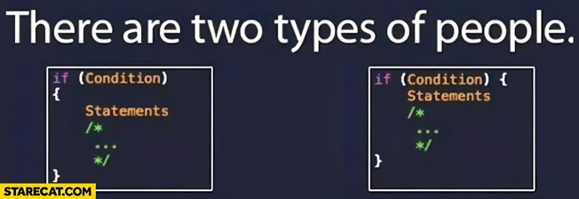

# General Code Quality

[&laquo; Return to the Chapter Index](index.md)

  

    Table of contents
  

  {: .text-delta }
1. TOC
{:toc}

## Key Idea

Programmers should always try to create efficient, readable, and maintainable code. It's not that hard to do it right.

## Best Practices

Good formatting, indenting, and consistency of style are important to maintaining a large code base. Many organizations will dictate these types of things.

-   Indents are 2 or 4 spaces
-   Braces at the end of lines or on a new line
-   Parameters on one line or multiple lines
-   The list goes on. There are best practices, but while many are agreed upon, some are preferences.

> Rule number 1: be consistent.

## Summary

When coding, remember you are not the only one who will look at your code. Others will be responsible for maintaining, updating, or using the code you produce. Writing well comments, well named, clear and consistent code is critical to success as a software developer.

## Chapter Summary

In order to write better programs, we must handle exceptional cases. The exception handling process (try/catch/finally) gives us a mechanism to easily handle these cases.

Code should be readable, maintainable, and understandable. Good comments are critical. Naming of functions, classes, and variables so that their names represent the information they will hold or action they will take is also important.

# Next Step

Next we'll examine testing: [Testing &raquo;](../8-testing/index.md)
