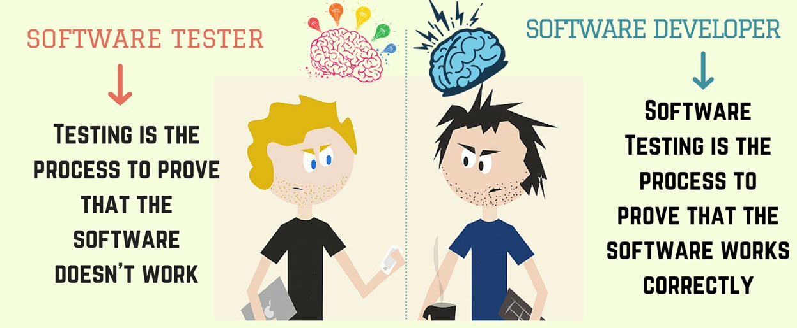

# Testing
[&laquo; Return to the Chapter Index](index.md)

<details open markdown="block">
  <summary>
    Table of contents
  </summary>
  {: .text-delta }
1. TOC
{:toc}
</details>

@# Key Idea
***Software Testing*** is the process of validating that software is bug free and meets requirements.
## General
What we are concerned with in software testing:
* Validate the software is bug free
* Validate the software meets requirements
* Validate the software behaves as expected on boundary cases
* Validate the software behaves as expected on exceptional cases

## Verification and Validation
* ***Verification*** refers to the set of tasks that ensure that the software correctly implements a specific function. It means “Are we building the product correctly?”.
* ***Validation*** refers to a different set of tasks that ensure that the software that has been built is traceable to customer requirements. It means “Are we building the correct product?”.

## Motivation
A little history to motivate the discussion.

Software bugs can be expensive, but they can also be very dangerous.  Here are a few examples of software bugs causing terrible outcomes:
* 1985: Canada's Therac-25 radiation therapy malfunctioned due to a software bug and resulted in lethal radiation doses to patients.
* 1994: China Airlines Airbus A300 crashed due to a software bug killing 264 people.
* 1999: A software bug caused the failure of a $1.2 billion military satellite launch.
* 2015: A software bug in an F-35 resulted in it being unable to detect targets correctly.
* Starbucks was forced to close more than 60% of its outlet in the U.S. and Canada due to a software failure in its POS system.
* Nissan cars were forced to recall 1 million cars from the market due to a software failure in the car's airbag sensory detectors.

***We have to get it right!!!***

## Types of testing
* ***Functional***: Does it do what it is supposed to do?  Does it meet requirements?  Does it work correctly on all possible inputs?
* ***Non-Functional***: How does it perform on various inputs? Does it scale? How usable is it?  How does it behave under heavy use/load?
* ***Regression Testing***: After the software is modified, verify that the modifications did not damage previously working components of the system.

## Testing levels
* ***Unit testing***: Test small independent components for correct behavior.  The purpose is to validate that each unit of the software performs as designed. 
* ***Integration testing***: Combining units and testing as a group.  The purpose of this level of testing is to expose faults in the interaction between integrated units. 
* ***System testing***: Tests of the completed system. The purpose of this test is to evaluate the system's compliance with the specified requirements. 
* ***Acceptance testing***: Test to ensure compliance with the requirements specification. The purpose of this test is to evaluate the system's compliance with the business requirements and assess whether it is acceptable for delivery. 

## Best Practices
* Test continuously throughout the development process.
* Make tests small and include many to make finding issues easier
* Use tools to evaluate things like code coverage to ensure thorough testing
* Don't skip regression testing.



Some comments from experience:
* While time consuming, testing is critical to writing good software systems.
* Poorly written tests are like having no tests at all.  This requires some thought.
* Failure to write tests will eventually cause problems in any system of a reasonable size.
* Seemingly unrelated code segments can and do break each other.
* Test after each change to aid in solving issues that arise as you code.
> In other words, you should write tests early in the process.  Possibly even before writing a line of code.

## Good Tests
So what makes a good test?
Start at the unit level (function) and validate that the function behaves as expected in all cases.
* Make sure you test its behavior on edge cases
* Make sure you test its behavior on exceptional/invalid inputs
* Make sure your comments document the behavior in exceptional/invalid instances. (ie. Does it replace the value, throw an exception)
Once you have unit tests, start testing higher level operations (i.e. instantiate classes that use your unit tested code.  Simulate the overall behavior of the system.  Again, use the same methodology.

## Understanding what to test.
We will be using jest to write tests in Typescript.  You have already seen this in lab, but now we are going to write our own tests.
Jest provides a format for writing tests in a simple and organized way.
Jest can run tests on the entire system or on individual components.
Jest can produce a coverage report to let you know which lines are not “covered” by the test (i.e. functions not called, branches not taken, etc.)
Testing can easily be built into the build cycle, so that tests are run as part of each build.

Here is some simple code that adds the root of the passed value to an array.
```
const valueArray:number[]=[];
/**
 * @description Takes a number and adds its square root to the array valueArray
 * @param value {number} - The number to be squared
 * @returns {number} - The square root of the number
 * @sideEffects - Adds the square root of the number to the valueArray
 */
function addToRootArray(value:number):number{
	const root=Math.sqrt(value);
	valueArray.push(root);
	return root;
}
```
Let's start by asking what we might want to know about how this code behaves, and how we could test that:
* How does it behave on a positive integer?
	* Pass it one and verify contents of the array
* How does it behave on a positive real number?
	* Pass it a positive real number and verify contents of the array
* How does it behave when passed a 0.
	* Pass it a 0 and verify the contents of the array
* How does it behave on a negative integer.
	* Pass it a negative integer and verify the contents of the array
* How does it behave on a negative real number?
	* Pass it a negative real and verify the contents of the array
* How does it behave when the array is empty/populated already?
	* Create various arrays with 0, 1, 2, and many elements, call the function and check the contents of the array.

>Are those behaviors what we expect and what is documented?

And here is another example.
```
export class Elements {
	private stringArray: string[] = [];
	/**
	 * @description This function returns and     * removes the last element
	 * @returns {string} - The last element of the
	 * array
	 * @sideEffects - Removes the last element of 
	 * the array
	 */
	getLastElement(): string {
		return this.stringArray.pop();
	}
}
```
What questions might we ask here?
* Can I construct one of these?
	* Call the constructor and verify
* Does it work normally?
	* Populate with some items and try
* What happens if the array is empty?
	* Ensure array is empty and try
* What happens if the array has only one element in it?
	*Populate with 1 item and try

To create tests in a project that is already configured for jest, we create files with the word ‘test' in their filename (i.e. myprogram.test.ts)

> This can be changed, but our projects will be pre-configured to work this way.

* Running jest on the command line by itself within the project folder will run tests in all properly named files.
* Running jest on the command line with the name of the file (without the test.ts) will run tests in only that file.
* Running jest on the command line with –coverage will produce a coverage report.

## Summary
Designing good tests and testing methodologies will help create software that can be validated and verified.  Different levels of testing allow for testing individual functions, classes, or sets of code as well as the full system.  Before writing tests, ask what types of thing should be tested.  Make sure you test edge cases and exceptional situations to make sure you have covered all possible inputs.

# Next Step

You may have noticed the odd syntax, before we continue, let's cover ***anonymous functions*** which will help us better understand the testing syntax.  
[Annonymous Functions &raquo;](../8-testing/anonymous.md)