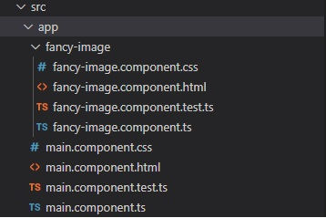
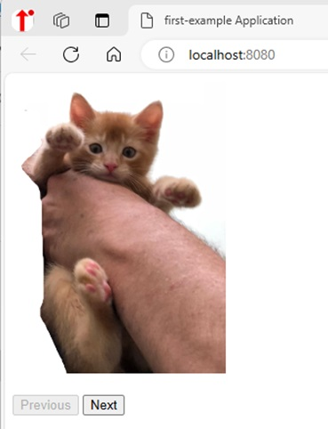
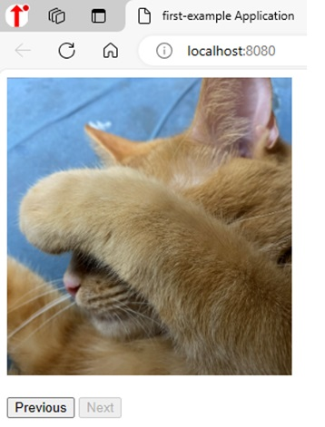

# Beginning WebZ
[&laquo; Return to the Chapter Index](index.md)

<details open markdown="block">
  <summary>
    Table of contents
  </summary>
  {: .text-delta }
1. TOC
{:toc}
</details>

# Key Idea
***WebZ*** is a lightweight web framework designed for this book.  It uses many of the same principals as more advanced web frameworks such as React and Angular, but simplifies operations to focus on Typescript development

# Overview
Once we have some html, we would like it to do something.  That’s where the typescript comes in.
You can create a web application without a framework, but it can be difficult and requires a deeper knowledge of how a web browser works.
Many frameworks exist, but because they are for commercial purposes, they are large and have steep learning curves (angular, vuejs, react, etc.)
We created WebZ to be a lighter weight, easier to learn framework that will prepare you for more complex frameworks that may come later and allow you to create impressive applications without a steep learning curve (still a curve, just not as steep).

## The WebZ Model
The WebZ model uses standard html and css like we talked about in the last section inside the basic unit of a component.
Every project starts with 1 component called MainComponent.  It has an html file, a css file, and a ts file to get you started (and a file for your tests).
Additional components can be created and inserted into the MainComponent to build an object-oriented web application.
Some Key design points:
* The html is plain html.
* The css is plain css.
* The ts file uses decorators to attach methods and properties of the class to the html by the element’s id attribute (I told you we would need it later).
The finished product is compiled into a website that can be published on any web server.

## Getting Started with WebZ
To get started, we need to install the WebZ command line tool from NPM.
```bash
npm i -g @boots-edu/webz-cli
```

To create a new project called Example Project, we can use the cli to build (scaffold) the code.
```bash
webz new first-example
```
This creates a fully working website with one component in it (MainComponent)

This installs a basic WebZ project with a single component in it that you can edit, and a lot of support files that you can ignore.
You are only interested in what is inside the src/app folder (src\app on Windows)

WebZ is a component-based system.  Individual elements should be broken up into components and attached to the web document in the constructor.
If we navigate to the src/app folder at a command prompt, we can add more components using the CLI interface.
```bash
webz component fancy-image
```
This will create a folder with the 4 files in it (Just like MainComponent)



Here you can see the structure created for us.  This does not attach the component to anything, it just creates the files for us.
To add the FancyImageComponent somewhere inside MainComponent we edit the files for MainComponent

First the html (main.component.html) (note the div is where the new component will go (image-holder).  The buttons are to allow us to navigate later in the example):
```html
<div id="image-holder"></div><br/>
<button id="prev">Previous</button>
<button id="next">Next</button>
```
And the typescript class (main.component.ts):
```
export class MainComponent extends WebzComponent {
	private fancyImg:FancyImageComponent = new FancyImageComponent();
	constructor() {
		super(html, css);
		this.addComponent(this.fancyImg,"image-holder");

	}
}
```

The div ```#image-holder``` is where we attach our component.  We have also added two buttons which we can use to control our fancy image component.

> We can run this to make sure it worked with npm run start.  We should see the default text for fancy-image and 2 buttons on the screen.

Now we will add the html and css for the fancy-image component.  We will also put two images img1.jpg and img2.jpg into the assets folder.

Replace the html with:
```html
</img>
```
Add CSS to set it's size:
```css
#image{
	height: 300px;
}
```
How we have a place for our image, and we have set its size.  What we want to do is have a variable in our class that is the name of the image we want to display.  The *image* property in the following code.
```
export class FancyImageComponent extends EzComponent {
	public imagePath: string = "assets/img1.jpg";

	constructor() {
		super(html, css);
	}
}
```
To connect html elements and class properties, we use typescript decorators to specify how to attach that variable to the html.  In this case we want to set the src attribute of the element with id image.  This will cause the src attribute of the element with id image to contain the text in the member property imagePath.
```
export class FancyImageComponent extends EzComponent {
	@BindAttribute("image", "src")  //this is the decorator binding src attribute of element with id image
	public imagePath: string = "assets/img1.jpg";

	constructor() {
		super(html, css);
	}
}
```
> If you run this code with ```npm run start``` you will see the image displayed.

## Decorator transforms
While this is nice, I would rather use a numeric value (1 or 2) to select my image.  I can do that in WebZ by using a custom transform.
```
@BindAttribute("image", "src", (imgNum: number): string => {
	    return `assets/img${imgNum}.jpg`;
})
public image: number = 1;
```
> Notice that we pass an anonymous function to the bind decorator that takes a number and returns a string.

Now we can just change the image number and it will just modify the img tag to load the correct image.

Remember the buttons we added to MainComponent.  What do we want them to do:
* If we are at the first image, disable the previous button.
* If we are at the second image, disable the next button.
* If next is pushed increment the image number
* If previous is pushed decrement the image number

So first we need variables to bind to the disabled attribute of the buttons so we can disable them.  There is a special decorator in WebZ, ```@BindDisabledToBoolean``` that greatly simplifies this process for us.

```
export class MainComponent extends EzComponent {
	private fancyImg: FancyImageComponent = new FancyImageComponent();
	@BindDisabledToBoolean("prev")
	public prevDisabled: boolean = true;
	@BindDisabledToBoolean("next")
	public nextDisabled: boolean = false;
	. . . //rest of class omitted for brevity
```

Then we need to bind the button's click events to a function that increments/decrements the value and properly sets the values of prevDisabled and nextDisabled.  Notice that the html id of the buttons is prev and next.  We use that in the @Click decorator to specify which button we are binding.
```
	@Click("next")
	onNext(){
		this.fancyImg.image++;
		this.prevDisabled = false;
		if(this.fancyImg.image === 2){
			this.nextDisabled = true;
		}
	}
	@Click("prev")
	onPrev(){
		this.fancyImg.image--;
		this.nextDisabled = false;
		if(this.fancyImg.image === 1){
			this.prevDisabled = true;
		}
	}
```
If next is pushed:
* Increment the image number
* Enable the previous button
* Disable the next button
if prev is pushed:
* Decrement the image number
* Disable the previous button
* Enable the next button

If we run this with ```npm run start``` we will initially see imag1.jpg displayed and our buttons.



Clicking hte next enables the previous button, disables the next button and displays img2.jpg.



There really isn’t much more to it.  Bind decorators connect properties to elements.  If we change the property, the element changes (NOT THE OTHER WAY AROUND).
Event Decorators capture events from the web page allowing us to react to those events.  These are decorators like @Click(…)
We will cover some more advanced features in the next chapter, but these are the basics.
## Decorators in WebZ
### Bind Decorators
General:
* @BindAttribute(id,attr,?trans)
* @BindCSSClass(id,class,?trans)
* @BindStyle(id,style,?trans)
* @BindValue(id,?trans)

Specialized:
* @BindValueToNumber(id,?append)
* @BindCSSClassToBoolean(id,class)
* @BindDisabledToBoolean(id)
* @BindVisibleToBoolean(id)
* @BindStyleToNumber(id,style,?append)
* @BindStyleToNumberAppendPx(id,style)

### Event Decorators
General:
* @GenericEvent(id,eventType) (e:Event)=>{}
* @WindowEvent(eventType) (e:WindowEvent)=>{}
* @Timer(milliseconds) (f:TimerCancelFunction)=>{}

Specialized:
* @Blur(id) (e:Event)=>{}
* @Change(id) (e:ValueEvent)=>{}
* @Click(id) (e:MouseEvent)=>{}
* @Input(id) (e:ValueEvent)=>{}

> Note: You can only use these on a class derived from WebzComponent.  All classes created with the CLI will automatically subclass WebzComponent.

## References
HTML References
* Intro:  https://developer.mozilla.org/en-US/docs/Learn/Getting_started_with_the_web/HTML_basics
* Reference: https://www.w3schools.com/tags/default.asp

CSS References
* Intro: https://developer.mozilla.org/en-US/docs/Learn/CSS/First_steps/Getting_started
* Reference: https://www.w3schools.com/cssref/index.php

Playgrounds
* https://playcode.io/html
* https://www.w3schools.com/tryit/
* https://jsfiddle.net/

## Summary
In this section we learned about the Webz framework and how we can build a simple interactive application.  The CLI can be used to generate new projects, and add components to an existing project.  We can then attach code and variables to our html using the various decorators outlined in this chapter.

# Chapter Summary
In this chapter we have learned the basics of web development including html and css.  We have introduced ***WebZ*** which is a framework developed for this book.  By binding variables to element attributes and functions to element events, we can build complex web applciations.
# Next Step

Next we'll learn more advanced features of Webz and how to use them [Advanced WebZ &raquo;](../10-webz-advanced/index.md)