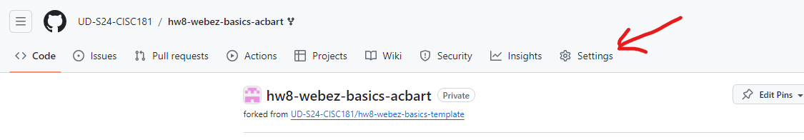

# Webz Basics Walkthrough
[&laquo; Return to the Chapter Index](index.md)

<details open markdown="block">
  <summary>
    Table of contents
  </summary>
  {: .text-delta }
1. TOC
{:toc}
</details>

## Key Idea
***Webz*** can be used to create an interactive website.


This walkthrough will help you build and deploy your first Webz application. You will learn how to create components, bind values, and handle basic events.

## 0) Setup

1. Use the Github classroom link provided in the original assignment on Canvas to create your own copy of the starter repo.
2. Clone the repo to your local machine in an appropriate directory.
3. Open the directory in VS Code, as you normally do.
4. Run `npm install` in the VS Code terminal to install the dependencies.

```bash
npm install
```

1. Run `npm run start` in the terminal to start the development server. This may take a few seconds to compile the code and start the server. If you need to stop the server, you can press `Ctrl+C` in the terminal.

<details markdown="block">
<summary>You can click here to see what the output looks like for us when the server starts successfully.</summary>

Keep in mind that the details of your output may look different!

```
> hw8-webz-basics@0.0.1 start
> webpack serve

<i> [webpack-dev-server] Project is running at:
<i> [webpack-dev-server] Loopback: http://localhost:8080/
<i> [webpack-dev-server] On Your Network (IPv4): http://10.0.0.154:8080/
<i> [webpack-dev-server] On Your Network (IPv6): http://[fe80::33d:1bcd:53b8:4c62]:8080/
<i> [webpack-dev-server] Content not from webpack is served from 'C:\Users\acbar\Projects\cisc181\sites\hw8-webz-basics-acbart\public' directory
<i> [webpack-dev-server] 404s will fallback to '/index.html'
assets by path assets/ 110 KiB
  asset assets/babbage.jpg 63.8 KiB [emitted] [from: assets/babbage.jpg] [copied]
  asset assets/ada.jpg 45.9 KiB [emitted] [from: assets/ada.jpg] [copied]
  asset assets/.keep 0 bytes [emitted] [from: assets/.keep] [copied]
asset main.bundle.js 367 KiB [emitted] (name: main) 1 related asset
asset index.html 198 bytes [emitted]
runtime modules 27.4 KiB 13 modules
modules by path ./node_modules/ 219 KiB 41 modules
modules by path ./src/app/ 38.9 KiB
  modules by path ./src/app/boop-button/ 7.3 KiB 4 modules
  modules by path ./src/app/simple-calculator/ 12.2 KiB 4 modules
  modules by path ./src/app/box-editor/ 10.7 KiB 4 modules
  modules by path ./src/app/*.css 3.02 KiB 2 modules
  ./src/app/main.component.ts 5.21 KiB [built] [code generated]
  ./src/app/main.component.html 445 bytes [built] [code generated]
modules by path ./*.css 3.5 KiB
  ./styles.css 2.23 KiB [built] [code generated]
  ./node_modules/css-loader/dist/cjs.js!./styles.css 1.27 KiB [built] [code generated]
./wbcore/start.ts 265 bytes [built] [code generated]
webpack 5.91.0 compiled successfully in 4226 ms
```
</details>

6. Although we could now open your website in chrome at the localhost url `http://localhost:8080`, we will use the integrated debugger in VS Code. Activate this by pressing `F5` on your keyboard (or selecting the `Run` tab from the top menu and then clicking `Start Debugging`). This will open a new browser window with your application running. The debugger has a bunch of useful features, like setting breakpoints and inspecting variables - we'll talk more about them later on.

{: .note-title }
> Debugging in VS Code
>
> You can only activate the debugger if you have the server running. If you close the server, you will need to start it again before you can use the debugger.

7. You should now be able to see your website. It won't be very exciting at first, but you can now start editing the code and see the changes in real-time!

## 1) Basic HTML

Let's start by adding some dynamic text to the page. We'll need to edit the `MainComponent`, which came with the starter repo. This is the main component that is displayed on the page, and there's always exactly one of them in every Webz application. Although we created the component for you, we haven't done anything else. Let's add some text to the page.

1. Expand the `src/app` folder in the sidebar. You will see four files there: `main.component.ts`, `main.component.html`, `main.component.css`, and `main.component.test.ts`. 


  * `main.component.html` is the HTML file that defines the structure of the component. This is where we put the visual content of your application.
  * `main.component.css` is the CSS file that defines the styles for the component. This is how we make things look pretty.
  * `main.component.ts` is the TypeScript file that defines the `MainComponent` class. This is where the application logic will go.
  * `main.component.test.ts` is a (mostly empty) test file for the component. We'll talk more about testing your own components later on.

2. Open `main.component.html`. You will see that it contains the following code:

{: .no-run }

```html
<div>
    <div class="header">
        <div class="title">hw8-webz-basics Example</div>
    </div>
</div>
```

This is the default content that comes with the starter repo. The `div` tag is a generic container that can hold other elements (a "division" of content). In this case, we have a `div` with the class `header`, which contains a `div` with the class `title`. The `class` attribute is used to apply CSS styles to the element. We'll talk more about CSS later on. For now, focus on the text inside of the `div` tags.

3. Change the text inside the `div` with the class `title` to something else. For example, you could change it to:

{: .no-run }

```html
<div class="title">My First Webz Application</div>
```

4. Save the file. You should see the changes reflected in the browser window automatically. If you don't see the changes, make sure that the debug mode is still running. 

5. Now, let's add a new element to the page with some more text. Add the following code after the `div` with the class `header`, but inside the outer `div`. The `p` tag is used to create a paragraph of text.

{: .no-run }

```html
<p>Welcome from the HTML side!</p>
```

If you did this correctly, the HTML should look something like the HTML below. Pay close attention to the structure of your HTML, and make sure you are closing all of your tags properly. The location of tags is important, as it determines how the elements are displayed on the page.

{: .no-run }

```html
<div>
    <div class="header">
        <div class="title">My First Webz Application</div>
    </div>
    <p>Welcome from the HTML side!</p>
</div>
```

6. Save the file, and confirm that the new text is displayed in the browser window.
7. We're going to modify the `p` tag to include an `id` attribute. This will make it easier to test our application later on. Add the `id` attribute to the `p` tag, like so:

{: .no-run }

```html
<p id="example-text">Welcome from the HTML side!</p>
```

Make sure you use the exact `id` value (`example-text`) as shown above. When you save the file, the page will not look any differently. The `id` attribute is used to uniquely identify an element in the HTML document, but does not affect the appearance of the element.

8. Now, let's add some dynamic text to the page. We're going to use TypeScript to change the text of a new `p` tag. Make a second, empty `p` tag with an `id` after the existing one, like so:

{: .no-run }

```html
<p id="example-target"></p>
```

<details markdown="block">
<summary>Click here to see the full HTML so far</summary>

{: .no-run }

```html
<div>
    <div class="header">
        <div class="title">My First Webz Application</div>
    </div>
    <p id="example-text">Welcome from the HTML side!</p>
    <p id="example-target"></p>
</div>
```

</details>

{: .important-title }

> IDs Matter!
> 
> Make sure you are matching the `id` values exactly as shown above. This will become important when we run the tests later!

9. Open `main.component.ts`. This is the TypeScript file that defines the `MainComponent` class. This is where the application logic will go. You will see that it contains the following code:

{: .no-run }

```typescript
import html from "./main.component.html";
import css from "./main.component.css";
import { WebzComponent } from '@boots-edu/webz';

/**
 * @description MainComponent is the main component of the app
 * @extends WebzComponent
 * 
 */
export class MainComponent extends WebzComponent {
    constructor() {
        super(html, css);
    }
}
```

In Webz, components are defined as classes that extend the `WebzComponent` class. The `MainComponent` class is the main component of the application, and it is the component that is displayed on the page. The `constructor` method is called when an instance of the class is created. In this case, we are calling the `super` method with the `html` and `css` variables. This is how we tell Webz to use the HTML and CSS files that we created. The `html` and `css` variables are just strings that contain the contents of the HTML and CSS files, imported from the files themselves.

10. Add a new private `string` field to the `MainComponent` class called `myText`, with the initial value `"Hello from the TypeScript side!"`. This field will hold the text that we want to display on the page.

{: .no-run }

```typescript
private myText: string = "Hello from the TypeScript side!";
```

11. On its own, just creating a field doesn't do anything interesting. We need to *bind* the field to the HTML so that the text is displayed on the page. We can do this by using the `BindValue` decorator. Add the following code directly above the `myText` field:

{: .no-run }

```typescript
@BindValue("example-target")
```

The `@BindValue` decorator is used to bind a field to an element in the HTML; in general, a decorator can enhance the functionality of a field or a method of a class. This decorator takes a single argument, which is the `id` of the element that we want to bind to. In this case, we are binding the `myText` field to the element with the `id` `example-target`.

12.  In order to use the decorator, we must also import the `BindValue` decorator from the `@boots-edu/webz` package. Modify the existing import statement at the top of the file to include the `BindValue` decorator:

{: .no-run }

```typescript
import { WebzComponent, BindValue } from '@boots-edu/webz';
```

13. If you save the file now, you should be able to see the changes in the live webpage. The text `"Hello from the TypeScript side!"` should be displayed on the page. This is because the `myText` field is bound to the `example-target` element in the HTML. When the field changes, the text on the page will automatically update.

<details markdown="block">
<summary>Click here to see the full TypeScript file so far</summary>

{: .no-run }

```typescript
import html from "./main.component.html";
import css from "./main.component.css";
import { WebzComponent, BindValue } from '@boots-edu/webz';

export class MainComponent extends WebzComponent {

    @BindValue("example-target")
    private myText: string = "Hello from the TypeScript side!";

    constructor() {
        super(html, css);
    }
}
```

</details>

14. To test if your website is working correctly, you can run the tests that are included with the starter repo. To do this, open a second terminal (click `Terminal` in the top menu, and then choose `New Terminal`) in VS Code and run the following command:

```bash
npm run test main
```

This will run the `main.test.ts` file that is included with the starter repo. If everything is working correctly, you should see a message that says `All tests passed!`. If you see any errors, double-check your code to make sure everything is correct.

## 2) Boop Button Component

Now we'll create a second component that lives in the `MainComponent`. This component will have a button that, when clicked, will add a bit of text to the screen. We'll use this to demonstrate how to handle events in Webz. We will call this component the "Boop Button", since our example will be about booping cat's noses. In the image below, every time the button is clicked, another cat head ("🐱") will be added to the record.


1. Begin by creating the new Boop Button component. This requires running a terminal command from within the `src/app` directory. Navigate to the terminal in VS Code and run the following commands:

```bash
cd src/app/
webz c boop-button
```

<details markdown="block">
<summary>Click here to see the expected output for this command</summary>

```
webz v.0.4.11 is starting...
Creating a new component: boop-button
Copying scaffold files
Component scaffold created
Finished
```

</details>

{: .warning-title }
> Error: Webz Is Not Installed
>
> If you get an error that says `webz: command not found` or `The term webz is not recognized`, you need to install Webz globally. You can do this by running `npm install -g @boots-edu/webz-cli` in the terminal.
> 
> If you are on a Mac, you may need to use `sudo npm install -g @boots-edu/webz-cli` instead. You may need to input your password to install the package.
> 
> If you are using PowerShell for Windows, you might get an error that says `running scripts is disabled on this system`. At the top right of your terminal in VS Code, there should be a little `+` button with a dropdown next to it (looks like `v`). If you click the dropdown, select `Command Prompt`, and that may allow you to run the command instead.

The `c` in the command is short for `component`, and `boop-button` is the name of the new component. This will create a new folder in the `src/app` directory with the necessary files for the new component.
That folder will have the following files: `boop-button.component.ts`, `boop-button.component.html`, `boop-button.component.css`, and `boop-button.component.test.ts`.

1. The component has been created, but it is not yet being used in the `MainComponent`. Open `main.component.ts` and add the following import statement at the top of the file:

{: .no-run }

```typescript
import { BoopButtonComponent } from './boop-button/boop-button.component';
```

This imports the `BoopButtonComponent` class from the `boop-button.component.ts` file. We will use this class to create an instance of the Boop Button component in the `MainComponent`.

3. Define a new private field in the `MainComponent` class called `boopButton` of type `BoopButtonComponent`. This field will hold an instance of the Boop Button component that should be created when the `MainComponent` is instantiated.

```typescript
private boopButton: BoopButtonComponent = new BoopButtonComponent();
```

4. Although the `MainComponent` class now has a `boopButton` field, it is not yet being displayed on the page. To do this, we need to add the HTML for the Boop Button component to the `main.component.html` file. Open `main.component.html` and add the following line after the `p` tags, but before the final `</div>`:

```html
<div id="boop-button"></div>
```

<details markdown="block">
<summary>Click here to see the <code>main.component.html</code> file so far</summary>

{: .no-run }

```html
<div>
    <div class="header">
        <div class="title">My First Webz Application</div>
    </div>
    <p id="example-text">Welcome from the HTML side!</p>
    <p id="example-target"></p>
    <div id="boop-button"></div>
</div>
```

</details>

5. Next, we have to actually add the component instance from the private field to the content of the `MainComponent`. Open `main.component.ts` and add the following line to the `constructor` method, after the call to `super`:

```typescript
this.addComponent(this.boopButton, "boop-button");
```

This takes the component stored in the `boopButton` field and adds it to the `MainComponent`'s content. The second argument is the `id` of the element in the HTML that the component should be added to. In this case, we are adding the Boop Button component to the element with the `id` `boop-button`. This allows us to place the Boop Button component in the correct location in the HTML; if we didn't specify an `id`, the component would just be added to the end.

<details markdown="block">
<summary>Click here to see the full <code>main.component.ts</code> file so far</summary>

{: .no-run }

```typescript
import html from "./main.component.html";
import css from "./main.component.css";
import { WebzComponent, BindValue } from '@boots-edu/webz';
import { BoopButtonComponent } from './boop-button/boop-button.component';

export class MainComponent extends WebzComponent {

    @BindValue("example-target")
    private myText: string = "Hello from the TypeScript side!";

    private boopButton: BoopButtonComponent = new BoopButtonComponent();

    constructor() {
        super(html, css);
        this.addComponent(this.boopButton, "boop-button");
    }
}
```

</details>

6. When you save these files, the Boop Button component should now be displayed on the page. However, there is not yet any button or functionality in the Boop Button component, just the default text that comes from creating a new component. Open the `boop-button/boop-button.component.html` file and replace the existing content with the following code:

{: .no-run }

```html
<div>
    <button id="booper">Boop!</button>
    <p>Boop Record: <span id="boops"></span></p>
</div>
```

This HTML creates a button with the text "Boop!" and a paragraph that displays the boop record, with a `span` tag holding the actual `boops` data. A `span` tag is meant to hold a short, inline snippet of text (inside of a paragraph tag or div). The `boops` span is initially empty, but it will be updated every time the button is clicked. We have also added an `id` attribute to the button (`booper`) and the span element (`boops`), which we will use to bind the button click event and the boop record text. Make sure you get the names of the `id` attributes exactly right, as they will be used in the TypeScript code to bind the elements.

7. Now, we need to add some functionality to the Boop Button component. Open the `boop-button/boop-button.component.ts` file and add a new private `string` field named `boops` to the `BoopButtonComponent` class, initially an empty string. You also need to import the `BindValue` decorator from the `@boots-edu/webz` package to *bind* the `boops` field to the `span` with the same `id` in the HTML.

{: .no-run }

```typescript
import { WebzComponent, BindValue } from '@boots-edu/webz';
import html from "./boop-button.component.html";
import css from "./boop-button.component.css";

export class BoopButtonComponent extends WebzComponent {

    @BindValue("boops")
    private boops: string = "";

    constructor() {
        super(html, css);
    }
}
```

8. When clicked, the button will not do anything yet, because we have not added any event handling to the Boop Button component. We need to add an event handler to the button that will update the `boops` field every time the button is clicked. To do this, we need to add a new method to the `BoopButtonComponent` class that will be called when the button is clicked. We will decorate that button with a special `Click` decorator (which must be imported from `@boots-edu/webz`. Add the following method to the `BoopButtonComponent` class:

```typescript
@Click("booper")
private boop() {
    this.boops += "🐱";
}
```


{: .note-title }

> Choose Your Own Emoji
> 
> You are free to replace the cat head emoji with any other character or text you like; the tests are flexible. 

The `@Click` decorator is used to bind a method to an event on an element. In this case, we are binding the `boop` method to the `Click` event on the button with the `id` `booper`. This means that every time the button is clicked, the `boop` method will be called. The `boop` method appends a cat head emoji to the `boops` field.

<details markdown="block">
<summary>Click here to see the full <code>boop-button.component.ts</code> file so far</summary>

{: .no-run }

```typescript
import { BindValue, Click, WebzComponent } from "@boots-edu/webz";
import html from "./boop-button.component.html";
import css from "./boop-button.component.css";

export class BoopButtonComponent extends WebzComponent {
    @BindValue("boops")
    private boops: string = "";

    constructor() {
        super(html, css);
    }

    @Click("booper")
    boop() {
        this.boops += "🐱";
    }
}
```

</details>

9. Save the files and check the live webpage. You should see the Boop Button component with a button that says "Boop!" and a paragraph that displays the boop record. Every time you click the button, a new cat head emoji should be added to the boop record. This demonstrates how to handle events in Webz.

10. To test if your website is working correctly, you can run the tests that are included with the starter repo. To do this, open a terminal in VS Code and run the following command:

```bash
npm run test boop
```

11. This is a good time to try out the debugger in VS Code. You can set a breakpoint in the `boop` method in the `BoopButtonComponent` class to see the current values of the variables. To do this, click on the left margin of the editor window next to the line of code where you want to set the breakpoint. A red dot will appear, indicating that a breakpoint has been set. When you click the button on the live webpage, the code will pause at the breakpoint, and you can inspect the values of the variables. Set a breakpoint next to the `boop` method as shown below:


Click the Boop button, and execution will pause inside of the `boop` method!


The left pane will be the debugger, accessible via the `Debug` tab in the sidebar (the bug on top of a triangle icon). 

* The top box is the variables in the current scope (and any enclosing scopes - don't worry about those just yet, though you're free to poke around if you are curious). 
* The middle box is the "Watch" box, where we can add specific variables and expressions to watch (we've added the `this.boops` expression to monitor).
* The bottom box is the call stack, which shows the current function calls that have led to the current point in the code.

There is a small bar in the topright of the screenshot (probably in the top center of your screen) with controls for stepping through the code. From left to right, they are:

* Continue (play button): Continue running the code until the next breakpoint.
* Step Over (arrow pointing right): Run the next line of code.
* Step Into (arrow pointing down): If the next line of code is a function call, step into the function.
* Step Out (arrow pointing up): Finish running the current function and return to the calling function.
* Restart (circular arrow): Restart the debugger from the beginning.
* Stop (square): Stop the debugger.

Click the Step Over button to run the next line of code. 


If you expand the `this` object in the variables pane, you can see the current value of the `boops` field. The output may look a little confusing, saying something like `f get() {\n` - this is a quirk of how Webz-decorated fields look in the debugger. To see the value properly, you must click the little eyeball symbol next to the field name.

To make things a little easier, you can also add the `this.boops` expression to the Watch box to monitor the value of the `boops` field as you step through the code. Hover over the `WATCH` box and click the `+` button to add a new watch expression. Type `this.boops` into the box and press `Enter`. You should see the current value of the `boops` field displayed in the Watch box.

{: .note-title }
> Hover Over Variables
>
> You can also hover over variables in the code to see their current values, while you are stepping through code. There are many other little features in the debugger that can be very helpful, so feel free to explore!


## 3) Simple Calculator Component

Our next component will be a simple calculator. This calculator will have two input fields for numbers, a select box for the operation, and a button to calculate the result. The result will be displayed on the page. We will use this component to demonstrate how to bind values to input fields and select boxes, and how to handle their associated events in Webz.


1. Begin by creating the new Simple Calculator component. Once again, this requires running a terminal command from within the `src/app` directory. Navigate to the terminal in VS Code. Most likely, you are already in the `src/app` directory, but if not, run `cd src/app/` and then run the following commands:

```bash
webz c simple-calculator
```

Just like last time, this will create a new folder in the `src/app` directory with the necessary files for the new component. The folder will have the following files: `simple-calculator.component.ts`, `simple-calculator.component.html`, `simple-calculator.component.css`, and `simple-calculator.component.test.ts`.

1. As before, we have to import the new component into the `MainComponent`, create an instance of the component, and add it to the content of the `MainComponent`. Open `main.component.ts`, import the `SimpleCalculatorComponent` class, and add a new private field to the `MainComponent` class called `calculator` of type `SimpleCalculatorComponent`. Then, add the component to the content of the `MainComponent` in the `constructor` method.

<details markdown="block">
<summary>Click here to see what the <code>main.component.ts</code> file should look like when you have done this!</summary>

{: .no-run }

```typescript
import html from "./main.component.html";
import css from "./main.component.css";
import { BindValue, WebzComponent } from "@boots-edu/webz";
import { BoopButtonComponent } from "./boop-button/boop-button.component";
import { SimpleCalculatorComponent } from "./simple-calculator/simple-calculator.component";

/**
 * @description MainComponent is the main component of the app
 * @extends WebzComponent
 *
 */
export class MainComponent extends WebzComponent {
    @BindValue("example-target")
    private myText: string = "Hello from the TypeScript side!";

    private boopButton = new BoopButtonComponent();
    private calculator = new SimpleCalculatorComponent();

    constructor() {
        super(html, css);
        this.addComponent(this.boopButton, "boop-button");
        this.addComponent(this.calculator, "calculator");
    }
}
```

</details>

2. Similarly, you must also add in a new `div` element with the `id` `calculator` to the `main.component.html` file. This will be the location where the Simple Calculator component will be displayed on the page. Open `main.component.html` and add the following line after the `boop-button` `div`, but before the final `</div>`:

{: .no-run }

```html
<div id="calculator"></div>
```

<details markdown="block">
<summary>Click here to see the <code>main.component.html</code> file when you have done this correctly.</summary>

{: .no-run }

```html
<div>
    <div class="header">
        <div class="title">My first application!</div>
    </div>
    <p id="example-text">Welcome from the HTML side!</p>
    <p id="example-target"></p>
    <div id="boop-button"></div>
    <div id="calculator"></div>
</div>
```

</details>

3. Once those files are saved, we can see the Simple Calculator component on the live webpage, although it will still just have the default content that comes from creating a new component. Open the `simple-calculator/simple-calculator.component.html` file and replace the existing content with the following code:

{: .no-run }

```html
<div>
    <input type="number" id="first-number" />
    <input type="number" id="second-number" />

    <select id="operation-select">
        <option value="add">Add</option>
        <option value="subtract">Subtract</option>
        <option value="multiply">Multiply</option>
        <option value="divide">Divide</option>
    </select>

    <button id="calculate-button">Calculate</button>

    <span id="result"></span>
</div>
```

Let's break down all the new elements in the Simple Calculator component:

* The first element is an `input` tag with the `type` attribute set to `number` and an `id` attribute set to `first-number`. This is where the user will input the first number for the calculation. The `type` attribute specifies the type of input field; we could have used `text`, `password`, or other types as well.
* The second element is another `input` tag, with similar settings, but with an `id` attribute set to `second-number`. This is where the user will input the second number for the calculation.
* The third element is a `select` tag with the `id` attribute set to `operation-select`. This is a dropdown box that allows the user to select the operation they want to perform. The `option` tags inside the `select` tag represent the different options in the dropdown box. Each `option` tag has a `value` attribute that specifies the actual value of the option when it is selected. The text inside the `option` tag is what is displayed to the user.
* The fourth element is a `button` tag with the `id` attribute set to `calculate-button`. This is the button that the user will click to perform the calculation. The text inside the `button` tag is what is displayed on the button.
* The fifth element is a `span` tag with the `id` attribute set to `result`. This is where the result of the calculation will be displayed.

4. Next, we need to add some TypeScript functionality to the Simple Calculator component. Open the `simple-calculator/simple-calculator.component.ts` file and add a new private field to the `SimpleCalculatorComponent` class called `firstNumber` of type `number`, initially set to `7`. You also need to import the `BindValueToNumber` decorator from the `@boots-edu/webz` package to *bind* the `result` field to the `span` with the same `id` in the HTML. Note that we are using `BindValueToNumber` instead of `BindValue` because the input fields are of type `number`!

{: .no-run }

```typescript
import { BindValueToNumber, WebzComponent } from "@boots-edu/webz";
import html from "./simple-calculator.component.html";
import css from "./simple-calculator.component.css";

export class SimpleCalculatorComponent extends WebzComponent {
    @BindValueToNumber("first-number")
    private firstNumber: number = 7;

    constructor() {
        super(html, css);
    }
}
```

When saved, the `firstNumber` field should be bound to the `first-number` input field in the HTML. This means that the value of the `firstNumber` field will be displayed in the input field. However, this is a one-way binding; if the user changes the value in the input field, the `firstNumber` field will not be updated. We will add that functionality next.

5. We need to add a new method to the `SimpleCalculatorComponent` class that will be called every time the value in the `first-number` input field changes. We will decorate this method with a special `Input` decorator (which must be imported from `@boots-edu/webz`, along with another class named `ValueEvent`). Add the following method to the `SimpleCalculatorComponent` class:

{: .no-run }

```typescript
@Input("first-number")
onFirstNumberChange(event: ValueEvent) {
    this.firstNumber = +event.value;
}
```

{: .note-title }
> Where to Place?
> 
> Put this method in the `SimpleCalculatorComponent` class, fully after the constructor. In general, we recommend putting the fields before the constructor, and the methods after the constructor.

The `@Input` decorator is used to bind a method to an "Input" event on an `input` element. In this case, we are binding the `onFirstNumberChange` method to the `Input` event on the input field with the `id` `first-number`. This means that every time the value in the input field changes, the `onFirstNumberChange` method will be called. The `onFirstNumberChange` method takes an `event` parameter of type `ValueEvent`, which contains the new `value` of the input field. The `+` operator is used to convert the value to a number, since the value is always a string. As long as the user inputs a valid number, this will work correctly.

6. Now we need to do the same thing for the `second-number` input field. Add a new private field to the `SimpleCalculatorComponent` class called `secondNumber` of type `number`, initially set to `3`. Then, add a new method to the `SimpleCalculatorComponent` class that will be called every time the value in the `second-number` input field changes. As before, we will decorate this method with a special `Input` decorator. Add the following code to the `SimpleCalculatorComponent` class:

{: .no-run }

```typescript
@BindValueToNumber("second-number")
private secondNumber: number = 3;

// ...constructor...

@Input("second-number")
onSecondNumberChange(event: ValueEvent) {
    this.secondNumber = +event.value;
}
```

7. Next, we need to add a new private field to the `SimpleCalculatorComponent` class called `operationSelect` of type `string`, initially set to `"add"`. This field will hold the value of the selected operation from the dropdown box. We also need to import the `BindValue` decorator from the `@boots-edu/webz` package to *bind* the `operationSelect` field to the `select` box with the same `id` in the HTML.

{: .no-run }

```typescript
import { BindValue, BindValueToNumber, WebzComponent, Input, ValueEvent } from "@boots-edu/webz";
// ...other imports...

export class SimpleCalculatorComponent extends WebzComponent {
    // ...other fields...

    @BindValue("operation-select")
    private operationSelect: string = "add";

    // ...other methods...
}
```

8. We need to add a new method to the `SimpleCalculatorComponent` class that will be called every time the value in the `operation-select` select box changes. We will decorate this method with a special `Change` decorator (which must, as always, be imported!). Add the following method to the `SimpleCalculatorComponent` class:

{: .no-run }

```typescript
@Change("operation-select")
onOperationChange(event: ValueEvent) {
    this.operationSelect = event.value;
}
```

The `@Change` decorator is used to bind a method to a "Change" event on a `select` element. In this case, we are binding the `onOperationChange` method to the `Change` event on the select box with the `id` `operation-select`. The `event` parameter is once again a `ValueEvent`, which contains the new `value` of the select box. This value is then stored in the `operationSelect` field directly, without needing to convert it to a number.

9. We need to add a new private field to the `SimpleCalculatorComponent` class called `result` of type `number`, initially set to `0`. This field will hold the result of the calculation. This field will be bound to the `result` span in the HTML.

{: .no-run }

```typescript
@BindValueToNumber("result")
private result: number = 0;
```

10. Finally, we need to add a new method to the `SimpleCalculatorComponent` class that will be called every time the button is clicked. We will decorate this method with the `Click` decorator. Add the following method to the `SimpleCalculatorComponent` class:

{: .no-run }

```typescript
@Click("calculate-button")
calculate() {
    const firstNumber = this.firstNumber;
    const secondNumber = this.secondNumber;
    let result = 0;

    // Do the math
    result = firstNumber + secondNumber;

    this.result = result;
}
```

The `calculate` method gets the values of the `firstNumber` and `secondNumber` fields, performs the calculation based on the selected operation, and stores the result in the `result` field. In this case, we are only performing addition, so you will need to modify this method to handle the other operations as well. Add an `if` statement to check the value of the `this.operationSelect` field and perform the appropriate calculation based on the selected operation.

<details markdown="block">
<summary>Click here to see the full <code>simple-calculator.component.ts</code> file when this is done correctly.</summary>

```typescript
import { BindValue, BindValueToNumber, Change, Click, WebzComponent, Input, ValueEvent } from "@boots-edu/webz";
import html from "./simple-calculator.component.html";
import css from "./simple-calculator.component.css";

export class SimpleCalculatorComponent extends WebzComponent {
    @BindValueToNumber("first-number")
    firstNumber: number = 7;
    @BindValueToNumber("second-number")
    secondNumber: number = 3;

    @BindValue("operation-select")
    operationSelect: string = "multiply";

    @BindValueToNumber("result")
    result: number = 0;

    constructor() {
        super(html, css);
    }

    @Input("first-number")
    onFirstNumberChange(evt: ValueEvent) {
        this.firstNumber = +evt.value;
    }

    @Input("second-number")
    onSecondNumberChange(evt: ValueEvent) {
        this.secondNumber = +evt.value;
    }

    @Change("operation-select")
    onOperationSelectChange(event: ValueEvent) {
        this.operationSelect = event.value;
    }

    @Click("calculate-button")
    calculate() {
        const firstNumber = this.firstNumber;
        const secondNumber = this.secondNumber;
        let result = 0;

        if (this.operationSelect === "add") {
            result = firstNumber + secondNumber;
        } else if (this.operationSelect === "subtract") {
            result = firstNumber - secondNumber;
        } else if (this.operationSelect === "multiply") {
            result = firstNumber * secondNumber;
        } else if (this.operationSelect === "divide") {
            result = firstNumber / secondNumber;
        }

        this.result = result;
    }
}

```

</details>

11. Save the files and check the live webpage. You should see the Simple Calculator component with two input fields for numbers, a dropdown box for the operation, a button to calculate the result, and a span to display the result. You can input numbers into the input fields, select an operation from the dropdown box, and click the button to perform the calculation. The result should be displayed in the span.

12. Run the tests for the Simple Calculator component to make sure everything is working correctly. Open a terminal in VS Code and run the following command:

```bash
npm run test calculator
```

{: .note-title }
> Save, Commit, and Push
>
> If you haven't saved, committed, and pushed recently, you should probably do so now. This will ensure that your changes are saved and backed up on Github. 

## 4) Box Editor Component

Our final component will be a Box Editor component. This component will allow the user to create a box around an image with a specified padding, margin, and background color. The user will be able to input these values into input fields and select boxes, and the box will be displayed on the page. We will use this component to demonstrate how to bind values to style properties, and show a little bit about the CSS "Box Model".


1. Begin by creating the new Box Editor component. Once again, this requires running a terminal command from within the `src/app` directory. Navigate to the terminal in VS Code. Most likely, you are already in the `src/app` directory, but if not, run `cd src/app/` and then run the following commands:

```bash
webz c box-editor
```

Just like last time, this will create a new folder in the `src/app` directory with the necessary files for the new component.

2. As before, we have to import the new component into the `MainComponent`, create an instance of the component, and add it to the content of the `MainComponent`. Open `main.component.ts`, import the `BoxEditorComponent` class, and add a new private field to the `MainComponent` class called `box` of type `BoxEditorComponent`. Then, add the component to the content of the `MainComponent` in the `constructor` method to a target id `"box"`.

3. Edit the `main.component.html` file to include a new `div` element with the `id` `box`, just like we did for the other components.

4. With the component added to the content of the `MainComponent`, we can see the Box Editor component on the live webpage. However, it will still just have the default content that comes from creating a new component. Open the `box-editor/box-editor.component.html` file and replace the existing content with the following code:

{: .no-run }

```html
<div class="frame">
    Box Editor:
    <div>
        <label for="padding-input">Padding: </label>
        <input type="number" id="padding-input" />
        <br />
        <label for="margin-input">Margin: </label>
        <input type="number" id="margin-input" />
        <br />
        <label for="background-select">Background Color: </label>
        <select id="background-select">
            <option value="red">Red</option>
            <option value="green">Green</option>
            <option value="blue">Blue</option>
        </select>
        <br />
        
    </div>
</div>
```

There's a lot of new stuff in this HTML, so let's break it down:

* The first element is a `div` tag with the class `frame`. This is the outer frame of the box that will be created around the box editor, and we are going to make it explicitly visible by adding some CSS styling to it. To do so, we have to attach the class `frame` to the `div` tag. More on that soon.
* Inside the inner `div` tag, we have three `label` tags, each with a `for` attribute that corresponds to the `id` of an input field or select box. This is a best practice for accessibility, as it allows screen readers to associate the label with the input field. It also makes it easier to use in general, since clicking on the label will focus the input field.
* The first `label` tag is for the padding input field, which is an `input` tag with the `type` attribute set to `number` and an `id` attribute set to `padding-input`. This is where the user will input the padding value for the box. The padding is the space around the image inside the box.
* The second `label` tag is for the margin input field, which is similar to the padding input field, but with an `id` attribute set to `margin-input`. This is where the user will input the margin value for the box. The margin is the space around the box itself, to keep it away from other HTML elements.
* The third `label` tag is for the background color select box, which is a `select` tag with the `id` attribute set to `background-select`. This is a dropdown box that allows the user to select the background color of the box. The `option` tags inside the `select` tag represent the different options in the dropdown box. Each `option` tag has a `value` attribute that specifies the actual value of the option when it is selected. The text inside the `option` tag is what is displayed to the user.
* The `br` tags are used to create line breaks between the input fields and select box, to make the form easier to read.
* Finally, the `img` tag is used to display an image inside the box. The `src` attribute is set to `___`, which is a placeholder for the actual image URL. The `id` attribute is set to `image`, and the `class` attribute is set to `frame`. The `class` attribute is used to attach the `frame` class to the image, which will make it visible inside the box.

5. We need to choose an image to display inside the box. You can use any image you like, although we recommend one that is not too large. We used a picture of our dog Ada. Save the image to the `assets` directory and replace the `___` in the `img` tag with the name of the image file. For example, if the image is named `ada.jpg`, the `img` tag should look like this:

{: .no-run }

```html

```

{: .note-title }
> The src Matters
> 
> The `src` attribute of the `img` tag should point to the correct location of the image file. If the image is not displayed, double-check the path to the image file. Make sure you put the file in the `assets` directory and that the path in the `src` attribute is correct, and does not have unnecessary slashes (`/`). Also double check that you have the right file extension (`.jpg`, `.png`, etc.).

6. Before we add the TypeScript functionality to the Box Editor component, we need to add some CSS styling to make the box frame visible. Open the `box-editor/box-editor.component.css` file and add the following CSS code:

{: .no-run }

```css
#image {
    width: 100px;
    height: 100px;
}

.frame {
    border: 1px solid black;
}
```

This is the first CSS we've written, so let's break it down:

* The `#image` selector is used to style the image inside the box. By using a `#` symbol, we can explicitly refer to a specific id on the page. Then, inside of the curly braces, we can set rules by writing `key: value;` pairs. In this case, we are setting the `width` and `height` of the image to `100px`. You can adjust these values to make the image larger or smaller, depending on your preference.
* The `.frame` selector is used to style the outer frame of the box. By using a `.` symbol, we can refer to any occurrence of a `class` on the page (as specified by the `class` attribute). In this case, we are setting the `border` of the frame to `1px solid black`. This will create a thin black border around the box. You can adjust the `1px` value to make the border thicker or thinner, and you can change the `black` value to any other color you like.

CSS is very powerful and allows you to style the page in a lot of different ways. That is all the CSS class styling we will do, but next we will add the TypeScript functionality that will affect the styling of the box dynamically.

7. Open the `box-editor/box-editor.component.ts` file and add a new private field to the `BoxEditorComponent` class called `padding` of type `number`, initially set to `0`. You also need to import the `BindValueToNumber` decorator from the `@boots-edu/webz` package to *bind* the `padding` field to the `padding-input` input field in the HTML. You then also need to create a new method (`onPaddingChange`) to handle the `Input` event on the `padding-input` input field. Refer to the code you used in the Simple Calculator component to help you with this.

8. Repeat this for the `margin` input field. Add a new private field to the `BoxEditorComponent` class called `margin` of type `number`, initially set to `0`. Bind the `margin` field to the `margin-input` input field in the HTML. Create a new method (`onMarginChange`) to handle the `Input` event on the `margin-input` input field.

9. Just changing the padding and margin values won't be enough to see the changes on the page. We need to bind the padding and margin values to the actual CSS properties of the box frame. To do this, we need to use a special `BindStyleToNumberAppendPx` decorator that will bind the padding and margin values to the `padding` and `margin` CSS properties of the image (these style attributes are measured in pixels, so the decorator appends `"px"` to the numbers automatically). Add the following code to the `BoxEditorComponent` fields:

{: .no-run }

```typescript
@BindStyleToNumberAppendPx("image", "padding")
@BindValueToNumber("padding-input")
private padding: number = 0;

@BindStyleToNumberAppendPx("image", "margin")
@BindValueToNumber("margin-input")
private margin: number = 0;
```

Now you should be able to change the padding and margin values in the input fields, and see the changes reflected in the box frame on the page. Try making the padding and margin values larger or smaller to see how it affects the box.

10. Next, we need to add a new private field to the `BoxEditorComponent` class called `background` of type `string`, initially set to `"red"`. You also need to import the `BindValue` decorator from the `@boots-edu/webz` package to *bind* the `background` field to the `background-select` select box in the HTML. Create a new method (`onBackgroundChange`) to handle the `Change` event on the `background-select` select box.

11. To make the background color change whenever we change the `background` field, we need to bind the `background` field to the `background-color` CSS property of the image. To do this, we need to use a special `BindStyle` decorator that will bind the `background` field to the `backgroundColor` CSS property of the image. Add the following code to the `BoxEditorComponent` fields:

{: .no-run }

```typescript
@BindStyle("image", "backgroundColor")
@BindValue("background-select")
background: string = "red";
```

{: .note-title }
> The `backgroundColor` Property
>
> The CSS property is actually called `background-color`, but Webz refers to it as `backgroundColor` to match the TypeScript naming style. This is a common convention in JavaScript and TypeScript, where hyphens from the CSS/HTML side are replaced with camelCase.

<details markdown="block">
<summary>Click here to see the full <code>box-editor.component.ts</code> file when this is done correctly.</summary>

{: .no-run }

```typescript
import {
    BindStyle,
    BindStyleToNumberAppendPx,
    BindValue,
    BindValueToNumber,
    Change,
    WebzComponent,
    Input,
    ValueEvent,
} from "@boots-edu/webz";
import html from "./box-editor.component.html";
import css from "./box-editor.component.css";

export class BoxEditorComponent extends WebzComponent {
    @BindStyleToNumberAppendPx("image", "padding")
    @BindValueToNumber("padding-input")
    padding: number = 0;

    @BindStyleToNumberAppendPx("image", "margin")
    @BindValueToNumber("margin-input")
    margin: number = 0;

    @BindStyle("image", "backgroundColor")
    @BindValue("background-select")
    background: string = "red";

    constructor() {
        super(html, css);
    }

    @Input("padding-input")
    onPaddingChange(v: ValueEvent) {
        this.padding = +v.value;
    }
    @Input("margin-input")
    onMarginChange(v: ValueEvent) {
        this.margin = +v.value;
    }

    @Change("background-select")
    onBackgroundChange(v: ValueEvent) {
        this.background = v.value;
    }
}
```

</details>

12. Save the files and check the live webpage. You should see the Box Editor component with input fields for padding and margin, a select box for the background color, and an image inside a box frame. You can input values into the input fields, select a background color from the dropdown box, and see the changes reflected in the box frame on the page.

You should also now run the tests for the Box Editor component to make sure everything is working correctly:

```bash
npm run test box
```

We have only begun to scratch the surface of what we can do with Webz:

* There are many other CSS properties we can manipulate, like borders, shadows, and animations.
* We can bind to other types of events, including Timers.
* We can create more complex components with multiple elements and interactions.
* We can use other HTML Elements and CSS properties to create more complex layouts and designs.

## 5) Deploy Your Site

For now, this is a good place to stop. You have learned how to create components, bind values to elements, handle events, and style elements with Webz. You have also learned how to use TypeScript and CSS to create dynamic and interactive web pages. You can now build on this knowledge to create more complex and interesting web applications. But before we finish, let's deploy your site!

1. In order to let you build your site locally (despite the tests originally failing), we modified one of the build files a little bit. To deploy your site, you need to revert this change. Open the `tsconfig.json` file in the top-level of your project folder, and change line 13 to become:

```json
    "include": ["./src/**/*", "./wbcore/**/*", "./jest/**/*", "./test/**/*"],
```

{: .note-title }
> Editing Build Files
>
> We won't normally ask you to edit your build files; this is a special case just to make it easier to get started on the assignment.

1. Make sure you save all the files, commit your changes, and push them to Github.

2. Next, you need to enable Github Pages for your repository. Go to the repository on Github, click on the "Settings" tab.



4. Scroll down to the "Github Pages" section. 


5. In the Source dropdown, select "GitHub Actions".


6. Go to the Actions tab and you should see a "workflow" running. This workflow will build and deploy your site to Github Pages. Once the workflow is complete, you should see a link to your site at the top of the page.


If the workflow doesn't seem to be running, click "Deploy dev build on main push" and then click "Run workflow". This will manually trigger the workflow to run, although you may have to reload the page to see it.


You can check the progress of a workflow by clicking on it:


Click on the "deploy" button on the left sidebar to see the details of the deployment.


Assuming nothing goes wrong during deployment, the final step can be expanded to get the URL of your live site. Click on the URL to visit your site!


If that URL is not visible, then you can also find the URL by going back to the "Settings" tab and scrolling down to the "Github Pages" section. The URL should be displayed there.

## 6) Submission

Once you have completed the tutorial and deployed your site, you can submit on GradeScope. If you have any questions or issues, please don't hesitate to ask for help!

In addition to passing our tests, you will also be graded on the successful deployment of your site. If the site is not deployed, you will not receive credit for the assignment. The TAs and instructors will review your site, your tests, and your code to ensure that you have completed the assignment correctly.


# Next Step

Next we'll learn more advanced features of Webz and how to use them [Advanced Webz &raquo;](../10-webz-advanced/index.md)