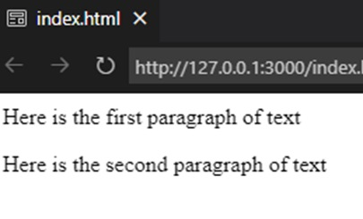
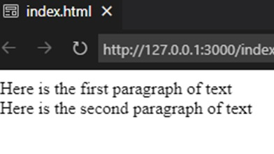
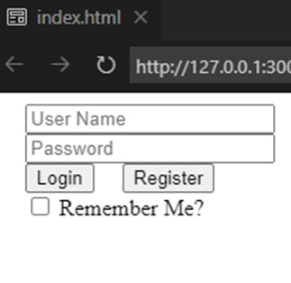
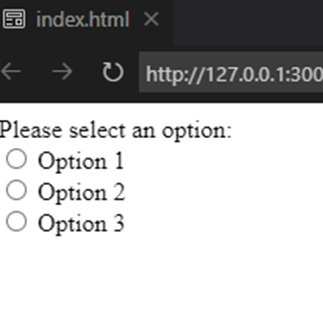
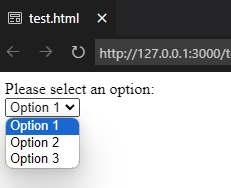
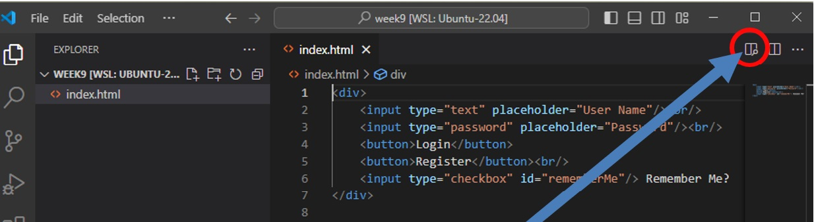
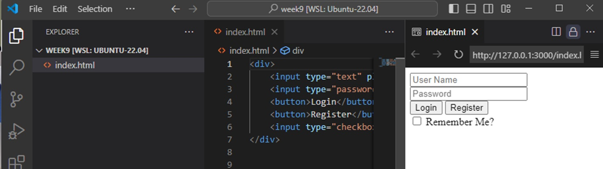
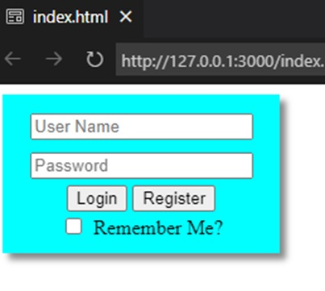
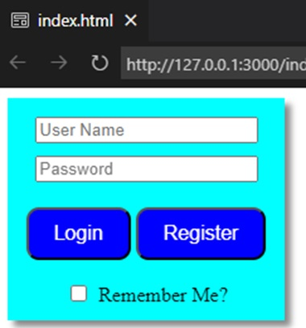

# Web Basics
[&laquo; Return to the Chapter Index](index.md)

<details open markdown="block">
  <summary>
    Table of contents
  </summary>
  {: .text-delta }
1. TOC
{:toc}
</details>

## Key Idea
Learning to develop web applications is a critical skill for software developers.  

## Review of Web Basics
The internet is the network over which many protocols can be transmitted (like email, IM, www, etc).  
DNS (Domain Name Service) is a distributed database that maps names to network addresses (e.g. udel.edu => 128.175.13.247)
One of the protocols the internet supports is Hyper Text Transport Protocol (http) or it's secure cousin (https).
Over this protocol, we send regular text files, that contain a specialized language called HyperText Markup Language (html) that tells a web browser reading the file how to render the page.
That's right, the web is basically just a bunch of text files (and a lot of cat videos).

### HTML Basics
HTML is a simple tag based language where elements are defined with an opening and closing tag 
```
<p>Something</p>
<button>Click Me</button>
<span>Something else</span>
<br/> (has no body, so no closing tag
These tags can be nested inside of each other
<span>Hello <button>Click</button></br><span>World</span>
```
If a tag is inside another tag, it can be affected by the parent's size, position, and style.

### Common HTML Tags
Common tags:
* ```<div></div>``` : Create a block which can be styled.
* ```<p></p>``` :  A paragraph 
* ```<input type=“text” />``` : An input box
* ```<input type=“password” />``` : An input box with the letters obscured
* ```<input type=“radio” />``` : A radio button
* ```<input type=“checkbox” />``` : A checkbox
* ```<button>Button Text</button>```
* ```<span></span>``` : An enclosing element that doesn't do much but can be styled.
* ```<select><option>1</option><option>2</option></select>``` : A drop down

### HTML Tags in action
```html
<div>
  <p>Here is the first paragraph of text</p>
  <p>Here is the second paragraph of text</p>
</div>
```
Here are two of the common tag types.  The outer div is not really doing anything other than grouping the other tags, but later we will learn to style that div which will make it important.



The 2 paragraph tags simply output the text to the browser with paragraph spacing between them.  

If we want less spacing between the two lines of text, we can use a line break instead of putting the text in paragraph tags.
```html
<div>
  Here is the first paragraph of text<br/>
  Here is the second paragraph of text
</div>
```


By removing the ```<p></p>``` tags, and adding a ```<br/>``` I get line spacing instead of paragraph spacing.

You can set various attributes on each tag.  Here is a simple login screen:
```html
<div>
	<input type="text" placeholder="User Name"/>
	<input type="password" placeholder="Password"/><br/>
	<button>Login</button>
	<button>Register</button><br/>
	<input type="checkbox"/> 
    Remember Me?
</div>
```


> Notice the placeholder attribute being set (and the type attribute)

Here is a set of radio buttons:
```html
<div>
	Please select an option:<br/>
	<input type="radio" name="option" value="1"/> 
    Option 1<br/>
	<input type="radio" name="option" value="2"/> 
    Option 2<br/>
	<input type="radio" name="option" value="3"/> 
    Option 3<br/>
</div>
```


> If radio buttons have the same name property, they will act as a group, where selecting one deselects the others.

Here is a dropdown box:
```html
<div>
	Please select an option:<br/>
	<select id="options">
		<option value="1">Option 1</option>
		<option value="2">Option 2</option>
		<option value="3">Option 3</option>
	</select>
</div>
```


### Web Development in VS-Code


Clicking this button, will bring up a preview panel on the right which will change automatically as you edit the file.



### Styling and CSS
Styling our elements allows us to alter colors, shapes, behaviors, appearance, and placement.
There are basically a few ways to style:
* Style a tag:  Note: This styles all tags of that type, so should not be used
* Inline style:  Add the style attribute in the html and set styles there.
* Style a class: We can add one or more CSS classes to any element, and they will take on that style.  The style affects all elements with that class.
* Style a specific element: We can apply a style to an id (remember from a few slides ago).  The style will only affect that element.
Often these styles are placed in a separate file with a .css extension (stands for ***cascading style sheets***).

Returning to our login screen example, we have added *id* and *class* attributes to our elements to allow us to style them.
```html
<div id="loginForm">
	<input type="text" id="username" placeholder="User Name"/><br/>
	<input type="password" id="password" placeholder="Password"/><br/>
	<button id="loginBtn" class="btn">Login</button>
	<button id="registerBtn“ class="btn">Register</button><br/>
	<input id="rememberMe" type="checkbox" id="rememberMe"/> Remember Me?
</div>
```
> Note: This does not change the appearance, but we can use the id and class properties as references in our style sheet.

First let's style the div.  It has an id, so we will style it by id.  To reference an id in a style, we put a # in front.
The style for the outer div tag is ```#loginForm```

```css
#loginForm{
  text-align: center;
  background-color: cyan;
}
#loginForm input{
  margin: 5px;
}
```


The first rule tells the loginForm div to center its content horizontally and set its background color.
The second is a combination of rule selectors.  This rule says to style all input tags inside the element with id ```#loginForm```.

Now our content is centered in the div, and there is a 5 pixel margin around all of the input elements in the div.

How about the buttons.  They were both defined with the class ```btn``` and because we want them to look the same, we can use the class name to style both of them.  For classes we specify the style rule by preceiding the class name with a ".", so ```btn``` is references as ```.btn```

```css
.btn{
	background-color: blue;
	color: white;
	padding: 10px 20px;
	font-size: 16px;
	border-radius: 10px;
	margin:15px 0;
}
```



We are setting the background and foreground colors.  The padding inside, the size of the text, spacing around the buttons, and making the corners round.  Notice it affects both buttons.

**What a difference it makes when we add just a little bit of styling to our tags.**

#### Box Positioning
As part of styling, we have a few very important styles we will use constantly.

***position:*** This sets how the element is positioned within its parent.
* relative: The most common.  It doesn't affect the object it is applied to, but it causes everything inside to be positioned relative to the object to which it is * applied.  By default, everything is page relative (ignores the parent) unless this is set.
* absolute: Positions the object outside the normal model.  This object has no affect on other objects (i.e. next object could be at the same position).
* fixed: Positioned relative to the window.  It stays there.
* sticky: Positioned with a scrolling window, stays in position relative to the scroll position.

***display:***  (Too many to list, here are the ones you will probably use)
* inline: Next element will be right after it (or on the next line if no room).  Sizes to the content
* block: Element will be displayed by itself vertically and can be sized manually with width and height, or top, button, left, and right.
* inline-block: Best of both worlds.  Sizable but still can be next to each other.

### Don't Panic
There are many html tags, and styles.  I am not sure anybody knows them all.  They are not even 100% consistent across web browsers.  You only need a few to do everything.
We will provide you with resources to look up what you need and vs code has excellent IntelliSense with html and styles.
This is an incredibly useful skill that is worth learning for your futures.

## Summary
Learning HTML is an important skill as web applications are pervasive both for internet and local applications.  While the number of tags and styles that are available is large, with a few tags and styles we can build beautiful web application displays.  We will learn much more about this as we begin to build applicaitons instead of static web pages.

# Next Step

Next we'll introduce Webz, a lightweight web framework for application development [Beginning Webz &raquo;](../9-webz-intro/beginning_webz.md)